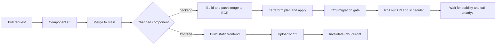

# GitHub Actions CI and deployment

This directory contains Prism's continuous-integration and production-deployment workflows. This guide explains what each workflow does, the GitHub and AWS configuration it expects, and how to operate or troubleshoot a release.

For the AWS resources themselves, begin with the [infrastructure guide](../../infra/README.md). The workflows deploy an existing environment; they do not bootstrap a new AWS account or deploy the Solidity contracts.

## Workflow summary

| Workflow | Trigger | Purpose |
| --- | --- | --- |
| [`backend-ci.yml`](./backend-ci.yml) | Pull requests changing `backend/**` or the workflow; reusable workflow calls | Check Go formatting, run tests, and build the API, scheduler, and migration commands |
| [`backend-deploy.yml`](./backend-deploy.yml) | Pushes to `main` changing `backend/**` or the workflow; manual dispatch | Run backend CI, publish an immutable image to ECR, apply Terraform, run the migration gate, deploy ECS services, and verify readiness |
| [`frontend-ci.yml`](./frontend-ci.yml) | Pull requests changing `frontend/**` or the workflow | Audit dependencies, check formatting, lint, test, and build the React application |
| [`frontend-deploy.yml`](./frontend-deploy.yml) | Pushes to `main` changing `frontend/**` or the workflow; manual dispatch | Validate and build the React application, upload it to S3, and invalidate CloudFront |

Changes elsewhere in the repository do not automatically start these workflows. Use **Actions > selected deployment workflow > Run workflow** when a production redeploy is needed without a matching source change.

## Release flow



Backend production runs are serialized by the `prism-production` concurrency group. Frontend runs are independently serialized by `prism-frontend-production`. Active deployments are not canceled when a newer run starts.

## Prerequisites

Before configuring GitHub Actions:

1. Deploy and verify the protocol contracts by following the [protocol guide](../../protocol/README.md).
2. Provision the production AWS stack and its prerequisites by following the [infrastructure guide](../../infra/README.md). At minimum, the ECR repository, Terraform state bucket, runtime secrets, DNS, Cognito resources, frontend bucket, and CloudFront distribution must exist.
3. Successfully run `terraform init`, `terraform validate`, and `terraform plan` locally using the production configuration.
4. Add GitHub's OIDC provider to the AWS account and create narrowly scoped backend and frontend deployment roles.
5. Create a protected GitHub environment named `production` and configure the variables and secrets listed below.

Do not store long-lived AWS access keys in GitHub. Both deployment workflows request short-lived credentials through GitHub OIDC and `sts:AssumeRoleWithWebIdentity`.

## AWS OIDC and IAM roles

An AWS account needs the GitHub OIDC provider only once:

```bash
aws iam create-open-id-connect-provider \
  --url https://token.actions.githubusercontent.com \
  --client-id-list sts.amazonaws.com
```

If it may already exist, check before creating it:

```bash
aws iam get-open-id-connect-provider \
  --open-id-connect-provider-arn \
  "arn:aws:iam::AWS_ACCOUNT_ID:oidc-provider/token.actions.githubusercontent.com"
```

The repository includes an example trust policy at [`../../infra/iam/github-actions-trust-policy.json`](../../infra/iam/github-actions-trust-policy.json). Replace its account and repository identifiers before use. Its subject must match the workflow's `production` environment exactly. GitHub OIDC subjects and environment names are case-sensitive.

Use separate roles for backend and frontend deployment so a frontend release cannot mutate ECS or Terraform state and a backend release cannot replace static-site objects. Restrict both trust policies to this repository and the `production` environment.

### Backend permissions

The backend role referenced by `AWS_ROLE_ARN` needs the checked-in policies for:

- ECR authentication, image upload, and digest lookup: [`github-actions-ecr-policy.json`](../../infra/iam/github-actions-ecr-policy.json)
- Terraform state and lock-file access: [`github-actions-terraform-state-policy.json`](../../infra/iam/github-actions-terraform-state-policy.json)
- Terraform refresh, task-definition registration, migrations, and API/scheduler rollout: [`github-actions-backend-release-policy.json`](../../infra/iam/github-actions-backend-release-policy.json)

These policies contain deployment-specific account, Region, repository, bucket, secret, cluster, service, and role ARNs. Review and replace them for another AWS environment. The release policy intentionally fails closed if a Terraform change attempts broader infrastructure mutation.

### Frontend permissions

The frontend role referenced by `FRONTEND_AWS_ROLE_ARN` needs permission to list the frontend bucket, put and delete its objects, and invalidate the target CloudFront distribution. Use [`github-actions-frontend-deploy-policy.json`](../../infra/iam/github-actions-frontend-deploy-policy.json) as the scoped template and replace its bucket, account, and distribution identifiers.

## GitHub production environment

In **Repository settings > Environments**, create `production`. Recommended protections include required reviewers, deployment-branch restriction to `main`, and preventing administrators from bypassing approval.

Environment-level values are preferred. Repository-level Actions variables and secrets also resolve, but the jobs still reference the `production` environment and its OIDC subject.

### Shared and backend variables

| Variable | Description | Example |
| --- | --- | --- |
| `AWS_REGION` | AWS Region containing Prism resources | `us-west-2` |
| `AWS_ROLE_ARN` | Backend deployment role | `arn:aws:iam::123456789012:role/prism-github-backend-deploy` |
| `ECR_REPOSITORY` | ECR repository name, without registry hostname | `prism/backend` |

### Backend secrets

| Secret | Description |
| --- | --- |
| `TF_BACKEND_HCL` | Complete production `backend.hcl`, including the state bucket, key, Region, encryption, and lock-file settings |
| `TFVARS` | Complete production `terraform.tfvars` containing configuration values and runtime-secret ARNs |

`TFVARS` should reference AWS Secrets Manager ARNs rather than contain the chain RPC URL, Redis token, database password, or liquidation private key. Its `image_uri` is only a valid fallback: each deployment supplies the newly published image digest through `terraform plan -var=image_uri=...`.

### Frontend variables

| Variable | Required | Description |
| --- | --- | --- |
| `FRONTEND_AWS_ROLE_ARN` | Yes | Frontend deployment role |
| `FRONTEND_BUCKET` | Yes | S3 bucket that serves the application |
| `FRONTEND_DISTRIBUTION_ID` | Yes | CloudFront distribution to invalidate |
| `VITE_PRISM_API_URL` | Yes | Public API base URL |
| `VITE_PRISM_CHAIN_ID` | Yes | Decimal EVM chain ID |
| `VITE_PRISM_CHAIN_NAME` | Yes | User-facing network name |
| `VITE_PRISM_RPC_URL` | Yes | Browser-accessible Ethereum RPC URL |
| `VITE_PRISM_POOL_ADDRESS` | Yes | Deployed `PrismPool` address |
| `VITE_PRISM_MULTISIG_ADDRESS` | Yes | Deployed `ThresholdMultiSig` address |
| `VITE_PRISM_EXPLORER_URL` | No | Block-explorer base URL |
| `VITE_PRISM_DEPLOYMENT_BLOCK` | No | First block scanned for protocol activity |
| `VITE_PRISM_AUTH_MODE` | No | Frontend authentication mode |
| `VITE_PRISM_COGNITO_DOMAIN` | For Cognito | Hosted UI domain |
| `VITE_PRISM_COGNITO_CLIENT_ID` | For Cognito | Cognito app-client ID |
| `VITE_PRISM_COGNITO_REDIRECT_URI` | For Cognito | Exact post-login redirect URI |
| `VITE_PRISM_COGNITO_LOGOUT_URI` | For Cognito | Exact post-logout URI |
| `VITE_PRISM_TELEMETRY_ENDPOINT` | No | Frontend telemetry destination |

Vite embeds every `VITE_*` value in the public JavaScript bundle. Never put credentials or private RPC tokens in these variables.

## What a backend deployment does

After the reusable backend CI job succeeds, the deployment job:

1. Assumes the backend AWS role using OIDC.
2. Builds `backend/Dockerfile` for `linux/amd64`.
3. Tags the image with the commit SHA, workflow run ID, and attempt number.
4. Pushes the image to ECR and resolves its immutable `sha256` digest.
5. Materializes `backend.hcl` and `terraform.tfvars` from protected secrets.
6. Initializes and validates Terraform, creates a saved plan using the new image digest, and applies that exact plan.
7. Lets Terraform's migration gate run before the API and scheduler update.
8. Waits for both ECS services to become stable and calls the Terraform `api_url` output at `/readyz`.

The deploy fails if CI, image publication, migration, Terraform apply, ECS stabilization, or readiness verification fails. Inspect the first failed step rather than rerunning blindly; a migration failure and an application-readiness failure require different recovery actions.

## What a frontend deployment does

The frontend deployment installs the locked npm dependency graph, checks formatting, lints, tests, audits production dependencies, and builds with the production `VITE_*` configuration. It then:

1. Uploads hashed assets to `s3://$FRONTEND_BUCKET/assets` with a one-year immutable cache policy and removes stale assets.
2. Uploads `index.html` separately with `Cache-Control: no-cache`.
3. Requests a CloudFront invalidation for `/*`.

Because configuration is compiled into the bundle, changing a frontend environment variable requires another frontend deployment.

## First production run

1. Protect `main` and require the relevant CI checks before merge.
2. Verify the `production` environment's reviewers, variables, and secrets.
3. Verify each AWS role's trust policy and attached or inline permissions.
4. Manually run **Deploy backend to AWS** and approve the environment gate.
5. Confirm the migration completes, both ECS services stabilize, and `/readyz` succeeds.
6. Manually run **Deploy frontend to AWS**.
7. Open the public site in a fresh browser session and verify API reads, wallet connection, the configured chain, and static-asset loading.

After this validation, merging matching backend or frontend changes to `main` deploys that component automatically.

## Rollback and recovery

### Backend

Images are addressed by digest and older ECS task-definition revisions are retained. To roll back, identify a known-good image digest, update the production `image_uri` through a reviewed Terraform plan, and apply it. Do not rerun a failed database migration until its failure and idempotency characteristics are understood.

If a deployment fails after Terraform apply, inspect the ECS service events, stopped-task reason, and CloudWatch logs. The `/readyz` endpoint checks MySQL, Redis, and chain RPC connectivity, so a failing readiness check may indicate dependency configuration rather than a bad container image.

### Frontend

Redeploy a known-good commit with **Run workflow**. S3 versioning, when enabled, provides an additional recovery path, but restoring objects must be followed by a CloudFront invalidation. A successful invalidation does not prove the application has valid runtime configuration; perform the browser checks above.

## Troubleshooting

### OIDC role assumption fails

Compare the AWS account, audience (`sts.amazonaws.com`), immutable or legacy repository subject, and `environment:production` suffix against the token claims. Confirm that the job has `id-token: write` and that the variable points to the intended role.

### Terraform state access is denied

Check that `TF_BACKEND_HCL` names the same bucket and key scoped by the state policy. Native S3 locking also needs access to the adjacent `.tflock` object.

### ECR push or digest lookup fails

Confirm `ECR_REPOSITORY`, `AWS_REGION`, and the ECR policy's repository ARN agree. The repository must already exist.

### Migration or ECS rollout fails

Read the migration task's stopped reason and CloudWatch logs, then inspect ECS service events. Verify that the role can pass only the expected task and execution roles and that production Secrets Manager ARNs point to populated secrets.

### Frontend deploy succeeds but old content appears

Confirm the workflow targeted the correct bucket and distribution, then inspect the CloudFront invalidation status. `index.html` should be non-cached; hashed assets should be immutable.

### Frontend builds with the wrong network or API

Check the `production` environment's `VITE_*` values and rerun the deployment. These values are build-time configuration and cannot be corrected by changing S3 metadata after upload.

## Safe workflow changes

Treat workflow and IAM changes as production code:

- Pin actions to reviewed versions and review their release notes before upgrading.
- Preserve minimal `permissions`; deployment jobs need `contents: read` and `id-token: write`.
- Keep untrusted pull-request code out of jobs that can access the production environment.
- Do not print Terraform configuration, tokens, credentials, or secret values to logs.
- Test IAM and Terraform changes in a non-production account before widening the production role.
- Keep backend and frontend deployment roles separate and resource-scoped.
