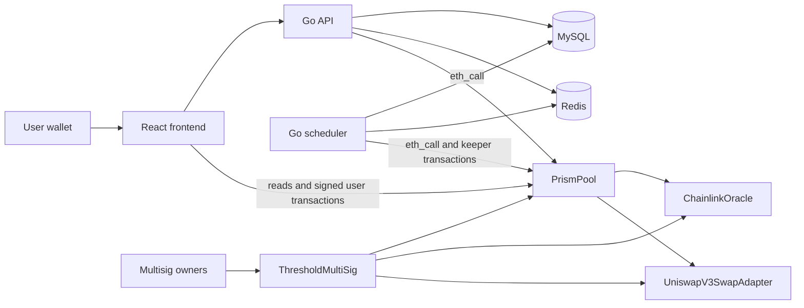

# Prism

Prism is an EVM fixed-rate lending protocol with Solidity contracts, a Go backend, a React frontend, and an AWS deployment stack.

## Components

- [`protocol/`](./protocol) contains the Solidity contracts, Hardhat tests, local-chain deployment, Sepolia deployment, multisig administration, and contract-binding generation instructions.
- [`backend/`](./backend) contains the Go API, scheduler, MySQL/Redis integration, local Docker Compose deployment, Chainlink price reader, and automatic liquidation keeper.
- [`frontend/`](./frontend) contains the React application, typed API and contract clients, injected-wallet integration, shared UI foundation, and frontend roadmap.
- [`infra/`](./infra) contains the production AWS architecture, Terraform configuration, runtime secrets, container deployment, migration gate, and operational verification.

## Architecture



The frontend combines indexed API data with live contract reads and wallet-signed transactions. The backend reads deployed contracts through Ethereum JSON-RPC, while production prices are gasless calls to the deployed `ChainlinkOracle`. When explicitly enabled, the scheduler uses a dedicated, narrowly authorized keeper wallet to submit liquidation transactions; the threshold multisig retains protocol administration.

## Repository layout

```text
prism/
├── .github/workflows/       Backend deployment and component CI workflows
├── protocol/                Solidity protocol and chain tooling
│   ├── contracts/           Pool, token, oracle, DEX adapter, and multisig contracts
│   ├── deployments/         Generated local and tracked network manifests
│   ├── scripts/             Deployment and protocol-operation scripts
│   └── test/                Hardhat contract tests
├── backend/                 Go services and data integrations
│   ├── cmd/                 API, scheduler, and migration entry points
│   ├── internal/            Auth, chain, quote, storage, cache, and service packages
│   ├── Dockerfile           Production multi-command image
│   └── docker-compose.yml   API, scheduler, MySQL, Redis, and migrations
├── frontend/                React and TypeScript application
│   ├── src/components/      Shared application and UI components
│   ├── src/config/          Validated runtime and chain configuration
│   ├── src/lib/             Typed API, contract, and formatting utilities
│   ├── src/pages/           Route-level product screens
│   └── src/wallet/          Injected-wallet state and network integration
└── infra/                   AWS infrastructure and deployment guidance
    ├── iam/                 GitHub Actions IAM policies
    └── terraform/           Production AWS resources and configuration
```

## Deployment guides

- Deploy and verify contracts: [`protocol/README.md`](./protocol/README.md)
- Run the backend locally: [`backend/README.md`](./backend/README.md)
- Run the frontend and view its roadmap: [`frontend/README.md`](./frontend/README.md)
- Deploy the production AWS stack: [`infra/README.md`](./infra/README.md)
- Automate backend CI and AWS deployment: [`docs/github-actions-deployment.md`](./docs/github-actions-deployment.md)

Follow them in that order for a new environment. The AWS stack consumes addresses from the verified protocol deployment manifest and does not deploy contracts.

## Local development

Prism's complete local environment uses a persistent Hardhat node, locally deployed contracts, the Docker Compose backend stack, and the Vite development server. Install Docker with the Compose plugin, Node.js, npm, Go, and `jq` before starting.

Start the local chain from `protocol/` and keep it running:

```bash
cd protocol
npm install
npx hardhat node --hostname 0.0.0.0
```

In another terminal, deploy and seed the contracts:

```bash
cd protocol
npm run deploy:local
```

Load the generated contract addresses and start the backend:

```bash
cd backend
export PRISM_POOL_ADDRESS="$(jq -r '.prismPool' ../protocol/deployments/local.json)"
export PRISM_MULTISIG_ADDRESS="$(jq -r '.multisig' ../protocol/deployments/local.json)"
docker compose up --build
```

Configure and start the frontend in another terminal:

```bash
cd frontend
cp .env.example .env.local
npm install
npm run dev
```

Update `frontend/.env.local` with `prismPool` and `multisig` from `protocol/deployments/local.json`. The frontend normally runs at `http://localhost:5173`, the API at `http://localhost:8080`, and the local chain at `http://127.0.0.1:8545`. Restarting the Hardhat node resets the chain, so redeploy the contracts and refresh the configured addresses afterward.

## Development checks

Protocol:

```bash
cd protocol
npm test
```

Backend:

```bash
cd backend
go test ./...
go vet ./...
```

Frontend:

```bash
cd frontend
npm run format:check
npm run lint
npm test
npm run build
```

Terraform:

```bash
cd infra/terraform
terraform fmt -check -recursive
terraform validate
```
