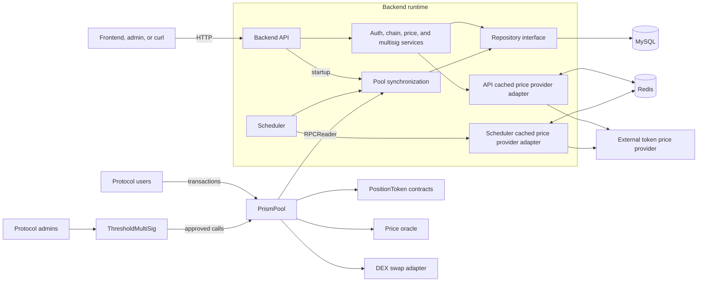
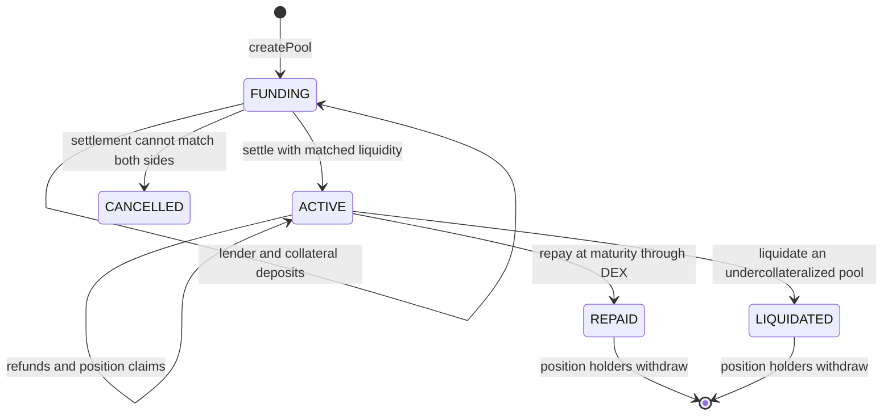

# Prism

Prism is a fixed-rate lending protocol with an accompanying indexing and API
backend. The repository contains two projects:

- [`protocol`](./protocol) contains the Solidity contracts, Hardhat configuration, and contract tests.
- [`backend`](./backend) contains the Go API and scheduler, plus MySQL and Redis infrastructure for indexed data and price caching.

## Current integration status

The protocol and backend are connected through Ethereum RPC at runtime.

- The contracts implement and test the lending lifecycle on Hardhat networks.
- A local deployment script deploys the protocol, configures its mock dependencies, and creates one seed pool on a persistent Hardhat node.
- The backend has an RPC implementation of `chain.Reader` backed by generated Go bindings. It reads `poolCount`, pool snapshots, pool data, and ERC-20 `symbol` and `decimals`.
- Both backend executables instantiate `RPCReader` from the configured RPC URL and deployed `PrismPool` address. `DemoReader` is used only by tests.
- Backend prices currently come from `DemoProvider`, wrapped by a Redis-backed cache.

Production use still requires durable deployment addresses and real oracle, DEX, and provider adapters.

## System architecture



Both backend processes read contract snapshots through the RPC adapter and generated Go bindings. The API syncs once during startup; the scheduler syncs once during startup and then at `PRISM_SYNC_INTERVAL`.

## Protocol

The protocol is built with Solidity 0.8.28, Hardhat 3, ethers 6, and OpenZeppelin Contracts.

### Contracts

| Contract | Responsibility |
| --- | --- |
| `PrismPool` | Creates lending pools and manages deposits, settlement, claims, repayment, liquidation, and withdrawals. |
| `PositionToken` | ERC-20 receipt token minted and burned by approved pool contracts. |
| `MockOracle` | Owner-controlled token prices for local development and tests. |
| `FixedRateSwap` | Deterministic exact-input and exact-output swaps for tests. |
| `ThresholdMultiSig` | Threshold approval and execution of administrative calls. |

### Lending lifecycle



During funding, lenders deposit the lend token and borrowers deposit
collateral. Settlement matches the two sides using oracle prices. Lenders and
borrowers can then claim position tokens, with borrowers also receiving the
matched loan. At maturity, repayment swaps enough collateral for the required
lend tokens. An undercollateralized active pool can instead be liquidated.

### Run the contract tests

```bash
cd protocol
npm install
npm test
```

The test command uses the optimized Hardhat production build profile. The test
suite covers pool creation, deposits, settlement, refunds, claims, repayment,
liquidation, position tokens, the mock oracle, fixed-rate swaps, and multisig
administration.

### Deploy the protocol locally

Start a persistent Hardhat node. Bind it to all host interfaces when the backend will run in Docker:

```bash
cd protocol
npx hardhat node --hostname 0.0.0.0
```

In a second terminal, deploy the protocol and create one seed pool:

```bash
cd protocol
npm run deploy:local
```

The deployment output includes the local RPC URL, chain ID, and deployed
`PrismPool` address. Addresses change whenever the local node is restarted.

Hardhat also defines simulated L1 and OP networks and an HTTP Sepolia network. Sepolia requires `SEPOLIA_RPC_URL` and `SEPOLIA_PRIVATE_KEY`; the current deployment script targets only the local persistent node.

See [`protocol/README.md`](./protocol/README.md) for the contract-focused lifecycle, local deployment, ABI extraction, and Go binding generation notes.

## Backend

The backend is a Go module with two executables:

- `cmd/api` performs an initial pool sync, serves public and protected HTTP endpoints, and shuts down gracefully on `SIGINT` or `SIGTERM`.
- `cmd/scheduler` performs an initial sync and repeats it according to `PRISM_SYNC_INTERVAL`.

Both processes can use an in-memory repository or MySQL. They use Redis for price caching and currently fetch cache misses from the demo price provider.
When both processes use MySQL, the scheduler's indexed snapshots are visible to the API.

The backend also contains:

- `internal/chain/rpc_reader.go`, which implements `chain.Reader` through Ethereum JSON-RPC;
- generated `PrismPool` and ERC-20 bindings in `internal/contracts`; and
- an in-process RPC test that verifies ABI encoding and decoding without a running Hardhat node.

### Run the complete backend stack

Docker Compose is the shortest path because it supplies MySQL and Redis:

```bash
cd backend
PRISM_POOL_ADDRESS=0x... \
PRISM_MULTISIG_ADDRESS=0x... \
docker compose up --build
```

Start the local Hardhat node with `--hostname 0.0.0.0` and run `npm run deploy:local` first. Use its `prismPool` and `multisig` addresses.

The containers resolve `host.docker.internal` to the host-side Docker gateway, commonly `172.17.0.1` on Linux. Hardhat must listen on that interface; its default `127.0.0.1` binding accepts host-loopback connections only. Binding to `0.0.0.0` is intended for local development and may expose the development node to the local network, depending on the host firewall.

This starts four containers:

| Service | Purpose | Host port |
| --- | --- | --- |
| `api` | HTTP API | `8080` |
| `scheduler` | Periodic pool and price synchronization | none |
| `mysql` | Persistent indexed state | `3306` |
| `redis` | Price cache | `6379` |

Check the running API:

```bash
curl http://localhost:8080/healthz
curl "http://localhost:8080/api/v1/poolBaseInfo?chainId=31337"
curl "http://localhost:8080/api/v1/price?symbol=PRM"
```

Stop the stack while preserving MySQL data:

```bash
docker compose down
```

To remove the MySQL volume as well:

```bash
docker compose down -v
```

### API summary

| Method | Path | Access |
| --- | --- | --- |
| `GET` | `/healthz` | Public |
| `GET` | `/api/v1/poolBaseInfo?chainId=97` | Public |
| `GET` | `/api/v1/poolDataInfo?chainId=97` | Public |
| `GET` | `/api/v1/token?chainId=97` | Public |
| `GET` | `/api/v1/price?symbol=PRM` | Public |
| `POST` | `/api/v1/user/login` | Public |
| `POST` | `/api/v1/user/logout` | Bearer token |
| `GET` | `/api/v1/admin/session` | Bearer token |
| `GET` | `/api/v1/multisig` | Public; reads owners and threshold on-chain |
| `POST` | `/api/v1/multisig/proposals` | Bearer token; prepares approval and execution transactions |
| `GET` | `/api/v1/multisig/proposals/{txHash}` | Public; reads on-chain approval status |

The Compose configuration uses development credentials:

```text
username: admin
password: password
```

Pass the token returned by login as:

```text
Authorization: Bearer <tokenId>
```

Do not use the Compose credentials or token secret in a public environment.

### Backend configuration

| Variable | Default | Purpose |
| --- | --- | --- |
| `PRISM_ENV` | `local` | Logging/runtime environment. |
| `PRISM_API_PORT` | `8080` | API listen port. |
| `PRISM_API_VERSION` | `1` | Version used in the `/api/v{n}` route prefix. |
| `PRISM_CHAIN_ID` | `31337` | Expected RPC chain ID and identifier used for indexed records. |
| `PRISM_CHAIN_RPC_URL` | `http://127.0.0.1:8545` | Ethereum JSON-RPC endpoint. |
| `PRISM_POOL_ADDRESS` | empty | Required deployed `PrismPool` contract address. |
| `PRISM_MULTISIG_ADDRESS` | empty | Required deployed `ThresholdMultiSig` contract address. |
| `PRISM_SYNC_INTERVAL` | `2m` | Scheduler synchronization interval. |
| `PRISM_STORE` | `memory` | Repository driver: `memory` or `mysql`. |
| `PRISM_MYSQL_DSN` | empty | MySQL connection string. |
| `PRISM_REDIS_ADDR` | `127.0.0.1:6379` | Redis address. |
| `PRISM_REDIS_PASSWORD` | empty | Redis password. |
| `PRISM_REDIS_DB` | `0` | Redis database number. |
| `PRISM_PRICE_SYMBOL` | `PRM` | Symbol refreshed by the scheduler. |
| `PRISM_PRICE_CACHE_TTL` | `30s` | Price-cache lifetime. |
| `PRISM_ADMIN_USERNAME` | `admin` | Development admin username. |
| `PRISM_ADMIN_PASSWORD` | `password` | Development admin password. |
| `PRISM_TOKEN_SECRET` | `local-development-secret` | HMAC token-signing secret. |
| `PRISM_TOKEN_TTL` | `1h` | Authentication token lifetime. |

See [`backend/README.md`](./backend/README.md) for endpoint payloads, storage
details, and the backend's implementation history.

### Run backend tests

```bash
cd backend
go test ./...
```

## Repository layout

```text
.
├── protocol/
│   ├── contracts/       Solidity protocol contracts
│   ├── test/            Hardhat integration and unit tests
│   ├── ignition/        Hardhat Ignition modules
│   └── scripts/         Network interaction scripts
└── backend/
    ├── cmd/api/         API executable
    ├── cmd/scheduler/   Scheduler executable
    ├── internal/        Services, adapters, storage, cache, and HTTP server
    │   └── contracts/   Generated Go contract bindings
    ├── Dockerfile       Multi-stage Go image
    └── docker-compose.yml
```

## Development checks

Run both project test suites before submitting changes:

```bash
cd protocol
npm test

cd ../backend
go test ./...
```
