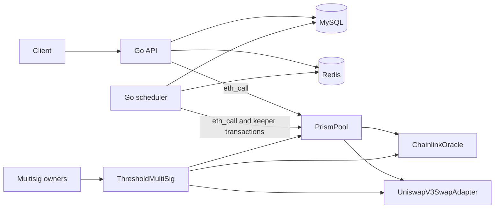

# Prism

Prism is an EVM lending protocol with a Go backend and an AWS deployment stack.

## Components

- [`protocol/`](./protocol) contains the Solidity contracts, Hardhat tests, local-chain deployment, Sepolia deployment, multisig administration, and contract-binding generation instructions.
- [`backend/`](./backend) contains the Go API, scheduler, MySQL/Redis integration, local Docker Compose deployment, Chainlink price reader, and automatic liquidation keeper.
- [`infra/`](./infra) contains the production AWS architecture, Terraform configuration, runtime secrets, container deployment, migration gate, and operational verification.

## Architecture



The backend reads deployed contracts through Ethereum JSON-RPC. Production prices are gasless calls to the deployed `ChainlinkOracle`. When explicitly enabled, the scheduler uses a dedicated, narrowly authorized keeper wallet to submit liquidation transactions; the threshold multisig retains protocol administration.

## Deployment guides

- Deploy and verify contracts: [`protocol/README.md`](./protocol/README.md)
- Run the backend locally: [`backend/README.md`](./backend/README.md)
- Deploy the production AWS stack: [`infra/README.md`](./infra/README.md)
- Automate backend CI and AWS deployment: [`docs/github-actions-deployment.md`](./docs/github-actions-deployment.md)

Follow them in that order for a new environment. The AWS stack consumes addresses from the verified protocol deployment manifest and does not deploy contracts.

## Repository layout

```text
prism/
├── protocol/   Solidity contracts, tests, scripts, ABIs, and deployment manifests
├── backend/    Go API, scheduler, storage, cache, contract bindings, and Docker image
├── infra/      AWS deployment runbook and Terraform
└── backend/docker-compose.yml Local MySQL, Redis, API, scheduler, and migration services
```

## Development checks

Protocol:

```bash
cd protocol
npm test
```

Backend:

```bash
cd backend
go test ./...
go vet ./...
```

Terraform:

```bash
cd infra/terraform
terraform fmt -check -recursive
terraform validate
```
