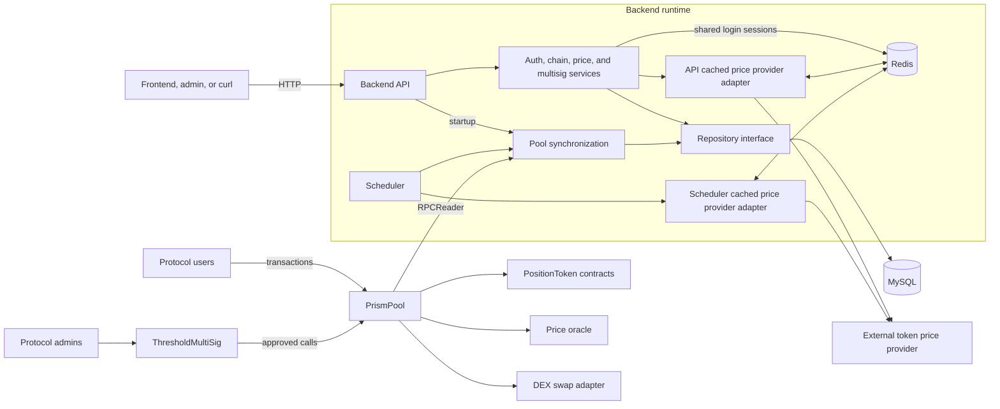
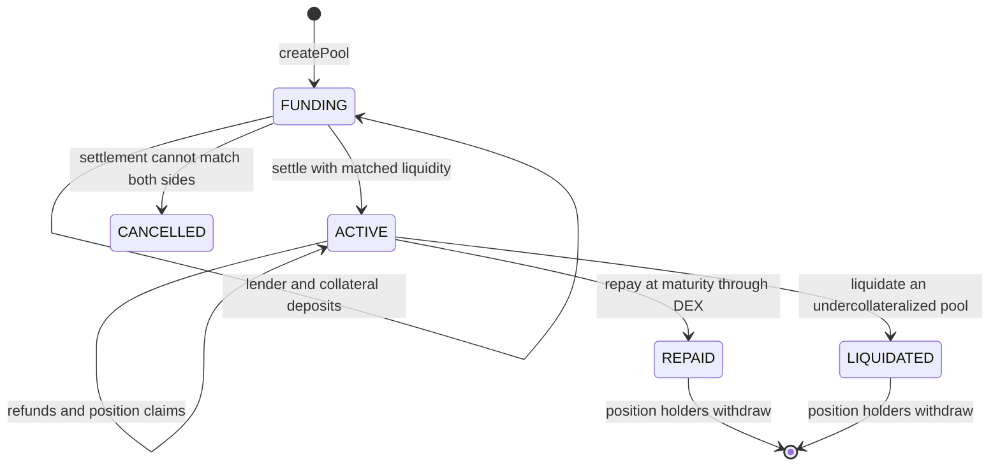

# Prism

Prism is a fixed-rate lending protocol with an accompanying indexing and API
backend. The repository contains two projects:

- [`protocol`](./protocol) contains the Solidity contracts, Hardhat configuration, and contract tests.
- [`backend`](./backend) contains the Go API and scheduler, plus MySQL and Redis infrastructure for indexed data, shared authentication sessions, and price caching.

## Current integration status

The protocol and backend are connected through Ethereum RPC at runtime.

- The contracts implement and test the lending lifecycle on Hardhat networks.
- A local deployment script deploys the protocol, configures its mock dependencies, and creates one seed pool on a persistent Hardhat node.
- The backend has an RPC implementation of `chain.Reader` backed by generated Go bindings. It reads `poolCount`, pool snapshots, pool data, and ERC-20 `symbol` and `decimals`.
- Both backend executables instantiate `RPCReader` from the configured RPC URL and deployed `PrismPool` address. `DemoReader` is used only by tests.
- Backend prices currently come from `DemoProvider`, wrapped by a Redis-backed cache.

Production use still requires durable deployment addresses and real oracle, DEX, and provider adapters.

## System architecture



Both backend processes read contract snapshots through the RPC adapter and generated Go bindings. The API syncs once during startup; the scheduler syncs once during startup and then at `PRISM_SYNC_INTERVAL`.

## Protocol

The protocol is built with Solidity 0.8.28, Hardhat 3, ethers 6, and OpenZeppelin Contracts.

### Contracts

| Contract | Responsibility |
| --- | --- |
| `PrismPool` | Creates lending pools and manages deposits, settlement, claims, repayment, liquidation, and withdrawals. |
| `PositionToken` | ERC-20 receipt token minted and burned by approved pool contracts. |
| `MockOracle` | Owner-controlled token prices for local development and tests. |
| `FixedRateSwap` | Deterministic exact-input and exact-output swaps for tests. |
| `ThresholdMultiSig` | Threshold approval and execution of administrative calls. |

### Lending lifecycle



During funding, lenders deposit the lend token and borrowers deposit
collateral. Settlement matches the two sides using oracle prices. Lenders and
borrowers can then claim position tokens, with borrowers also receiving the
matched loan. At maturity, repayment swaps enough collateral for the required
lend tokens. An undercollateralized active pool can instead be liquidated.

### Run the contract tests

```bash
cd protocol
npm install
npm test
```

The test command uses the optimized Hardhat production build profile. The test
suite covers pool creation, deposits, settlement, refunds, claims, repayment,
liquidation, position tokens, the mock oracle, fixed-rate swaps, and multisig
administration.

## Backend

The backend is a Go module with two executables:

- `cmd/api` performs an initial pool sync, serves public and protected HTTP endpoints, and shuts down gracefully on `SIGINT` or `SIGTERM`.
- `cmd/scheduler` performs an initial sync and repeats it according to `PRISM_SYNC_INTERVAL`.

Both processes can use an in-memory repository or MySQL. They use Redis for
price caching, and the API uses Redis for shared login sessions. Price cache
misses currently come from the demo price provider.
When both processes use MySQL, the scheduler's indexed snapshots are visible to the API.

The backend also contains:

- `internal/chain/rpc_reader.go`, which implements `chain.Reader` through Ethereum JSON-RPC;
- generated `PrismPool` and ERC-20 bindings in `internal/contracts`; and
- an in-process RPC test that verifies ABI encoding and decoding without a running Hardhat node.

### Run the complete backend stack

Docker Compose is the shortest path because it supplies MySQL and Redis:

```bash
cd backend
PRISM_POOL_ADDRESS=0x... \
PRISM_MULTISIG_ADDRESS=0x... \
docker compose up --build
```

Start the local Hardhat node with `--hostname 0.0.0.0` and run `npm run deploy:local` first. Use its `prismPool` and `multisig` addresses.

The containers resolve `host.docker.internal` to the host-side Docker gateway, commonly `172.17.0.1` on Linux. Hardhat must listen on that interface; its default `127.0.0.1` binding accepts host-loopback connections only. Binding to `0.0.0.0` is intended for local development and may expose the development node to the local network, depending on the host firewall.

This starts four containers:

| Service | Purpose | Host port |
| --- | --- | --- |
| `api` | HTTP API | `8080` |
| `scheduler` | Periodic pool and price synchronization | none |
| `mysql` | Persistent indexed state | `3306` |
| `redis` | Price cache | `6379` |

Check the running API:

```bash
curl http://localhost:8080/healthz
curl "http://localhost:8080/api/v1/poolBaseInfo?chainId=31337"
curl "http://localhost:8080/api/v1/price?symbol=PRM"
```

Stop the stack while preserving MySQL data:

```bash
docker compose down
```

To remove the MySQL volume as well:

```bash
docker compose down -v
```
### Run the local protocol/backend integration for entire pool lifecycle

Use this sequence whenever the Solidity ABI may have changed. It rebuilds the
contracts, regenerates the Go bindings used by the backend, starts the local
chain and backend stack, creates a pool through the backend-prepared multisig
flow, and queries the indexed pool information.

#### 1. Install the ABI generation tools

Run these commands from the repository root:

```bash
sudo apt install jq
go install github.com/ethereum/go-ethereum/cmd/abigen@latest
abigen --version
```

#### 2. Compile the contracts and extract the current ABIs

```bash
cd protocol
npm install
npx hardhat build --build-profile production
cd ..

jq '.abi' \
  protocol/artifacts/contracts/pool/PrismPool.sol/PrismPool.json \
  > protocol/contracts/pool/PrismPool.abi.json

jq '.abi' \
  protocol/artifacts/contracts/admin/ThresholdMultiSig.sol/ThresholdMultiSig.json \
  > protocol/contracts/admin/ThresholdMultiSig.abi.json
```

#### 3. Regenerate and verify the Go contract bindings

The `abigen` commands intentionally overwrite generated files. Do not edit these files manually.

```bash
abigen \
  --abi protocol/contracts/pool/PrismPool.abi.json \
  --pkg contracts \
  --type PrismPool \
  --out backend/internal/contracts/prism_pool.go

abigen \
  --abi protocol/contracts/admin/ThresholdMultiSig.abi.json \
  --pkg contracts \
  --type ThresholdMultiSig \
  --out backend/internal/contracts/threshold_multi_sig.go

gofmt -w \
  backend/internal/contracts/prism_pool.go \
  backend/internal/contracts/threshold_multi_sig.go

cd backend
go test ./...
cd ..
```

The generic ERC-20 binding in `backend/internal/contracts/erc20_token.go` does not need regeneration unless the ERC-20 ABI used by the backend changes.

#### 4. Start the local chain

Start a persistent Hardhat node. Bind it to all host interfaces when the backend will run in Docker:

```bash
cd protocol
npm run node -- --hostname 0.0.0.0
# or bypass npm script:
npx hardhat node --hostname 0.0.0.0
```

The first `--` tells npm to pass the remaining arguments to `hardhat node`.
Keep this terminal running.

#### 5. Deploy the protocol

In a second terminal, deploy the protocol and create seed pool `0`:

```bash
cd protocol
npm run deploy:local
```

The deployment output includes the local RPC URL, chain ID, and deployed
contract addresses. It also writes them to `protocol/deployments/local.json`.
Addresses change whenever the local node is restarted, so redeploy after every
restart and use the newly generated addresses.

#### 6. Build and start the backend

In a third terminal, run these commands from the repository root:

```bash
cd backend

export PRISM_POOL_ADDRESS="$(
  jq -r '.prismPool' ../protocol/deployments/local.json
)"
export PRISM_MULTISIG_ADDRESS="$(
  jq -r '.multisig' ../protocol/deployments/local.json
)"

docker compose up --build
```

The `--build` option compiles the backend with the regenerated Go bindings.
For a completely uncached image build, use:

```bash
docker compose build --no-cache api scheduler
docker compose up
```

Wait for the API and scheduler to start, then check the API from another
terminal:

```bash
curl -s http://localhost:8080/healthz
```

#### 7. Create a pool through the integration helper

In a fourth terminal:

```bash
cd protocol
npm run create-pool:api
```

The helper logs into the backend, requests a `create_pool` multisig proposal, broadcasts the required two local-owner approvals, executes the proposal, checks that `poolCount()` increased, and waits for the scheduler to index the new pool in MySQL. Because deployment creates pool `0`, this command normally creates pool `1`.

Successful output ends with messages similar to:

```text
Created on-chain pool 1 in block ...
Backend indexed pool 1
```

#### 8. Settle a pool through the integration helper

The local deployment's seed pool has no deposits, so settle pool `0` to verify
the settlement proposal flow and its transition from `FUNDING` to `CANCELLED`:

```bash
cd protocol
npm run settle-pool:api
```

To settle another zero-based on-chain pool ID:

```bash
PRISM_POOL_ID=1 npm run settle-pool:api
```

The helper advances the local Hardhat timestamp to the selected pool's
settlement time when necessary, obtains and validates the backend-prepared
`settle_pool` proposal, broadcasts the multisig approvals and execution, then
waits for the backend to index the resulting `ACTIVE` or `CANCELLED` state.

#### 9. Repay an active pool through the integration helper

Prepare the latest `FUNDING` pool with deposits, a fixed swap rate, and swap
liquidity, then settle it through the API into `ACTIVE`:

```bash
cd protocol
npm run setup-repay:local
```

The intended fresh sequence is:

```bash
npm run create-pool:api
npm run setup-repay:local
PRISM_POOL_ID=1 npm run repay-pool:api
```

The setup helper targets the latest pool by default. `PRISM_POOL_ID` can select
another funding pool. Its local token amounts and swap configuration can be
overridden with `PRISM_SETUP_LEND_AMOUNT`, `PRISM_SETUP_COLLATERAL_AMOUNT`,
`PRISM_SETUP_SWAP_RATE`, and `PRISM_SETUP_SWAP_LIQUIDITY`.

By default, the helper permits selling up to all settled pool collateral.
Override the maximum in the collateral token's smallest unit when needed:

```bash
PRISM_POOL_ID=1 \
PRISM_MAX_COLLATERAL_AMOUNT=5000000000000000000 \
npm run repay-pool:api
```

The helper checks the swap quote and liquidity, advances local Hardhat time to
maturity, obtains and validates the backend-prepared `repay_pool` proposal,
executes the multisig flow, verifies state `REPAID`, and waits for the backend
to index it.

#### 10. Liquidate an undercollateralized pool

Create a new funding pool, prepare it for liquidation, then execute the
API-prepared multisig proposal:

```bash
cd protocol
npm run create-pool:api
npm run setup-liquidate:local
PRISM_POOL_ID=1 npm run liquidate-pool:api
```

The setup helper funds and activates the latest pool, configures and funds the
swap, lowers the mock collateral price, and verifies that the pool is
undercollateralized. Override the default crash price with
`PRISM_SETUP_COLLATERAL_CRASH_PRICE`. The liquidation helper defaults its
maximum to all settled collateral; override it with
`PRISM_MAX_COLLATERAL_AMOUNT`.

#### 11. Query the indexed pool information

```bash
curl -s \
  "http://localhost:8080/api/v1/poolBaseInfo?chainId=31337" |
  jq

curl -s \
  "http://localhost:8080/api/v1/poolDataInfo?chainId=31337" |
  jq

curl -s \
  "http://localhost:8080/api/v1/token?chainId=31337" |
  jq
```

The scheduler synchronizes every 30 seconds. The integration helper waits up to 90 seconds for its new pool, but a manual query immediately after another on-chain transaction may briefly return the previous snapshot.

#### 12. Stop the backend stack

From the `backend` directory, preserve the MySQL volume with:

```bash
docker compose down
```

To remove the local MySQL data as well:

```bash
docker compose down -v
```

Hardhat also defines simulated L1 and OP networks and an HTTP Sepolia network. Sepolia requires `SEPOLIA_RPC_URL` and `SEPOLIA_PRIVATE_KEY`; the current deployment script targets only the local persistent node.

See [`protocol/README.md`](./protocol/README.md) for the contract-focused lifecycle, local deployment, ABI extraction, and Go binding generation notes.

### API summary

| Method | Path | Access |
| --- | --- | --- |
| `GET` | `/healthz` | Public |
| `GET` | `/api/v1/poolBaseInfo?chainId=31337` | Public |
| `GET` | `/api/v1/poolDataInfo?chainId=31337` | Public |
| `GET` | `/api/v1/token?chainId=31337` | Public |
| `GET` | `/api/v1/price?symbol=PRM` | Public |
| `POST` | `/api/v1/user/login` | Public |
| `POST` | `/api/v1/user/logout` | Bearer token |
| `GET` | `/api/v1/admin/session` | Bearer token |
| `GET` | `/api/v1/multisig` | Public; reads owners and threshold on-chain |
| `POST` | `/api/v1/multisig/proposals` | Bearer token; prepares approval and execution transactions |
| `GET` | `/api/v1/multisig/proposals/{txHash}` | Public; reads on-chain approval status |

The Compose configuration uses development credentials:

```text
username: admin
password: password
```

Pass the token returned by login as:

```text
Authorization: Bearer <tokenId>
```

Do not use the Compose credentials or token secret in a public environment.

### Backend configuration

| Variable | Default | Purpose |
| --- | --- | --- |
| `PRISM_ENV` | `local` | Logging/runtime environment. |
| `PRISM_API_PORT` | `8080` | API listen port. |
| `PRISM_API_VERSION` | `1` | Version used in the `/api/v{n}` route prefix. |
| `PRISM_CHAIN_ID` | `31337` | Expected RPC chain ID and identifier used for indexed records. |
| `PRISM_CHAIN_RPC_URL` | `http://127.0.0.1:8545` | Ethereum JSON-RPC endpoint. |
| `PRISM_POOL_ADDRESS` | empty | Required deployed `PrismPool` contract address. |
| `PRISM_MULTISIG_ADDRESS` | empty | Required deployed `ThresholdMultiSig` contract address. |
| `PRISM_SYNC_INTERVAL` | `2m` | Scheduler synchronization interval. |
| `PRISM_STORE` | `memory` | Repository driver: `memory` or `mysql`. |
| `PRISM_MYSQL_DSN` | empty | MySQL connection string. |
| `PRISM_REDIS_ADDR` | `127.0.0.1:6379` | Redis address. |
| `PRISM_REDIS_PASSWORD` | empty | Redis password. |
| `PRISM_REDIS_DB` | `0` | Redis database number. |
| `PRISM_PRICE_SYMBOL` | `PRM` | Symbol refreshed by the scheduler. |
| `PRISM_PRICE_CACHE_TTL` | `30s` | Price-cache lifetime. |
| `PRISM_ADMIN_USERNAME` | `admin` | Development admin username. |
| `PRISM_ADMIN_PASSWORD` | `password` | Development admin password. |
| `PRISM_TOKEN_SECRET` | `local-development-secret` | HMAC token-signing secret. |
| `PRISM_TOKEN_TTL` | `1h` | Authentication token lifetime. |

See [`backend/README.md`](./backend/README.md) for endpoint payloads, storage
details, and the backend's implementation history.

### Run backend tests

```bash
cd backend
go test ./...
```

## Repository layout

```text
.
├── protocol/
│   ├── contracts/       Solidity protocol contracts
│   ├── test/            Hardhat integration and unit tests
│   ├── ignition/        Hardhat Ignition modules
│   └── scripts/         Network interaction scripts
└── backend/
    ├── cmd/api/         API executable
    ├── cmd/scheduler/   Scheduler executable
    ├── internal/        Services, adapters, storage, cache, and HTTP server
    │   └── contracts/   Generated Go contract bindings
    ├── Dockerfile       Multi-stage Go image
    └── docker-compose.yml
```

## Development checks

Run both project test suites before submitting changes:

```bash
cd protocol
npm test

cd ../backend
go test ./...
```
