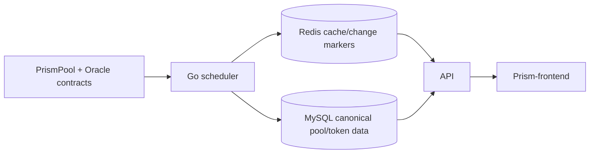

# prism backend

The backend consists of:

- API server: serve frontend/admin HTTP APIs, token list, pool data, login, websocket price push.

- Scheduler worker: read on-chain pool/oracle data and save snapshots into MySQL.



## Step 1: Runnable API Skeleton
- Build the smallest runnable backend API process.
- Keep configuration loading separate from HTTP route setup.
- Create a health endpoint before adding database, Redis, or contract logic.
- Establish the runtime path: `main -> config -> logger -> HTTP server`.

Files:

- `cmd/api/main.go`
- `internal/config/config.go`
- `internal/httpserver/server.go`
- `internal/logging/logger.go`

Run:

```bash
cd backend
PRISM_ENV=local PRISM_API_PORT=8081 go run ./cmd/api
```

Then open:

```bash
curl http://localhost:8080/healthz
```

Run Go Tests:

```bash
cd backend
# Run all Go tests in the current module, recursively.
go test ./...
```

## Step 2: Database models

- Model the three core backend tables from the original project: `poolbases`, `pooldata`, and `tokeninfo`.
- Keep chain values and token amounts as strings because contract values are large integer strings, not floats.
- Use `chainID + poolID` as the logical pool key.
- Use `chainID + token address` as the logical token key.
- Add a repository interface before adding MySQL so the API can depend on behavior instead of a concrete database driver.

For now, Step 2 uses an in-memory repository. MySQL comes later after the API shape is clear.

Files:

- `internal/store/models.go`
- `internal/store/repository.go`
- `internal/store/memory.go`
- `internal/store/memory_test.go`

Run:

```bash
cd backend
go test ./...
```

## Step 3: Pool and token Read-only API

- Expose the pools and tokens read-only API and keep route handlers thin: parse `chainId`, call the repository, return JSON.
- Serve data from the repository interface instead of hardcoding storage details into the HTTP layer.
- Use seeded memory data until the contract reader and MySQL store are added.

Files:
- `internal/httpserver/server.go`
- `internal/httpserver/server_test.go`
- `internal/store/seed.go`
- `internal/config/config.go`
- `cmd/api/main.go`

Run:

```bash
cd backend
PRISM_ENV=local PRISM_API_VERSION=1 PRISM_API_PORT=8080 go run ./cmd/api
```

Then query:

```bash
curl "http://localhost:8080/api/v1/poolBaseInfo?chainId=97"
curl "http://localhost:8081/api/v1/poolDataInfo?chainId=97"
curl "http://localhost:8080/api/v1/token?chainId=97"
```

Run Go Tests:

```bash
cd backend
go test ./...
```

## Step 4: Contract reader

- Define the boundary between backend code and on-chain contract reads.
- Keep raw contract-shaped data separate from database/API models.
- Translate contract indexes into API pool IDs: contract index `0` becomes
  `poolID = 1`.
- Sync pool base data, pool settlement data, and token metadata into the
  repository through one function.

Files:

- `internal/chain/reader.go`
- `internal/chain/demo_reader.go`
- `internal/chain/sync.go`
- `internal/chain/sync_test.go`
- `cmd/api/main.go`
- `internal/config/config.go`

Run:

```bash
cd backend
PRISM_ENV=local PRISM_CHAIN_ID=97 PRISM_API_VERSION=1 PRISM_API_PORT=8081 go run ./cmd/api
```

Then query:

```bash
curl "http://localhost:8080/api/v1/poolBaseInfo?chainId=97"
curl "http://localhost:8080/api/v1/poolDataInfo?chainId=97"
curl "http://localhost:8080/api/v1/token?chainId=97"
```

Run Go Tests:

```bash
cd backend
go test ./...
```

For now, Step 4 uses `DemoReader` instead of a real RPC client. The next real
reader can implement the same `chain.Reader` interface.

## Step 5: Scheduler

## Step 6: Admin auth

## Step 7: Price service

## Step 8: Multisig/admin config API