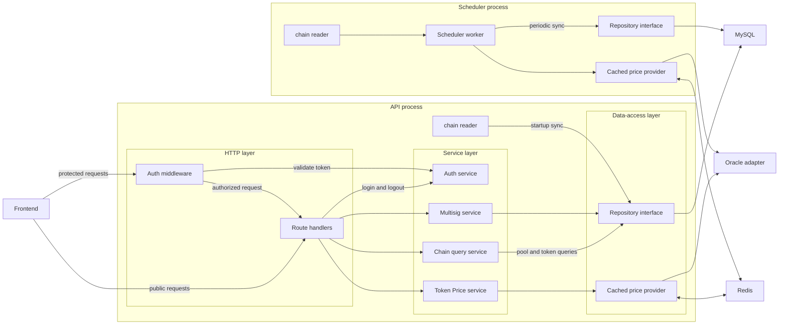

# Prism Backend

The Prism backend is a Go service that exposes pool, token, price, authentication, and multisignature-management APIs.
It contains two executables:

- `cmd/api` starts the HTTP server. On startup, it reads chain data and stores a snapshot in the configured repository (`memory` or `mysql`). Pool and token requests read that indexed data through the chain query service.
- `cmd/scheduler` periodically reads chain data, writes it to the configured repository, and refreshes the configured price quote through a Redis-backed cache.

Selecting MySQL for both executables gives the API and scheduler a shared, persistent repository.

Both executables use Redis to cache price quotes for the configured TTL. On a
cache miss, the cached provider fetches a fresh quote from the underlying price
provider.

Docker Compose runs the API, scheduler, MySQL, and Redis as separate containers on a shared network.



## API Endpoints

Health:

```text
GET  /healthz
```

Public read APIs:

```text
GET  /api/v1/poolBaseInfo?chainId=97
GET  /api/v1/poolDataInfo?chainId=97
GET  /api/v1/token?chainId=97
GET  /api/v1/price?symbol=PRM
```

Auth APIs:

```text
POST /api/v1/user/login
POST /api/v1/user/logout
```

Protected admin APIs:

```text
GET  /api/v1/admin/session
POST /api/v1/pool/setMultiSign
POST /api/v1/pool/getMultiSign
```

Protected routes require either header:

```text
Authorization: Bearer <tokenId>
```

The `/api/v1` prefix uses `PRISM_API_VERSION=1`.

## Cache

The API and scheduler use Redis to cache price quotes under keys such as
`price:PRM`. On a cache miss, they fetch the quote from the underlying provider
and store it for `PRISM_PRICE_CACHE_TTL`.

Redis config:

```text
PRISM_REDIS_ADDR=127.0.0.1:6379
PRISM_REDIS_PASSWORD=
PRISM_REDIS_DB=0
PRISM_PRICE_CACHE_TTL=30s
```

Run either process with Redis cache:

```bash
cd backend
PRISM_REDIS_ADDR=127.0.0.1:6379 \
PRISM_PRICE_CACHE_TTL=30s \
PRISM_API_PORT=8080 \
go run ./cmd/api

PRISM_REDIS_ADDR=127.0.0.1:6379 \
PRISM_PRICE_CACHE_TTL=30s \
PRISM_SYNC_INTERVAL=30s \
go run ./cmd/scheduler
```

Important:

```text
Redis must be running before starting the API or scheduler.
```

## Storage

The backend supports two storage modes:

```text
PRISM_STORE=memory
```

Use in-memory storage for tests and quick local runs. Each process owns a
separate in-memory repository, so the API and scheduler do not share state in
this mode.

```text
PRISM_STORE=mysql
```

Use MySQL so the API and scheduler share persistent indexed state.

Example MySQL DSN:

```text
PRISM_MYSQL_DSN="prism:prism@tcp(127.0.0.1:3306)/backend?parseTime=true&charset=utf8mb4&loc=Local"
```

The MySQL store creates these tables if they do not exist:

- `poolbases`
- `pooldata`
- `token_info`
- `multi_sign`

Run API with MySQL:

```bash
cd backend
PRISM_STORE=mysql \
PRISM_MYSQL_DSN="prism:prism@tcp(127.0.0.1:3306)/prism_backend?parseTime=true&charset=utf8mb4&loc=Local" \
PRISM_ENV=local \
PRISM_CHAIN_ID=97 \
PRISM_API_VERSION=1 \
PRISM_API_PORT=8080 \
go run ./cmd/api
```

Run scheduler with MySQL:

```bash
cd backend
PRISM_STORE=mysql \
PRISM_MYSQL_DSN="prism:prism@tcp(127.0.0.1:3306)/backend?parseTime=true&charset=utf8mb4&loc=Local" \
PRISM_ENV=local \
PRISM_CHAIN_ID=97 \
PRISM_SYNC_INTERVAL=30s \
go run ./cmd/scheduler
```

Important:

```text
Use parseTime=true in the DSN so MySQL DATETIME columns scan into Go time.Time.
```

## Docker Compose

Run the stack with API, scheduler, MySQL, and Redis:

```bash
cd backend
docker compose up --build
```

The API is exposed on the host at `http://localhost:8080`.

Quick checks:

```bash
curl http://localhost:8080/healthz
curl http://localhost:8080/api/v1/poolBaseInfo?chainId=97
curl http://localhost:8080/api/v1/price?symbol=PRM
```

Stop the stack:

```bash
docker compose down
```

Remove the MySQL volume too:

```bash
docker compose down -v
```

`Dockerfile` describes how to build the Go app image from source code. Docker Compose needs instructions for turning api and scheduler repo into runnable binaries:
```
RUN go build -o /out/api ./cmd/api
RUN go build -o /out/scheduler ./cmd/scheduler
```

`docker-compose.yml` describes which containers to run together.
```
run api
run scheduler
run mysql
run redis
connect them with env vars
expose API on localhost:8080
```

## Step 1: Runnable API Skeleton
- Build the smallest runnable backend API process.
- Keep configuration loading separate from HTTP route setup.
- Create a health endpoint before adding database, Redis, or contract logic.
- Establish the runtime path: `main -> config -> logger -> HTTP server`.

Files:

- `cmd/api/main.go`
- `internal/config/config.go`
- `internal/httpserver/server.go`
- `internal/logging/logger.go`

Run:

```bash
cd backend
PRISM_ENV=local PRISM_API_PORT=8080 go run ./cmd/api
```

Then open:

```bash
curl http://localhost:8080/healthz
```

Run Go Tests:

```bash
cd backend
# Run all Go tests in the current module, recursively.
go test ./...
```

## Step 2: Database models

- Model the three core backend tables from the original project: `poolbases`, `pooldata`, and `tokeninfo`.
- Keep chain values and token amounts as strings because contract values are large integer strings, not floats.
- Use `chainID + poolID` as the logical pool key.
- Use `chainID + token address` as the logical token key.
- Add a repository interface before adding MySQL so the API can depend on behavior instead of a concrete database driver.

For now, Step 2 uses an in-memory repository. MySQL comes later after the API shape is clear.

Files:

- `internal/store/models.go`
- `internal/store/repository.go`
- `internal/store/memory.go`
- `internal/store/memory_test.go`

Run:

```bash
cd backend
go test ./...
```

## Step 3: Pool and token Read-only API

- Expose the pools and tokens read-only API and keep route handlers thin: parse `chainId`, call the repository, return JSON.
- Serve data from the repository interface instead of hardcoding storage details into the HTTP layer.
- Use seeded memory data until the contract reader and MySQL store are added.

Files:
- `internal/httpserver/server.go`
- `internal/httpserver/server_test.go`
- `internal/store/seed.go`
- `internal/config/config.go`
- `cmd/api/main.go`

Run:

```bash
cd backend
PRISM_ENV=local PRISM_API_VERSION=1 PRISM_API_PORT=8080 go run ./cmd/api
```

Then query:

```bash
curl "http://localhost:8080/api/v1/poolBaseInfo?chainId=97"
curl "http://localhost:8080/api/v1/poolDataInfo?chainId=97"
curl "http://localhost:8080/api/v1/token?chainId=97"
```

Run Go Tests:

```bash
cd backend
go test ./...
```

## Step 4: Contract reader

- Define the boundary between backend code and on-chain contract reads.
- Keep raw contract-shaped data separate from database/API models.
- Translate contract indexes into API pool IDs: contract index `0` becomes
  `poolID = 1`.
- Sync pool base data, pool settlement data, and token metadata into the
  repository through one function.

Files:

- `internal/chain/reader.go`
- `internal/chain/demo_reader.go`
- `internal/chain/sync.go`
- `internal/chain/sync_test.go`
- `cmd/api/main.go`
- `internal/config/config.go`

Run:

```bash
cd backend
PRISM_ENV=local PRISM_CHAIN_ID=97 PRISM_API_VERSION=1 PRISM_API_PORT=8080 go run ./cmd/api
```

Then query:

```bash
curl "http://localhost:8080/api/v1/poolBaseInfo?chainId=97"
curl "http://localhost:8080/api/v1/poolDataInfo?chainId=97"
curl "http://localhost:8080/api/v1/token?chainId=97"
```

Run Go Tests:

```bash
cd backend
go test ./...
```

For now, Step 4 uses `DemoReader` instead of a real RPC client. The next real
reader can implement the same `chain.Reader` interface.

## Step 5: Scheduler

- Build the second backend process: a scheduler worker.
- Reuse the same `chain.SyncPools` function from the API bootstrap path.
- Run one sync immediately, then repeat on `PRISM_SYNC_INTERVAL`.
- Keep failures isolated to one sync attempt so the worker can keep running.

The scheduler selects its repository with `PRISM_STORE`. Memory is the default;
select MySQL when its snapshots must be shared with the API.

Files:

- `cmd/scheduler/main.go`
- `internal/scheduler/pool_syncer.go`
- `internal/scheduler/pool_syncer_test.go`
- `internal/config/config.go`

Run:

```bash
cd backend
PRISM_ENV=local PRISM_CHAIN_ID=97 PRISM_SYNC_INTERVAL=30s go run ./cmd/scheduler
```

Run Go Tests:

```bash
cd backend
go test ./...
```

## Step 6: Admin auth (custom bearer-token authentication using HMAC-SHA256)

- Add config-driven admin credentials.
- Issue signed tokens after login.
- Track active sessions in memory so logout can revoke a token.
- Protect admin routes with auth middleware.

Important for this checkpoint:

```text
Sessions are still in memory. Redis will be added later to store login state
so logout survives across API processes.
```

Files:

- `internal/auth/service.go`
- `internal/auth/service_test.go`
- `internal/httpserver/server.go`
- `internal/httpserver/server_test.go`
- `internal/config/config.go`
- `cmd/api/main.go`

Run:

```bash
cd backend
PRISM_ENV=local \
PRISM_CHAIN_ID=97 \
PRISM_API_VERSION=1 \
PRISM_API_PORT=8080 \
PRISM_ADMIN_USERNAME=admin \
PRISM_ADMIN_PASSWORD=password \
PRISM_TOKEN_SECRET=local-secret \
PRISM_TOKEN_TTL=1h \
go run ./cmd/api
```

Login:

```bash
curl -X POST "http://localhost:8080/api/v1/user/login" \
  -H "Content-Type: application/json" \
  -d '{"name":"admin","password":"password"}'
```

Use the returned `tokenId`:

```bash
curl "http://localhost:8080/api/v1/admin/session" \
  -H "Authorization: Bearer <tokenId>"
```

Logout:

```bash
curl -X POST "http://localhost:8080/api/v1/user/logout" \
  -H "Authorization: Bearer <tokenId>"
```

Run Go Tests:

```bash
cd backend
go test ./...
```

## Step 7: Price service

- Add a dedicated price service instead of mixing price logic into HTTP routes.
- Keep the price provider behind an interface so a future oracle provider can replace the demo provider.
- Expose `GET /api/v1/price?symbol=PRISM` for a simple latest-price read.
- Let the scheduler refresh/log the configured price symbol on each sync cycle.

Files:

- `internal/price/service.go`
- `internal/price/demo_provider.go`
- `internal/price/service_test.go`
- `internal/httpserver/server.go`
- `internal/httpserver/server_test.go`
- `internal/scheduler/pool_syncer.go`
- `internal/config/config.go`
- `cmd/api/main.go`
- `cmd/scheduler/main.go`

Run API:

```bash
cd backend
PRISM_ENV=local \
PRISM_CHAIN_ID=97 \
PRISM_API_VERSION=1 \
PRISM_API_PORT=8080 \
PRISM_PRICE_SYMBOL=PRM \
go run ./cmd/api
```

Query latest price:

```bash
curl "http://localhost:8080/api/v1/price?symbol=PRM"
```

Run scheduler:

```bash
cd backend
PRISM_ENV=local \
PRISM_CHAIN_ID=97 \
PRISM_SYNC_INTERVAL=30s \
PRISM_PRICE_SYMBOL=PRM \
go run ./cmd/scheduler
```

Run Go Tests:

```bash
cd backend
go test ./...
```

## Step 8: Multisig/admin config API

- Add protected admin endpoints for chain-specific multisig metadata.
- Store one multisig config per chain ID.
- Require admin auth before reading or writing admin config.

Files:

- `internal/multisig/service.go`
- `internal/multisig/service_test.go`
- `internal/httpserver/server.go`
- `internal/httpserver/server_test.go`
- `cmd/api/main.go`

Run API:

```bash
cd backend
PRISM_ENV=local \
PRISM_CHAIN_ID=97 \
PRISM_API_VERSION=1 \
PRISM_API_PORT=8080 \
PRISM_ADMIN_USERNAME=admin \
PRISM_ADMIN_PASSWORD=password \
PRISM_TOKEN_SECRET=local-secret \
go run ./cmd/api
```

Login:

```bash
curl -X POST "http://localhost:8080/api/v1/user/login" \
  -H "Content-Type: application/json" \
  -d '{"name":"admin","password":"password"}'
```

Set multisig config:

```bash
curl -X POST "http://localhost:8080/api/v1/pool/setMultiSign" \
  -H "Authorization: Bearer <tokenId>" \
  -H "Content-Type: application/json" \
  -d '{
    "chain_id":"97",
    "sp_name":"SP",
    "_spToken":"SP",
    "jp_name":"JP",
    "_jpToken":"JP",
    "sp_address":"0xsp",
    "jp_address":"0xjp",
    "spHash":"0xsphash",
    "jpHash":"0xjphash",
    "multi_sign_account":["0xowner1","0xowner2"]
  }'
```

Get multisig config:

```bash
curl -X POST "http://localhost:8080/api/v1/pool/getMultiSign" \
  -H "Authorization: Bearer <tokenId>" \
  -H "Content-Type: application/json" \
  -d '{"chain_id":"97"}'
```

Run Go Tests:

```bash
cd backend
go test ./...
```

## Step 9: Shared store and MySQL

- Merge multisig persistence into the shared `store.Repository`.
- Use one repository dependency for pool data, token metadata, and multisig config.
- Keep `internal/multisig` focused on validation and service behavior.
- Add a MySQL-backed store behind the same repository interfaces used by the API and scheduler.
- Preserve the backend's table concepts: pool base snapshots, pool settlement data, token metadata, and multisig config.

Files:

- `internal/store/mysql.go`
- `internal/store/memory.go`
- `internal/store/memory_test.go`
- `internal/store/repository.go`
- `internal/multisig/service.go`
- `cmd/api/main.go`
- `cmd/scheduler/main.go`
- `internal/config/config.go`
- `go.mod`
- `go.sum`

Run with memory:

```bash
cd backend
PRISM_STORE=memory go test ./...
```

Run API with MySQL:

```bash
cd backend
PRISM_STORE=mysql \
PRISM_MYSQL_DSN="prism:prism@tcp(127.0.0.1:3306)/backend?parseTime=true&charset=utf8mb4&loc=Local" \
PRISM_CHAIN_ID=97 \
PRISM_API_VERSION=1 \
PRISM_API_PORT=8080 \
go run ./cmd/api
```

Run scheduler with MySQL:

```bash
cd backend
PRISM_STORE=mysql \
PRISM_MYSQL_DSN="prism:prism@tcp(127.0.0.1:3306)/backend?parseTime=true&charset=utf8mb4&loc=Local" \
PRISM_CHAIN_ID=97 \
PRISM_SYNC_INTERVAL=30s \
go run ./cmd/scheduler
```
Notes:
```text
Memory remains the default so tests and quick demos do not need a database.
When PRISM_STORE=mysql is selected, API and scheduler can share indexed state through MySQL.
```
