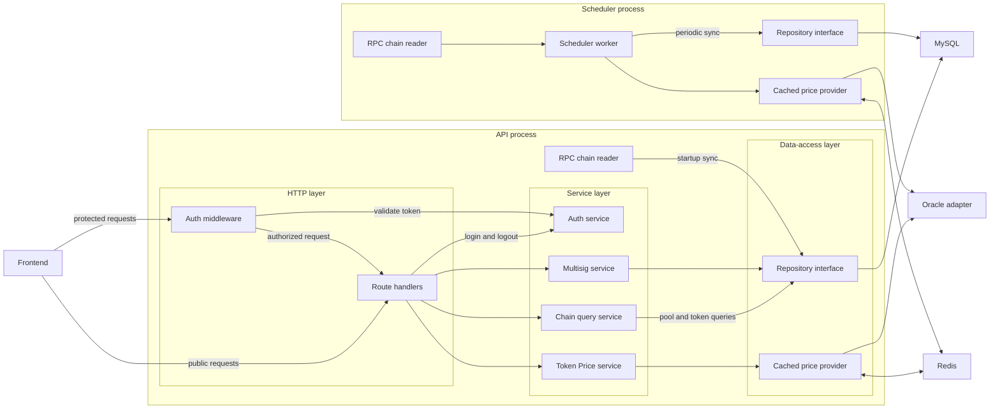

# Prism Backend

The Prism backend is a Go service that exposes pool, token, price, authentication, and multisignature-management APIs.
It contains two executables:

- `cmd/api` starts the HTTP server. On startup, it reads chain data over Ethereum JSON-RPC and stores a snapshot in the configured repository (`memory` or `mysql`). Pool and token requests read that indexed data through the chain query service.
- `cmd/scheduler` periodically reads chain data over Ethereum JSON-RPC, writes it to the configured repository, and refreshes the configured price quote through a Redis-backed cache.

Both executables require `PRISM_POOL_ADDRESS`; the API also requires `PRISM_MULTISIG_ADDRESS`. They use `PRISM_CHAIN_RPC_URL=http://127.0.0.1:8545` by default and verify that the RPC chain ID matches `PRISM_CHAIN_ID`. `FakeReader` is used only by tests.

Selecting MySQL for both executables gives the API and scheduler a shared, persistent repository.

Both executables use Redis to cache price quotes for the configured TTL. On a cache miss, the cached provider fetches a fresh quote from the underlying price provider.

Docker Compose runs the API, scheduler, MySQL, and Redis as separate containers on a shared network.


```mermaid
flowchart LR
  Client[Frontend] -->|public requests| Routes
  Client -->|protected requests| AuthMiddleware

  subgraph APIProcess[API process]
    direction TB
    subgraph HTTPAPI[HTTP layer]
      AuthMiddleware[Auth middleware]
      Routes[Route handlers]
      AuthMiddleware -->|authorized request| Routes
    end

    subgraph APIServices[Service layer]
      Auth[Auth service]
      ChainService[Chain query service]
      MultiSig[Multisig service]
      PriceService[Token Price service]
    end

    subgraph APIData[Data-access layer]
      APIRepo[Repository interface]
      APICachedProvider[Cached price provider]
    end

    Routes -->|login and logout| Auth
    AuthMiddleware -->|validate token| Auth
    Routes --> ChainService
    Routes --> MultiSig
    Routes --> PriceService
    ChainService -->|pool and token queries| APIRepo
    MultiSig --> APIRepo
    PriceService --> APICachedProvider
    RPCChainA[RPC chain reader] -->|startup sync| APIRepo
  end

  subgraph SchedulerProcess[Scheduler process]
    Scheduler[Scheduler worker] -->|periodic sync| SchedulerRepo[Repository interface]
    RPCChainS[RPC chain reader] --> Scheduler
    Scheduler --> SchedulerCachedProvider[Cached price provider]
  end

  APICachedProvider --> OracleAdapter[Oracle adapter]
  SchedulerCachedProvider --> OracleAdapter[Oracle adapter]
  APIRepo --> MySQL
  SchedulerRepo --> MySQL
  APICachedProvider <--> Redis
  SchedulerCachedProvider <--> Redis
```

## API Endpoints

Health:

```text
GET  /healthz
```

Public read APIs:

```text
GET  /api/v1/poolBaseInfo?chainId=31337
GET  /api/v1/poolDataInfo?chainId=31337
GET  /api/v1/token?chainId=31337
GET  /api/v1/price?symbol=PRM
```

Auth APIs:

```text
POST /api/v1/user/login
POST /api/v1/user/logout
```

Protected admin APIs:

```text
GET  /api/v1/admin/session
POST /api/v1/multisig/proposals
```

Public multisig reads:

```text
GET /api/v1/multisig
GET /api/v1/multisig/proposals/{txHash}
```

Protected routes require either header:

```text
Authorization: Bearer <tokenId>
```

The `/api/v1` prefix uses `PRISM_API_VERSION=1`.

## Chain RPC

Start the local Hardhat node and deploy the protocol before either backend process. Use a Docker-reachable bind address when running the backend through Compose:

```bash
cd protocol
npx hardhat node --hostname 0.0.0.0
```

In another terminal:

```bash
cd protocol
npm run deploy:local
```

Use the `chainId`, `rpcUrl`, `prismPool`, and `multisig` values printed by the deployment:

```text
PRISM_CHAIN_ID=31337
PRISM_CHAIN_RPC_URL=http://127.0.0.1:8545
PRISM_POOL_ADDRESS=0x...
PRISM_MULTISIG_ADDRESS=0x...
```

The API and scheduler fail at startup when the RPC connection, chain ID, or
pool address is invalid. The API also verifies that `PrismPool.owner()` equals `PRISM_MULTISIG_ADDRESS`.

### Prepare a multisig proposal

The configured contract at `PRISM_MULTISIG_ADDRESS` is the source of truth for owners and threshold. One proposal request encodes both the inner operation and its multisig approval and execution transactions. Pool creation, settlement, repayment, and liquidation are available as the `create_pool`, `settle_pool`, `repay_pool`, and `liquidate_pool` operations; there are no direct pool-owner transaction endpoints because individual wallets do not own `PrismPool`.

To prepare an owner update:

```bash
curl -X POST http://localhost:8080/api/v1/multisig/proposals \
  -H "Authorization: Bearer $TOKEN_ID" \
  -H "Content-Type: application/json" \
  -d '{
    "chain_id": "31337",
    "nonce": "1",
    "operation": {
      "type": "add_owner",
      "params": {
        "owner": "0x3000000000000000000000000000000000000003"
      }
    }
  }'
```

Supported configuration operations and their additional fields are:

- `add_owner`: `owner`
- `remove_owner`: `owner`
- `replace_owner`: `old_owner` and `new_owner`
- `change_threshold`: `threshold`

Each operation puts its fields inside `params`. Fields belonging to a different operation are rejected rather than silently ignored.

For multisig-controlled pool creation, use `create_pool` and put the normal pool fields in the same operation object:

```json
{
  "chain_id": "31337",
  "nonce": "2",
  "operation": {
    "type": "create_pool",
    "params": {
      "settleTime": "2000000000",
      "maturityTime": "2000600000",
      "interestRate": "1000000",
      "maxLendSupply": "1000000000000000000000",
      "collateralizationRatio": "200000000",
      "lendToken": "0x...",
      "collateralToken": "0x...",
      "lenderPositionToken": "0x...",
      "borrowerPositionToken": "0x...",
      "liquidateRate": "20000000"
    }
  }
}
```

`nonce` is a non-negative decimal string chosen by the caller. Clients should use a unique nonce for each proposal.

To prepare settlement for an existing pool, use its zero-based on-chain pool ID:

```json
{
  "chain_id": "31337",
  "nonce": "3",
  "operation": {
    "type": "settle_pool",
    "params": {
      "poolId": "0"
    }
  }
}
```

`poolId` must be a non-negative decimal string within the Solidity `uint256`
range. Settlement still succeeds only when the contract's normal settlement
conditions are met; preparing a proposal does not preflight the eventual
on-chain execution.

To prepare repayment for an active pool after maturity, provide the zero-based on-chain pool ID and the most collateral the transaction may sell:

```json
{
  "chain_id": "31337",
  "nonce": "4",
  "operation": {
    "type": "repay_pool",
    "params": {
      "poolId": "1",
      "maxCollateralAmount": "5000000000000000000"
    }
  }
}
```

`maxCollateralAmount` must be a positive decimal string within the Solidity `uint256` range and is denominated in the collateral token's smallest unit.
The backend validates the proposal inputs and calldata encoding. The contract still enforces pool state, maturity, DEX liquidity, and whether the maximum is sufficient when the multisig executes the transaction.

To prepare liquidation of an undercollateralized active pool:

```json
{
  "chain_id": "31337",
  "nonce": "5",
  "operation": {
    "type": "liquidate_pool",
    "params": {
      "poolId": "1",
      "maxCollateralAmount": "5000000000000000000"
    }
  }
}
```

Liquidation uses the same input rules as repayment: `poolId` is a non-negative decimal `uint256`, and `maxCollateralAmount` is a positive decimal `uint256` denominated in the collateral token's smallest unit. The contract enforces that the pool is active and undercollateralized and that the swap can execute within the supplied collateral limit.

The response contains the canonical inner `proposal` plus an unsigned `approvalTransaction` and `executionTransaction`.

Every required owner wallet signs and broadcasts the identical approval transaction. After its on-chain approval count reaches the current threshold, an owner signs and broadcasts the execution transaction. The backend prepares calldata only; it never signs or broadcasts either transaction.

```json
{
  "data": {
    "proposal": {
      "transactionHash": "0xProposalHash",
      "operation": "add_owner",
      "target": "0xMultisig",
      "value": "0x0",
      "data": "0xAddOwnerCalldata",
      "nonce": "1"
    },
    "approvalTransaction": {
      "to": "0xMultisig",
      "data": "0xApproveTransactionCalldata",
      "value": "0x0",
      "chainId": "31337"
    },
    "executionTransaction": {
      "to": "0xMultisig",
      "data": "0xExecuteTransactionCalldata",
      "value": "0x0",
      "chainId": "31337"
    }
  }
}
```

Read approval and execution status directly from the contract:

```bash
curl "http://localhost:8080/api/v1/multisig/proposals/0xProposalHash"
```

The response reports the current owners, each owner's approval, approval count, threshold, execution state, and whether the proposal was approved under the current multisig configuration. `readyToExecute` is true only when the threshold is reached, the proposal configuration is still valid, and the proposal has not executed.

## Cache

The API and scheduler use Redis to cache price quotes under keys such as `price:PRM`. On a cache miss, they fetch the quote from the underlying provider and store it for `PRISM_PRICE_CACHE_TTL`.

Redis config:

```text
PRISM_REDIS_ADDR=127.0.0.1:6379
PRISM_REDIS_PASSWORD=
PRISM_REDIS_DB=0
PRISM_PRICE_CACHE_TTL=30s
```

Run either process with Redis cache:

```bash
cd backend
PRISM_REDIS_ADDR=127.0.0.1:6379 \
PRISM_PRICE_CACHE_TTL=30s \
PRISM_CHAIN_ID=31337 \
PRISM_POOL_ADDRESS=0x... \
PRISM_MULTISIG_ADDRESS=0x... \
PRISM_API_PORT=8080 \
go run ./cmd/api

PRISM_REDIS_ADDR=127.0.0.1:6379 \
PRISM_PRICE_CACHE_TTL=30s \
PRISM_CHAIN_ID=31337 \
PRISM_POOL_ADDRESS=0x... \
PRISM_SYNC_INTERVAL=30s \
go run ./cmd/scheduler
```

Important:

```text
Redis must be running before starting the API or scheduler.
```

## Storage

The backend supports two storage modes:

```text
PRISM_STORE=memory
```

Use in-memory storage for tests and quick local runs. Each process owns a
separate in-memory repository, so the API and scheduler do not share state in
this mode.

```text
PRISM_STORE=mysql
```

Use MySQL so the API and scheduler share persistent indexed state.

Example MySQL DSN:

```text
PRISM_MYSQL_DSN="prism:prism@tcp(127.0.0.1:3306)/backend?parseTime=true&charset=utf8mb4&loc=Local"
```

The MySQL store creates these tables if they do not exist:

- `poolbases`
- `pooldata`
- `token_info`

Run API with MySQL:

```bash
cd backend
PRISM_STORE=mysql \
PRISM_MYSQL_DSN="prism:prism@tcp(127.0.0.1:3306)/prism_backend?parseTime=true&charset=utf8mb4&loc=Local" \
PRISM_ENV=local \
PRISM_CHAIN_ID=31337 \
PRISM_API_VERSION=1 \
PRISM_API_PORT=8080 \
go run ./cmd/api
```

Run scheduler with MySQL:

```bash
cd backend
PRISM_STORE=mysql \
PRISM_MYSQL_DSN="prism:prism@tcp(127.0.0.1:3306)/backend?parseTime=true&charset=utf8mb4&loc=Local" \
PRISM_ENV=local \
PRISM_CHAIN_ID=31337 \
PRISM_SYNC_INTERVAL=30s \
go run ./cmd/scheduler
```

Important:

```text
Use parseTime=true in the DSN so MySQL DATETIME columns scan into Go time.Time.
```

## Docker Compose

Run the stack with API, scheduler, MySQL, and Redis:

```bash
cd backend
PRISM_POOL_ADDRESS=0x... \
PRISM_MULTISIG_ADDRESS=0x... \
docker compose up --build
```

Compose connects the API and scheduler to the Hardhat node running on the host
and uses chain ID `31337`. On Linux, Compose maps `host.docker.internal` to Docker's host gateway:

```yaml
extra_hosts:
  - "host.docker.internal:host-gateway"
```

The gateway is commonly `172.17.0.1`, not `127.0.0.1`, because loopback inside a container refers to that container. The mapping identifies how to reach the host, while `--hostname 0.0.0.0` makes Hardhat accept the connection on the host's Docker bridge interface. Both pieces are required for this setup.

Binding Hardhat to `0.0.0.0` is for local development only and may expose its development accounts and RPC methods to the local network, depending on the host firewall.

The API is exposed on the host at `http://localhost:8080`.

Quick checks:

```bash
curl http://localhost:8080/healthz
curl http://localhost:8080/api/v1/poolBaseInfo?chainId=31337
curl http://localhost:8080/api/v1/price?symbol=PRM
```

Stop the stack:

```bash
docker compose down
```

Remove the MySQL volume too:

```bash
docker compose down -v
```

`Dockerfile` describes how to build the Go app image from source code. Docker Compose needs instructions for turning api and scheduler repo into runnable binaries:
```
RUN go build -o /out/api ./cmd/api
RUN go build -o /out/scheduler ./cmd/scheduler
```

`docker-compose.yml` describes which containers to run together.
```
run api
run scheduler
run mysql
run redis
connect them with env vars
expose API on localhost:8080
```

## Step 1: Runnable API Skeleton
- Build the smallest runnable backend API process.
- Keep configuration loading separate from HTTP route setup.
- Create a health endpoint before adding database, Redis, or contract logic.
- Establish the runtime path: `main -> config -> logger -> HTTP server`.

Files:

- `cmd/api/main.go`
- `internal/config/config.go`
- `internal/httpserver/server.go`
- `internal/logging/logger.go`

Run:

```bash
cd backend
PRISM_ENV=local PRISM_API_PORT=8080 go run ./cmd/api
```

Then open:

```bash
curl http://localhost:8080/healthz
```

Run Go Tests:

```bash
cd backend
# Run all Go tests in the current module, recursively.
go test ./...
```

## Step 2: Database models

- Model the three core backend tables from the original project: `poolbases`, `pooldata`, and `tokeninfo`.
- Keep chain values and token amounts as strings because contract values are large integer strings, not floats.
- Use `chainID + poolID` as the logical pool key.
- Use `chainID + token address` as the logical token key.
- Add a repository interface before adding MySQL so the API can depend on behavior instead of a concrete database driver.

For now, Step 2 uses an in-memory repository. MySQL comes later after the API shape is clear.

Files:

- `internal/store/models.go`
- `internal/store/repository.go`
- `internal/store/memory.go`
- `internal/store/memory_test.go`

Run:

```bash
cd backend
go test ./...
```

## Step 3: Pool and token Read-only API

- Expose the pools and tokens read-only API and keep route handlers thin: parse `chainId`, call the repository, return JSON.
- Serve data from the repository interface instead of hardcoding storage details into the HTTP layer.
- Use seeded memory data until the contract reader and MySQL store are added.

Files:
- `internal/httpserver/server.go`
- `internal/httpserver/server_test.go`
- `internal/store/seed.go`
- `internal/config/config.go`
- `cmd/api/main.go`

Run:

```bash
cd backend
PRISM_ENV=local PRISM_API_VERSION=1 PRISM_API_PORT=8080 go run ./cmd/api
```

Then query:

```bash
curl "http://localhost:8080/api/v1/poolBaseInfo?chainId=31337"
curl "http://localhost:8080/api/v1/poolDataInfo?chainId=31337"
curl "http://localhost:8080/api/v1/token?chainId=31337"
```

Run Go Tests:

```bash
cd backend
go test ./...
```

## Step 4: Contract reader

- Define the boundary between backend code and on-chain contract reads.
- Keep raw contract-shaped data separate from database/API models.
- Translate contract indexes into API pool IDs: contract index `0` becomes
  `poolID = 1`.
- Sync pool base data, pool settlement data, and token metadata into the
  repository through one function.

Files:

- `internal/chain/reader.go`
- `internal/chain/demo_reader.go`
- `internal/chain/sync.go`
- `internal/chain/sync_test.go`
- `cmd/api/main.go`
- `internal/config/config.go`

Run:

```bash
cd backend
PRISM_ENV=local PRISM_CHAIN_ID=31337 PRISM_API_VERSION=1 PRISM_API_PORT=8080 go run ./cmd/api
```

Then query:

```bash
curl "http://localhost:8080/api/v1/poolBaseInfo?chainId=31337"
curl "http://localhost:8080/api/v1/poolDataInfo?chainId=31337"
curl "http://localhost:8080/api/v1/token?chainId=31337"
```

Run Go Tests:

```bash
cd backend
go test ./...
```

This step originally used a fake reader while the API shape was being built. The current API and scheduler use `RPCReader` in all runtime environments, including the local Hardhat network. Unit tests use `FakeReader` as a deterministic `chain.Reader` fixture.

## Step 5: Scheduler

- Build the second backend process: a scheduler worker.
- Reuse the same `chain.SyncPools` function from the API bootstrap path.
- Run one sync immediately, then repeat on `PRISM_SYNC_INTERVAL`.
- Keep failures isolated to one sync attempt so the worker can keep running.

The scheduler selects its repository with `PRISM_STORE`. Memory is the default;
select MySQL when its snapshots must be shared with the API.

Files:

- `cmd/scheduler/main.go`
- `internal/scheduler/pool_syncer.go`
- `internal/scheduler/pool_syncer_test.go`
- `internal/config/config.go`

Run:

```bash
cd backend
PRISM_ENV=local PRISM_CHAIN_ID=31337 PRISM_SYNC_INTERVAL=30s go run ./cmd/scheduler
```

Run Go Tests:

```bash
cd backend
go test ./...
```

## Step 6: Admin auth (custom bearer-token authentication using HMAC-SHA256)

- Add config-driven admin credentials.
- Issue signed tokens after login.
- Track active sessions in memory so logout can revoke a token.
- Protect admin routes with auth middleware.

Important for this checkpoint:

```text
Sessions are still in memory. Redis will be added later to store login state
so logout survives across API processes.
```

Files:

- `internal/auth/service.go`
- `internal/auth/service_test.go`
- `internal/httpserver/server.go`
- `internal/httpserver/server_test.go`
- `internal/config/config.go`
- `cmd/api/main.go`

Run:

```bash
cd backend
PRISM_ENV=local \
PRISM_CHAIN_ID=31337 \
PRISM_API_VERSION=1 \
PRISM_API_PORT=8080 \
PRISM_ADMIN_USERNAME=admin \
PRISM_ADMIN_PASSWORD=password \
PRISM_TOKEN_SECRET=local-secret \
PRISM_TOKEN_TTL=1h \
go run ./cmd/api
```

Login:

```bash
curl -X POST "http://localhost:8080/api/v1/user/login" \
  -H "Content-Type: application/json" \
  -d '{"name":"admin","password":"password"}'
```

Use the returned `tokenId`:

```bash
curl "http://localhost:8080/api/v1/admin/session" \
  -H "Authorization: Bearer <tokenId>"
```

Logout:

```bash
curl -X POST "http://localhost:8080/api/v1/user/logout" \
  -H "Authorization: Bearer <tokenId>"
```

Run Go Tests:

```bash
cd backend
go test ./...
```

## Step 7: Price service

- Add a dedicated price service instead of mixing price logic into HTTP routes.
- Keep the price provider behind an interface so a future oracle provider can replace the demo provider.
- Expose `GET /api/v1/price?symbol=PRISM` for a simple latest-price read.
- Let the scheduler refresh/log the configured price symbol on each sync cycle.

Files:

- `internal/price/service.go`
- `internal/price/demo_provider.go`
- `internal/price/service_test.go`
- `internal/httpserver/server.go`
- `internal/httpserver/server_test.go`
- `internal/scheduler/pool_syncer.go`
- `internal/config/config.go`
- `cmd/api/main.go`
- `cmd/scheduler/main.go`

Run API:

```bash
cd backend
PRISM_ENV=local \
PRISM_CHAIN_ID=31337 \
PRISM_API_VERSION=1 \
PRISM_API_PORT=8080 \
PRISM_PRICE_SYMBOL=PRM \
go run ./cmd/api
```

Query latest price:

```bash
curl "http://localhost:8080/api/v1/price?symbol=PRM"
```

Run scheduler:

```bash
cd backend
PRISM_ENV=local \
PRISM_CHAIN_ID=31337 \
PRISM_SYNC_INTERVAL=30s \
PRISM_PRICE_SYMBOL=PRM \
go run ./cmd/scheduler
```

Run Go Tests:

```bash
cd backend
go test ./...
```

## Step 8: Multisig chain API

- Read owners, threshold, and proposal status from `ThresholdMultiSig`.
- Configure the deployed contract with `PRISM_MULTISIG_ADDRESS`.
- Require admin auth only when preparing a proposal.

Files:

- `internal/multisig/reader.go`
- `internal/multisig/transaction.go`
- `internal/multisig/transaction_test.go`
- `internal/httpserver/server.go`
- `internal/httpserver/server_test.go`
- `cmd/api/main.go`

Run API:

```bash
cd backend
PRISM_ENV=local \
PRISM_CHAIN_ID=31337 \
PRISM_API_VERSION=1 \
PRISM_API_PORT=8080 \
PRISM_ADMIN_USERNAME=admin \
PRISM_ADMIN_PASSWORD=password \
PRISM_TOKEN_SECRET=local-secret \
go run ./cmd/api
```

Login:

```bash
curl -X POST "http://localhost:8080/api/v1/user/login" \
  -H "Content-Type: application/json" \
  -d '{"name":"admin","password":"password"}'
```

Read the on-chain multisig config:

```bash
curl "http://localhost:8080/api/v1/multisig"
```

Read an on-chain proposal status:

```bash
curl "http://localhost:8080/api/v1/multisig/proposals/<txHash>"
```

Run Go Tests:

```bash
cd backend
go test ./...
```

## Step 9: Shared pool store and MySQL

- Use one repository dependency for pool data and token metadata.
- Add a MySQL-backed store behind the same repository interfaces used by the API and scheduler.
- Preserve the backend's table concepts: pool base snapshots, pool settlement data, and token metadata.

Files:

- `internal/store/mysql.go`
- `internal/store/memory.go`
- `internal/store/memory_test.go`
- `internal/store/repository.go`
- `cmd/api/main.go`
- `cmd/scheduler/main.go`
- `internal/config/config.go`
- `go.mod`
- `go.sum`

Run with memory:

```bash
cd backend
PRISM_STORE=memory go test ./...
```

Run API with MySQL:

```bash
cd backend
PRISM_STORE=mysql \
PRISM_MYSQL_DSN="prism:prism@tcp(127.0.0.1:3306)/backend?parseTime=true&charset=utf8mb4&loc=Local" \
PRISM_CHAIN_ID=31337 \
PRISM_API_VERSION=1 \
PRISM_API_PORT=8080 \
go run ./cmd/api
```

Run scheduler with MySQL:

```bash
cd backend
PRISM_STORE=mysql \
PRISM_MYSQL_DSN="prism:prism@tcp(127.0.0.1:3306)/backend?parseTime=true&charset=utf8mb4&loc=Local" \
PRISM_CHAIN_ID=31337 \
PRISM_SYNC_INTERVAL=30s \
go run ./cmd/scheduler
```
Notes:
```text
Memory remains the default so tests and quick demos do not need a database.
When PRISM_STORE=mysql is selected, API and scheduler can share indexed state through MySQL.
```
### Pool lifecycle proposals

The backend prepares all owner-controlled pool lifecycle calls through `POST /api/v1/multisig/proposals`: `create_pool`, `settle_pool`, `repay_pool`, and `liquidate_pool`. Each operation validates its parameters, encodes the corresponding `PrismPool` call, and wraps that calldata in the existing prepare–approve–execute multisig workflow.
