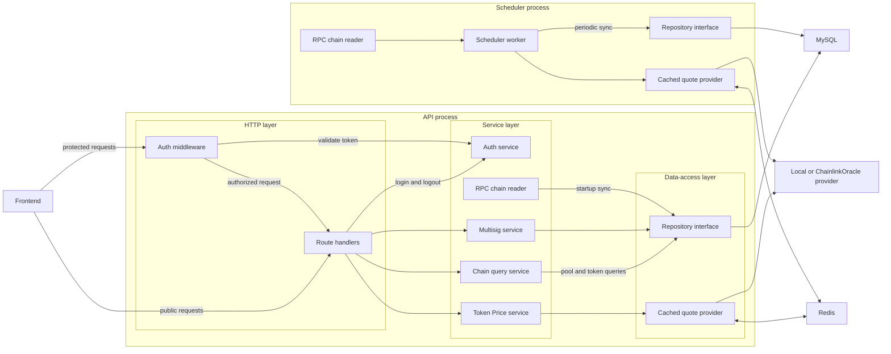

# Prism Backend

The Prism backend is a Go service that exposes pool, token, quote, authentication, and multisignature-management APIs.
It contains three executables:

- `cmd/api` starts the HTTP server. On startup, it reads chain data over Ethereum JSON-RPC and stores a snapshot in the configured repository (`memory` or `mysql`). Pool and token requests read that indexed data through the chain query service.
- `cmd/scheduler` periodically reads chain data over Ethereum JSON-RPC, writes it to the configured repository, and refreshes the configured price quote through a Redis-backed cache.
- `cmd/migrate` applies ordered MySQL schema migrations and exits.

The API and scheduler require `PRISM_POOL_ADDRESS`; production also requires `PRISM_ORACLE_ADDRESS` and `PRISM_PRICE_TOKEN_ADDRESSES`, while the API additionally requires `PRISM_MULTISIG_ADDRESS`. They use `PRISM_CHAIN_RPC_URL=http://127.0.0.1:8545` by default and verify that the RPC chain ID matches `PRISM_CHAIN_ID`. `FakeReader` is used only by tests.

Selecting MySQL for both executables gives the API and scheduler a shared, persistent repository.

Both executables use Redis to cache price quotes for the configured TTL. The
API also stores active login sessions in Redis, so authentication and logout
remain consistent across restarts and multiple API replicas. On a price-cache
miss, the cached provider fetches a fresh quote from the underlying price
provider.

Docker Compose runs the API, scheduler, MySQL, and Redis as separate containers on a shared network.


```mermaid
flowchart LR
  Client[Frontend] -->|public requests| Routes
  Client -->|protected requests| AuthMiddleware

  subgraph APIProcess[API process]
    direction TB
    subgraph HTTPAPI[HTTP layer]
      AuthMiddleware[Auth middleware]
      Routes[Route handlers]
      AuthMiddleware -->|authorized request| Routes
    end

    subgraph APIServices[Service layer]
      Auth[Auth service]
      ChainService[Chain query service]
      MultiSig[Multisig service]
      PriceService[Token Price service]
      RPCChainA[RPC chain reader]
    end

    subgraph APIData[Data-access layer]
      APIRepo[Repository interface]
      APICachedQuoteProvider[Cached quote provider]
    end

    Routes -->|login and logout| Auth
    AuthMiddleware -->|validate token| Auth
    Routes --> ChainService
    Routes --> MultiSig
    Routes --> PriceService
    ChainService -->|pool and token queries| APIRepo
    MultiSig --> APIRepo
    PriceService --> APICachedQuoteProvider
    RPCChainA[RPC chain reader] -->|startup sync| APIRepo
  end

  subgraph SchedulerProcess[Scheduler process]
    Scheduler[Scheduler worker] -->|periodic sync| SchedulerRepo[Repository interface]
    RPCChainS[RPC chain reader] --> Scheduler
    Scheduler --> SchedulerCachedQuoteProvider[Cached quote provider]
  end

  APICachedQuoteProvider --> QuoteProvider[Local or ChainlinkOracle provider]
  SchedulerCachedQuoteProvider --> QuoteProvider
  APIRepo --> MySQL
  SchedulerRepo --> MySQL
  APICachedQuoteProvider <--> Redis
  SchedulerCachedQuoteProvider <--> Redis
```

## API Endpoints

Health:

```text
GET  /healthz  process liveness; does not call dependencies
GET  /readyz   readiness; checks MySQL, Redis, and chain RPC
```

`/readyz` runs its dependency probes concurrently under a two-second overall timeout. It returns HTTP `200` with status `ready` only when every dependency responds and the RPC reports the configured chain ID. It returns HTTP `503` with status `not_ready` otherwise. Responses expose only dependency names and `ok` or `failed` states, not internal connection errors or credentials. The production load balancer uses `/readyz`; orchestration should use `/healthz` only to determine whether the API process itself is alive.

Public read APIs:

```text
GET  /api/v1/poolBaseInfo?chainId=31337
GET  /api/v1/poolDataInfo?chainId=31337
GET  /api/v1/token?chainId=31337
GET  /api/v1/price?symbol=PRM
```

Auth APIs:

```text
POST /api/v1/user/login
POST /api/v1/user/logout
```

Protected admin APIs:

```text
GET  /api/v1/admin/session
POST /api/v1/multisig/proposals
```

Public multisig reads:

```text
GET /api/v1/multisig
GET /api/v1/multisig/proposals/{txHash}
```

Protected routes require either header:

```text
Authorization: Bearer <tokenId>
```

Authentication defaults to `PRISM_AUTH_MODE=local`, where `/user/login` creates
a Redis-backed session and `/user/logout` revokes it. Production deployments can
use Cognito access tokens instead:

```text
PRISM_AUTH_MODE=cognito
PRISM_COGNITO_REGION=us-west-2
PRISM_COGNITO_USER_POOL_ID=us-west-2_example
PRISM_COGNITO_CLIENT_ID=<app-client-id>
PRISM_COGNITO_PROPOSAL_SCOPE=prism/proposals.write
PRISM_COGNITO_ADMIN_SCOPE=prism/admin.read
```

In Cognito mode, the login and logout routes are not registered. The backend
validates Cognito's RS256 signature and rotating JWKS, issuer, app client,
`token_use=access`, expiry, and required scopes. Configure an API Gateway HTTP
API JWT authorizer with the same issuer and audience as the outer enforcement
layer, require `prism/proposals.write` on the proposal route, and require
`prism/admin.read` on admin routes. The backend
repeats token and scope validation so a network-path mistake cannot bypass the
authorization policy.

The `/api/v1` prefix uses `PRISM_API_VERSION=1`.

## Chain RPC

Deploy the contracts by following [`../protocol/README.md`](../protocol/README.md), then configure the backend with the resulting manifest values:

```text
PRISM_CHAIN_ID=31337
PRISM_CHAIN_RPC_URL=http://127.0.0.1:8545
PRISM_POOL_ADDRESS=0x...
PRISM_MULTISIG_ADDRESS=0x...
```

The API and scheduler fail at startup when the RPC connection, chain ID, or
pool address is invalid. The API also verifies that `PrismPool.owner()` equals `PRISM_MULTISIG_ADDRESS`.

### Prepare a multisig proposal

The configured contract at `PRISM_MULTISIG_ADDRESS` is the source of truth for owners and threshold. One proposal request encodes both the inner operation and its multisig approval and execution transactions. Pool creation, settlement, repayment, and liquidation are available as the `create_pool`, `settle_pool`, `repay_pool`, and `liquidate_pool` operations; there are no direct pool-owner transaction endpoints because individual wallets do not own `PrismPool`.

To prepare an owner update:

```bash
curl -X POST http://localhost:8080/api/v1/multisig/proposals \
  -H "Authorization: Bearer $TOKEN_ID" \
  -H "Content-Type: application/json" \
  -d '{
    "chain_id": "31337",
    "nonce": "1",
    "operation": {
      "type": "add_owner",
      "params": {
        "owner": "0x3000000000000000000000000000000000000003"
      }
    }
  }'
```

Supported configuration operations and their additional fields are:

- `add_owner`: `owner`
- `remove_owner`: `owner`
- `replace_owner`: `old_owner` and `new_owner`
- `change_threshold`: `threshold`

Each operation puts its fields inside `params`. Fields belonging to a different operation are rejected rather than silently ignored.

For multisig-controlled pool creation, use `create_pool` and put the normal pool fields in the same operation object:

```json
{
  "chain_id": "31337",
  "nonce": "2",
  "operation": {
    "type": "create_pool",
    "params": {
      "settleTime": "2000000000",
      "maturityTime": "2000600000",
      "interestRate": "1000000",
      "maxLendSupply": "1000000000000000000000",
      "collateralizationRatio": "200000000",
      "lendToken": "0x...",
      "collateralToken": "0x...",
      "lenderPositionToken": "0x...",
      "borrowerPositionToken": "0x...",
      "liquidateRate": "20000000"
    }
  }
}
```

`nonce` is a non-negative decimal string chosen by the caller. Clients should use a unique nonce for each proposal.

To prepare settlement for an existing pool, use its zero-based on-chain pool ID:

```json
{
  "chain_id": "31337",
  "nonce": "3",
  "operation": {
    "type": "settle_pool",
    "params": {
      "poolId": "0"
    }
  }
}
```

`poolId` must be a non-negative decimal string within the Solidity `uint256`
range. Settlement still succeeds only when the contract's normal settlement
conditions are met; preparing a proposal does not preflight the eventual
on-chain execution.

To prepare repayment for an active pool after maturity, provide the zero-based on-chain pool ID and the most collateral the transaction may sell:

```json
{
  "chain_id": "31337",
  "nonce": "4",
  "operation": {
    "type": "repay_pool",
    "params": {
      "poolId": "1",
      "maxCollateralAmount": "5000000000000000000"
    }
  }
}
```

`maxCollateralAmount` must be a positive decimal string within the Solidity `uint256` range and is denominated in the collateral token's smallest unit.
The backend validates the proposal inputs and calldata encoding. The contract still enforces pool state, maturity, DEX liquidity, and whether the maximum is sufficient when the multisig executes the transaction.

To prepare liquidation of an undercollateralized active pool:

```json
{
  "chain_id": "31337",
  "nonce": "5",
  "operation": {
    "type": "liquidate_pool",
    "params": {
      "poolId": "1",
      "maxCollateralAmount": "5000000000000000000"
    }
  }
}
```

Liquidation uses the same input rules as repayment: `poolId` is a non-negative decimal `uint256`, and `maxCollateralAmount` is a positive decimal `uint256` denominated in the collateral token's smallest unit. The contract enforces that the pool is active and undercollateralized and that the swap can execute within the supplied collateral limit.

The response contains the canonical inner `proposal` plus an unsigned `approvalTransaction` and `executionTransaction`.

Every required owner wallet signs and broadcasts the identical approval transaction. After its on-chain approval count reaches the current threshold, an owner signs and broadcasts the execution transaction. The backend prepares calldata only; it never signs or broadcasts either transaction.

```json
{
  "data": {
    "proposal": {
      "transactionHash": "0xProposalHash",
      "operation": "add_owner",
      "target": "0xMultisig",
      "value": "0x0",
      "data": "0xAddOwnerCalldata",
      "nonce": "1"
    },
    "approvalTransaction": {
      "to": "0xMultisig",
      "data": "0xApproveTransactionCalldata",
      "value": "0x0",
      "chainId": "31337"
    },
    "executionTransaction": {
      "to": "0xMultisig",
      "data": "0xExecuteTransactionCalldata",
      "value": "0x0",
      "chainId": "31337"
    }
  }
}
```

Read approval and execution status directly from the contract:

```bash
curl "http://localhost:8080/api/v1/multisig/proposals/0xProposalHash"
```

The response reports the current owners, each owner's approval, approval count, threshold, execution state, and whether the proposal was approved under the current multisig configuration. `readyToExecute` is true only when the threshold is reached, the proposal configuration is still valid, and the proposal has not executed.

## Cache

The API and scheduler use Redis to cache price quotes under keys such as `price:WETH`. On a cache miss, they read the normalized USD price from the deployed `ChainlinkOracle` with a gasless `eth_call` and store it for `PRISM_PRICE_CACHE_TTL`. Local development defaults to `PRISM_PRICE_PROVIDER=local`; production requires the Chainlink provider.

Redis config:

```text
PRISM_REDIS_ADDR=127.0.0.1:6379
PRISM_REDIS_PASSWORD=
PRISM_REDIS_DB=0
PRISM_REDIS_TLS=false
PRISM_PRICE_CACHE_TTL=30s
PRISM_PRICE_PROVIDER=local
```

Production requires Redis TLS:

```text
PRISM_ENV=production
PRISM_REDIS_ADDR=master.example.cache.amazonaws.com:6379
PRISM_REDIS_PASSWORD=<secret>
PRISM_REDIS_TLS=true
PRISM_REDIS_TLS_SERVER_NAME=
```

When `PRISM_REDIS_TLS_SERVER_NAME` is empty, the client derives it from
`PRISM_REDIS_ADDR`. Set it explicitly only when the certificate name differs
from the connection hostname. The client requires TLS 1.2 or newer and verifies
the server certificate against the container's trusted CA certificates.
Production API and scheduler processes refuse to start when
`PRISM_REDIS_TLS=false`.

For production, configure the deployed oracle and map API symbols to the token addresses registered in that oracle:

```text
PRISM_ENV=production
PRISM_PRICE_PROVIDER=chainlink
PRISM_ORACLE_ADDRESS=0x...
PRISM_PRICE_SYMBOL=WETH
PRISM_PRICE_TOKEN_ADDRESSES={"USDC":"0x...","WETH":"0x..."}
```

The public price endpoint retains the same response shape:

```json
{
  "symbol": "WETH",
  "currency": "USD",
  "price": "1915.73",
  "source": "chainlink-oracle",
  "updatedAt": "2026-07-26T12:00:00Z"
}
```

`ChainlinkOracle` already rejects non-positive, incomplete, future-dated, and stale feed rounds and returns an 18-decimal normalized USD price. Reading it through RPC does not submit a transaction or consume gas, though it counts against the configured RPC provider's request limits.

### Automatic liquidation keeper

Automatic liquidation is disabled by default. When enabled, each scheduler cycle asks `PrismPool.isUndercollateralized(poolId)` for every pool. For each unsafe active pool, it obtains the current DEX input quote, applies the configured slippage allowance, caps the transaction at the pool's settled collateral, submits `liquidate`, and waits for a successful receipt.

```text
PRISM_LIQUIDATION_ENABLED=true
PRISM_LIQUIDATION_PRIVATE_KEY=0x...
PRISM_LIQUIDATION_SLIPPAGE_BPS=100
```

The key must belong to a dedicated, minimally funded keeper address that the `PrismPool` owner has authorized with `setLiquidator`. Startup fails if the configured signer is not the on-chain liquidator. The keeper can call only the liquidation path; the multisig retains ownership and can replace or revoke it by setting another address or the zero address. Store the key in a secrets manager, never in source control or Terraform variables.

The scheduler does not calculate collateral health from its cached HTTP price. The contract performs the authoritative check against its configured `ChainlinkOracle` in the same transaction, preventing a stale backend decision from forcing liquidation.

Run either process with Redis cache:

```bash
cd backend
PRISM_REDIS_ADDR=127.0.0.1:6379 \
PRISM_PRICE_CACHE_TTL=30s \
PRISM_CHAIN_ID=31337 \
PRISM_POOL_ADDRESS=0x... \
PRISM_MULTISIG_ADDRESS=0x... \
PRISM_API_PORT=8080 \
go run ./cmd/api

PRISM_REDIS_ADDR=127.0.0.1:6379 \
PRISM_PRICE_CACHE_TTL=30s \
PRISM_CHAIN_ID=31337 \
PRISM_POOL_ADDRESS=0x... \
PRISM_SYNC_INTERVAL=30s \
go run ./cmd/scheduler
```

Important:

```text
Redis must be running before starting the API or scheduler.
```

### Production configuration validation

With `PRISM_ENV=production`, each executable validates its configuration before opening external connections. API and scheduler require `PRISM_STORE=mysql`, either `PRISM_MYSQL_DSN` or the separate `PRISM_MYSQL_*` connection fields, a deployed pool and oracle address, a symbol-to-token map, and Redis TLS. The API also requires a multisig address. Local authentication mode requires non-default admin credentials, an admin password of at least 12 characters, and a token secret of at least 32 characters; Cognito mode instead requires its region, user pool, app client, and proposal scope settings. The migration executable validates only its MySQL settings because it does not use contracts, Redis, prices, or authentication.

The API bounds client connections with a 5-second header timeout, 15-second request-read timeout, 30-second response-write timeout, 60-second idle timeout, and 1 MiB maximum request-header size. These limits also apply locally so runtime behavior matches production.

### Dependency deadlines and retries

The API has a 30-second startup deadline and gives each HTTP request a 25-second context deadline. Each scheduler synchronization cycle has a 30-second deadline, and the one-shot migration process has a ten-minute overall deadline. Cancellation propagates into MySQL, Redis, price, and chain RPC calls.

Chain and Chainlink price reads use the configured Ethereum RPC. Chainlink price reads use at most three five-second attempts with exponential backoff beginning at 100 milliseconds and capped at one second. Redis uses its native client policy: a five-second connection timeout, three-second read and write timeouts, and at most two retries with 100-millisecond-to-one-second backoff.

MySQL uses a five-second connection timeout and 30-second socket read and write timeouts. Its initial connectivity check uses three bounded attempts. Individual queries remain bounded by the request, scheduler-cycle, migration, or shutdown context. Database writes and transaction-like protocol operations are not automatically retried because a lost response does not prove that the server failed to apply the operation; callers must reconcile state before repeating them.

## Storage

The backend supports two storage modes:

```text
PRISM_STORE=memory
```

Use in-memory storage for tests and quick local runs. Each process owns a
separate in-memory repository, so the API and scheduler do not share state in
this mode.

```text
PRISM_STORE=mysql
```

Use MySQL so the API and scheduler share persistent indexed state.

Example MySQL DSN:

```text
PRISM_MYSQL_DSN="prism:prism@tcp(127.0.0.1:3306)/backend?parseTime=true&charset=utf8mb4&loc=Local"
```

The MySQL store creates these tables if they do not exist:

- `poolbases`
- `pooldata`
- `token_info`

Run API with MySQL:

```bash
cd backend
PRISM_STORE=mysql \
PRISM_MYSQL_DSN="prism:prism@tcp(127.0.0.1:3306)/prism_backend?parseTime=true&charset=utf8mb4&loc=Local" \
PRISM_ENV=local \
PRISM_CHAIN_ID=31337 \
PRISM_API_VERSION=1 \
PRISM_API_PORT=8080 \
go run ./cmd/api
```

Run scheduler with MySQL:

```bash
cd backend
PRISM_STORE=mysql \
PRISM_MYSQL_DSN="prism:prism@tcp(127.0.0.1:3306)/backend?parseTime=true&charset=utf8mb4&loc=Local" \
PRISM_ENV=local \
PRISM_CHAIN_ID=31337 \
PRISM_SYNC_INTERVAL=30s \
go run ./cmd/scheduler
```

Important:

```text
Use parseTime=true in the DSN so MySQL DATETIME columns scan into Go time.Time.
```

Run migrations before starting either process with MySQL:

```bash
cd backend
PRISM_STORE=mysql \
PRISM_MYSQL_DSN="prism:prism@tcp(127.0.0.1:3306)/prism_backend?parseTime=true&charset=utf8mb4&loc=Local" \
go run ./cmd/migrate
```

## Local backend deployment

Install Docker with the Compose plugin and `jq`. First complete the local protocol deployment in [`../protocol/README.md`](../protocol/README.md). For Docker Compose, start the Hardhat node with `npx hardhat node --hostname 0.0.0.0` instead of its loopback-only default, then run the protocol guide's local deployment command. Keep the node running. Binding to `0.0.0.0` is for local development and may expose Hardhat development accounts and RPC methods to the local network. The deployment writes the current contract addresses to `../protocol/deployments/local.json`.

From the repository's `backend` directory, load the two required host-provided variables from that manifest:

```bash
cd /home/boris-alienware/projects/prism/backend

export PRISM_POOL_ADDRESS="$(
  jq -r '.prismPool' ../protocol/deployments/local.json
)"
export PRISM_MULTISIG_ADDRESS="$(
  jq -r '.multisig' ../protocol/deployments/local.json
)"
```

Run the stack with migration, API, scheduler, MySQL, and Redis services:

```bash
docker compose up --build
```

`PRISM_POOL_ADDRESS` and `PRISM_MULTISIG_ADDRESS` are the only variables that the default local Compose deployment requires from the host. `docker-compose.yml` supplies the local chain ID and RPC URL, MySQL and Redis configuration, API authentication defaults, scheduler interval, and local fixed-price provider.

Automatic liquidation is disabled by default. After the multisig authorizes a dedicated local keeper address as documented under [Automatic liquidation keeper](#automatic-liquidation-keeper), export its corresponding key and optional slippage limit before starting Compose:

```bash
export PRISM_LIQUIDATION_ENABLED=true
export PRISM_LIQUIDATION_PRIVATE_KEY=0x...
export PRISM_LIQUIDATION_SLIPPAGE_BPS=100

docker compose up --build
```

Compose injects these optional values only into the scheduler container. The API and migration containers do not receive the keeper private key.

Compose connects the API and scheduler to the Hardhat node running on the host and uses chain ID `31337`. On Linux, Compose maps `host.docker.internal` to Docker's host gateway:

```yaml
extra_hosts:
  - "host.docker.internal:host-gateway"
```

The gateway is commonly `172.17.0.1`, not `127.0.0.1`, because loopback inside a container refers to that container. The mapping identifies how to reach the host, while `--hostname 0.0.0.0` makes Hardhat accept the connection on the host's Docker bridge interface. Both pieces are required for this setup.

Compose waits for MySQL health, runs the one-shot `migrate` service, and starts the API and scheduler only after migration succeeds.

Binding Hardhat to `0.0.0.0` is for local development only and may expose its development accounts and RPC methods to the local network, depending on the host firewall.

The API is exposed on the host at `http://localhost:8080`.

Quick checks:

```bash
curl http://localhost:8080/healthz
curl http://localhost:8080/readyz
curl http://localhost:8080/api/v1/poolBaseInfo?chainId=31337
curl http://localhost:8080/api/v1/price?symbol=PRM
```

Stop the stack:

```bash
docker compose down
```

Remove the MySQL volume too:

```bash
docker compose down -v
```

`Dockerfile` describes how to build the Go app image from source code. Docker Compose needs instructions for turning api and scheduler repo into runnable binaries:
```
RUN go build -o /out/api ./cmd/api
RUN go build -o /out/scheduler ./cmd/scheduler
RUN go build -o /out/migrate ./cmd/migrate
```

`docker-compose.yml` describes which containers to run together.
```
run api
run scheduler
run one-shot migrations before api and scheduler
run mysql
run redis
connect them with env vars
expose API on localhost:8080
```

## Step 1: Runnable API Skeleton
- Build the smallest runnable backend API process.
- Keep configuration loading separate from HTTP route setup.
- Create a health endpoint before adding database, Redis, or contract logic.
- Establish the runtime path: `main -> config -> logger -> HTTP server`.

Files:

- `cmd/api/main.go`
- `internal/config/config.go`
- `internal/httpserver/server.go`
- `internal/logging/logger.go`

Run:

```bash
cd backend
PRISM_ENV=local PRISM_API_PORT=8080 go run ./cmd/api
```

Then open:

```bash
curl http://localhost:8080/healthz
```

Run Go Tests:

```bash
cd backend
# Run all Go tests in the current module, recursively.
go test ./...
```

## Step 2: Database models

- Model the three core backend tables from the original project: `poolbases`, `pooldata`, and `tokeninfo`.
- Keep chain values and token amounts as strings because contract values are large integer strings, not floats.
- Use `chainID + poolID` as the logical pool key.
- Use `chainID + token address` as the logical token key.
- Add a repository interface before adding MySQL so the API can depend on behavior instead of a concrete database driver.

For now, Step 2 uses an in-memory repository. MySQL comes later after the API shape is clear.

Files:

- `internal/store/models.go`
- `internal/store/repository.go`
- `internal/store/memory.go`
- `internal/store/memory_test.go`

Run:

```bash
cd backend
go test ./...
```

## Step 3: Pool and token Read-only API

- Expose the pools and tokens read-only API and keep route handlers thin: parse `chainId`, call the repository, return JSON.
- Serve data from the repository interface instead of hardcoding storage details into the HTTP layer.
- Use seeded memory data until the contract reader and MySQL store are added.

Files:
- `internal/httpserver/server.go`
- `internal/httpserver/server_test.go`
- `internal/store/seed.go`
- `internal/config/config.go`
- `cmd/api/main.go`

Run:

```bash
cd backend
PRISM_ENV=local PRISM_API_VERSION=1 PRISM_API_PORT=8080 go run ./cmd/api
```

Then query:

```bash
curl "http://localhost:8080/api/v1/poolBaseInfo?chainId=31337"
curl "http://localhost:8080/api/v1/poolDataInfo?chainId=31337"
curl "http://localhost:8080/api/v1/token?chainId=31337"
```

Run Go Tests:

```bash
cd backend
go test ./...
```

## Step 4: Contract reader

- Define the boundary between backend code and on-chain contract reads.
- Keep raw contract-shaped data separate from database/API models.
- Translate contract indexes into API pool IDs: contract index `0` becomes
  `poolID = 1`.
- Sync pool base data, pool settlement data, and token metadata into the
  repository through one function.

Files:

- `internal/chain/reader.go`
- `internal/chain/demo_reader.go`
- `internal/chain/sync.go`
- `internal/chain/sync_test.go`
- `cmd/api/main.go`
- `internal/config/config.go`

Run:

```bash
cd backend
PRISM_ENV=local PRISM_CHAIN_ID=31337 PRISM_API_VERSION=1 PRISM_API_PORT=8080 go run ./cmd/api
```

Then query:

```bash
curl "http://localhost:8080/api/v1/poolBaseInfo?chainId=31337"
curl "http://localhost:8080/api/v1/poolDataInfo?chainId=31337"
curl "http://localhost:8080/api/v1/token?chainId=31337"
```

Run Go Tests:

```bash
cd backend
go test ./...
```

This step originally used a fake reader while the API shape was being built. The current API and scheduler use `RPCReader` in all runtime environments, including the local Hardhat network. Unit tests use `FakeReader` as a deterministic `chain.Reader` fixture.

## Step 5: Scheduler

- Build the second backend process: a scheduler worker.
- Reuse the same `chain.SyncPools` function from the API bootstrap path.
- Run one sync immediately, then repeat on `PRISM_SYNC_INTERVAL`.
- Keep failures isolated to one sync attempt so the worker can keep running.

The scheduler selects its repository with `PRISM_STORE`. Memory is the default;
select MySQL when its snapshots must be shared with the API.

Files:

- `cmd/scheduler/main.go`
- `internal/scheduler/pool_syncer.go`
- `internal/scheduler/pool_syncer_test.go`
- `internal/config/config.go`

Run:

```bash
cd backend
PRISM_ENV=local PRISM_CHAIN_ID=31337 PRISM_SYNC_INTERVAL=30s go run ./cmd/scheduler
```

Run Go Tests:

```bash
cd backend
go test ./...
```

## Step 6: Admin auth (custom bearer-token authentication using HMAC-SHA256)

- Add config-driven admin credentials.
- Issue signed tokens after login.
- Track active sessions so logout can revoke a token.
- Protect admin routes with auth middleware.

This step originally tracked sessions in process memory. The current API stores
hashed session keys in Redis with the configured token TTL, so login state and
logout are shared by all API replicas. Unit tests use `MemorySessionStore` as a
deterministic fixture.

Files:

- `internal/auth/service.go`
- `internal/auth/session_store.go`
- `internal/auth/cache_session_store.go`
- `internal/auth/service_test.go`
- `internal/httpserver/server.go`
- `internal/httpserver/server_test.go`
- `internal/config/config.go`
- `cmd/api/main.go`

Run:

```bash
cd backend
PRISM_ENV=local \
PRISM_CHAIN_ID=31337 \
PRISM_API_VERSION=1 \
PRISM_API_PORT=8080 \
PRISM_ADMIN_USERNAME=admin \
PRISM_ADMIN_PASSWORD=password \
PRISM_TOKEN_SECRET=local-secret \
PRISM_TOKEN_TTL=1h \
go run ./cmd/api
```

Login:

```bash
curl -X POST "http://localhost:8080/api/v1/user/login" \
  -H "Content-Type: application/json" \
  -d '{"name":"admin","password":"password"}'
```

Use the returned `tokenId`:

```bash
curl "http://localhost:8080/api/v1/admin/session" \
  -H "Authorization: Bearer <tokenId>"
```

Logout:

```bash
curl -X POST "http://localhost:8080/api/v1/user/logout" \
  -H "Authorization: Bearer <tokenId>"
```

Run Go Tests:

```bash
cd backend
go test ./...
```

## Step 7: Price service

- Add a dedicated price service instead of mixing price logic into HTTP routes.
- Keep the price provider behind an interface so production can read the deployed `ChainlinkOracle` while local development uses fixed quotes.
- Expose `GET /api/v1/price?symbol=PRISM` for a simple latest-price read.
- Let the scheduler refresh/log the configured price symbol on each sync cycle.

Files:

- `internal/price/service.go`
- `internal/price/local_quote_provider.go`
- `internal/price/chainlink_quote_provider.go`
- `internal/price/chainlink_quote_provider_test.go`
- `internal/price/service_test.go`
- `internal/httpserver/server.go`
- `internal/httpserver/server_test.go`
- `internal/scheduler/pool_syncer.go`
- `internal/config/config.go`
- `cmd/api/main.go`
- `cmd/scheduler/main.go`

Run API:

```bash
cd backend
PRISM_ENV=local \
PRISM_CHAIN_ID=31337 \
PRISM_API_VERSION=1 \
PRISM_API_PORT=8080 \
PRISM_PRICE_SYMBOL=PRM \
go run ./cmd/api
```

Query latest price:

```bash
curl "http://localhost:8080/api/v1/price?symbol=PRM"
```

Run scheduler:

```bash
cd backend
PRISM_ENV=local \
PRISM_CHAIN_ID=31337 \
PRISM_SYNC_INTERVAL=30s \
PRISM_PRICE_SYMBOL=PRM \
go run ./cmd/scheduler
```

Run Go Tests:

```bash
cd backend
go test ./...
```

## Step 8: Multisig chain API

- Read owners, threshold, and proposal status from `ThresholdMultiSig`.
- Configure the deployed contract with `PRISM_MULTISIG_ADDRESS`.
- Require admin auth only when preparing a proposal.

Files:

- `internal/multisig/reader.go`
- `internal/multisig/transaction.go`
- `internal/multisig/transaction_test.go`
- `internal/httpserver/server.go`
- `internal/httpserver/server_test.go`
- `cmd/api/main.go`

Run API:

```bash
cd backend
PRISM_ENV=local \
PRISM_CHAIN_ID=31337 \
PRISM_API_VERSION=1 \
PRISM_API_PORT=8080 \
PRISM_ADMIN_USERNAME=admin \
PRISM_ADMIN_PASSWORD=password \
PRISM_TOKEN_SECRET=local-secret \
go run ./cmd/api
```

Login:

```bash
curl -X POST "http://localhost:8080/api/v1/user/login" \
  -H "Content-Type: application/json" \
  -d '{"name":"admin","password":"password"}'
```

Read the on-chain multisig config:

```bash
curl "http://localhost:8080/api/v1/multisig"
```

Read an on-chain proposal status:

```bash
curl "http://localhost:8080/api/v1/multisig/proposals/<txHash>"
```

Run Go Tests:

```bash
cd backend
go test ./...
```

## Step 9: Shared pool store and MySQL

- Use one repository dependency for pool data and token metadata.
- Add a MySQL-backed store behind the same repository interfaces used by the API and scheduler.
- Preserve the backend's table concepts: pool base snapshots, pool settlement data, and token metadata.

Files:

- `internal/store/mysql.go`
- `internal/store/memory.go`
- `internal/store/memory_test.go`
- `internal/store/repository.go`
- `cmd/api/main.go`
- `cmd/scheduler/main.go`
- `internal/config/config.go`
- `go.mod`
- `go.sum`

Run with memory:

```bash
cd backend
PRISM_STORE=memory go test ./...
```

Run API with MySQL:

```bash
cd backend
PRISM_STORE=mysql \
PRISM_MYSQL_DSN="prism:prism@tcp(127.0.0.1:3306)/backend?parseTime=true&charset=utf8mb4&loc=Local" \
PRISM_CHAIN_ID=31337 \
PRISM_API_VERSION=1 \
PRISM_API_PORT=8080 \
go run ./cmd/api
```

Run scheduler with MySQL:

```bash
cd backend
PRISM_STORE=mysql \
PRISM_MYSQL_DSN="prism:prism@tcp(127.0.0.1:3306)/backend?parseTime=true&charset=utf8mb4&loc=Local" \
PRISM_CHAIN_ID=31337 \
PRISM_SYNC_INTERVAL=30s \
go run ./cmd/scheduler
```
Notes:
```text
Memory remains the default so tests and quick demos do not need a database.
When PRISM_STORE=mysql is selected, API and scheduler can share indexed state through MySQL.
```
### Pool lifecycle proposals

The backend prepares all owner-controlled pool lifecycle calls through `POST /api/v1/multisig/proposals`: `create_pool`, `settle_pool`, `repay_pool`, and `liquidate_pool`. Each operation validates its parameters, encodes the corresponding `PrismPool` call, and wraps that calldata in the existing prepare–approve–execute multisig workflow.

### Production observability

Non-local processes emit JSON logs so CloudWatch Logs can filter stable fields instead of parsing message text. Every API request accepts a valid `X-Request-ID` or generates one, returns it in the response header, includes it in request logs, and includes it in JSON error responses:

```json
{
  "error": "chainId is required",
  "code": "http_400",
  "request_id": "938de57960e728d9dbaf02b8f4339b0e"
}
```

The Terraform stack converts API 5xx, scheduler success/failure, provider failure, and migration failure events into CloudWatch metrics. Alarms notify the SNS alerts topic for API errors, provider and migration failures, sustained API CPU, and scheduler lag. Scheduler lag means no successful sync was logged in two consecutive five-minute periods. Set `alarm_email` in `terraform.tfvars` and confirm the subscription email from AWS; SNS cannot deliver alerts until that confirmation is complete.

### TODO: Production blockers

- [x] Pin versioned migrations to one MySQL connection so the advisory lock, schema changes, version records, and lock release use the same server session.
- [x] Add an AWS Cognito authentication mode backed by Cognito User Pools and an API Gateway HTTP API JWT authorizer. Protect proposal and admin routes with access-token scopes and disable custom login/logout in Cognito mode. Hardhat helpers remain local-only and continue to use local authentication.
- [x] Replace mock protocol oracle and DEX dependencies with Chainlink Data Feed and Uniswap V3 production adapters, while retaining mocks for local development, and validate the Sepolia network and configured contract addresses during deployment.
- [x] Store chain-specific contract addresses and deployment metadata in versioned deployment manifests, with explicit environment and network verification; archive production manifests as deployment artifacts.
- [x] Define AWS infrastructure as code for ECS/Fargate, ALB, RDS, ElastiCache, networking, security groups, IAM, DNS, TLS certificates, autoscaling, and the one-shot migration task. See `../infra/terraform`.
- [x] Move database, Redis, RPC, and temporary authentication secrets out of `terraform.tfvars` and ECS task-definition environment variables into AWS Secrets Manager. RDS generates and manages its master password; ECS resolves only explicitly authorized secret ARNs at task startup. The Redis token is read by Terraform to configure ElastiCache and therefore remains protected by the encrypted remote state.
- [x] Add a bounded `/readyz` endpoint that checks MySQL, Redis, and the configured chain RPC concurrently before the load balancer sends traffic, while retaining `/healthz` as a dependency-free liveness endpoint.
- [x] Enforce one scheduler task for now: the ECS service has a fixed desired count of one and 0%/100% rolling-deployment bounds, which stop the old task before starting its replacement. Do not run standalone scheduler tasks or another scheduler service; add a distributed lock before allowing redundancy or overlapping deployments.
- [x] Limit login JSON bodies to 4 KiB and proposal JSON bodies to 64 KiB in the application, returning HTTP 413 when exceeded; attach AWS WAF to the ALB and rate-limit login and proposal POST requests per source IP with configurable five-minute limits and HTTP 429 responses.
- [x] Add bounded deadlines and retry/backoff policies for chain RPC, Chainlink price, MySQL, and Redis operations. Retry only idempotent reads and initial connectivity checks; never blindly retry database writes or transaction-like operations with ambiguous outcomes.
- [x] Add production metrics, request correlation IDs, structured error fields, CloudWatch alarms, scheduler-lag monitoring, and alerts for migration or provider failures.
- [x] Enforce safe deployment ordering with a Terraform migration gate: create or update infrastructure and the one-shot migration task first, run that exact ECS task revision and require exit code zero, and only then update the API and scheduler ECS services. A failed migration stops the apply before either service rollout.
- [ ] Bootstrap and protect the remote Terraform state store with the separate `../infra/terraform-bootstrap` stack: use a private S3 bucket with KMS encryption, versioning, public-access blocking, TLS enforcement, native S3 lockfiles, state-deletion protection, and least-privilege access that excludes historical versions. Downloaded state files are ignored and state access is treated as secret access because the state can contain the Redis token even when Terraform redacts it from plan output.
