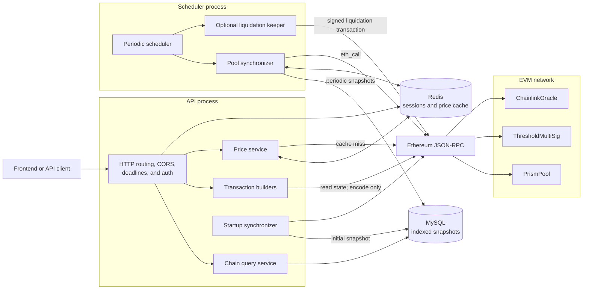

# Prism backend

The Prism backend indexes `PrismPool` state for fast reads, exposes protocol and multisig APIs, caches token prices, manages operator authentication, and optionally submits automated liquidation transactions.

It is an off-chain convenience and automation layer. Deployed contracts remain the source of truth for balances, pool state, prices used by protocol transactions, multisig approvals, and authorization.

## Runtime components

The production image contains three commands:

| Command | Responsibility |
| --- | --- |
| `cmd/api` | Validate dependencies, synchronize an initial pool snapshot, serve HTTP APIs, prepare unsigned multisig transactions, and expose liveness/readiness probes |
| `cmd/scheduler` | Periodically synchronize pool and token snapshots, refresh the configured price cache, and optionally check and liquidate unsafe pools |
| `cmd/migrate` | Apply ordered MySQL migrations under an advisory lock, then exit |

The API and scheduler are separate processes. In production they share MySQL and Redis; only one scheduler replica should run until the scheduler has a distributed lock.


```mermaid
flowchart LR
  Browser[Frontend or API client]

  subgraph APIProcess[API process]
    HTTP[HTTP routing, CORS,<br/>deadlines, and auth]
    Queries[Chain query service]
    Proposals[Transaction builders]
    PriceAPI[Price service]
    Startup[Startup synchronizer]
    HTTP --> Queries
    HTTP --> Proposals
    HTTP --> PriceAPI
  end

  subgraph SchedulerProcess[Scheduler process]
    Timer[Periodic scheduler]
    Sync[Pool synchronizer]
    Keeper[Optional liquidation keeper]
    Timer --> Sync
    Timer --> Keeper
  end

  MySQL[(MySQL<br/>indexed snapshots)]
  Redis[(Redis<br/>sessions and price cache)]
  RPC[Ethereum JSON-RPC]

  subgraph Chain[EVM network]
    Pool[PrismPool]
    Multisig[ThresholdMultiSig]
    Oracle[ChainlinkOracle]
  end

  Browser --> HTTP
  Queries --> MySQL
  Startup -->|initial snapshot| MySQL
  Sync -->|periodic snapshots| MySQL
  HTTP --> Redis
  PriceAPI <--> Redis
  Sync <--> Redis
  Startup --> RPC
  Proposals -->|read state; encode only| RPC
  Sync -->|eth_call| RPC
  Keeper -->|signed liquidation transaction| RPC
  PriceAPI -->|cache miss| RPC
  RPC --> Pool
  RPC --> Multisig
  RPC --> Oracle
```

### Data consistency

- Pool and token list endpoints read indexed snapshots from the configured repository; they do not query the chain per request.
- The API synchronizes once before accepting traffic. The scheduler synchronizes immediately on startup and then on `PRISM_SYNC_INTERVAL`.
- With `PRISM_STORE=mysql`, both processes share persistent state. With `memory`, each process has an isolated repository, so a scheduler cannot update an API process.
- Multisig configuration and proposal status are read live from `ThresholdMultiSig`.
- Price responses use Redis first, then the configured local or on-chain provider on a cache miss.
- Transaction-critical frontend checks should still use live contract reads and simulation.

## Quick start with Docker Compose

Prerequisites are Docker with the Compose plugin, Node.js, npm, and `jq`.

First start a local Hardhat node from `protocol/` and leave it running:

```bash
cd protocol
npm install
npx hardhat node --hostname 0.0.0.0
```

Binding the development node to `0.0.0.0` lets containers reach it and may expose its test accounts and RPC methods to the local network. Use this only for local development.

In another terminal, deploy and seed the local contracts:

```bash
cd protocol
npm run deploy:local
```

Start the backend using the generated addresses:

```bash
cd backend
export PRISM_POOL_ADDRESS="$(jq -r '.prismPool' ../protocol/deployments/local.json)"
export PRISM_MULTISIG_ADDRESS="$(jq -r '.multisig' ../protocol/deployments/local.json)"
docker compose up --build
```

Compose starts MySQL and Redis, runs migrations once, and starts the API and scheduler only after migration succeeds. It maps `host.docker.internal` to the Linux host gateway so the containers can reach Hardhat. The local API is available at `http://localhost:8080`.

Verify the stack:

```bash
curl http://localhost:8080/healthz
curl http://localhost:8080/readyz
curl "http://localhost:8080/api/v1/poolBaseInfo?chainId=31337"
curl "http://localhost:8080/api/v1/price?symbol=PRM"
```

Stop the stack while retaining MySQL data:

```bash
docker compose down
```

To also delete the local MySQL volume:

```bash
docker compose down -v
```

Restarting Hardhat creates a new chain. Redeploy the contracts, reload both exported addresses, and remove stale local MySQL state before using the new deployment.

## API reference

The prefix is `/api/v${PRISM_API_VERSION}` and defaults to `/api/v1`.

### Health

| Method | Path | Description |
| --- | --- | --- |
| `GET` | `/healthz` | Process liveness only; does not call external dependencies |
| `GET` | `/readyz` | Concurrently checks the repository, Redis, and the configured chain RPC |

Readiness has a two-second overall deadline. It returns `200` with `status: ready` only when all probes succeed and returns `503` otherwise. Dependency responses expose status, not connection details or credentials. The production load balancer uses `/readyz`.

### Public reads

| Method | Path | Data source |
| --- | --- | --- |
| `GET` | `/api/v1/poolBaseInfo?chainId=31337` | Indexed repository |
| `GET` | `/api/v1/poolDataInfo?chainId=31337` | Indexed repository |
| `GET` | `/api/v1/token?chainId=31337` | Indexed repository |
| `GET` | `/api/v1/price?symbol=PRM` | Redis-cached price provider |
| `GET` | `/api/v1/multisig` | Live contract read |
| `GET` | `/api/v1/multisig/proposals/{txHash}` | Live contract read |

The three indexed endpoints require `chainId`. The price endpoint uses `PRISM_PRICE_SYMBOL` when `symbol` is omitted.

### Authentication and protected routes

| Method | Path | Protection |
| --- | --- | --- |
| `POST` | `/api/v1/user/login` | Local-auth mode only |
| `POST` | `/api/v1/user/logout` | Local bearer token; local-auth mode only |
| `GET` | `/api/v1/admin/session` | Bearer token and admin-read scope in Cognito mode |
| `POST` | `/api/v1/multisig/proposals` | Bearer token and proposal-write scope in Cognito mode |

Send protected credentials as:

```text
Authorization: Bearer <token>
```

Local mode compares the configured administrator credentials, issues an HMAC-signed opaque token, and stores only the active session record in Redis. Logout revokes that shared session. It is intended for local development or a deliberately configured private deployment.

```bash
curl -X POST http://localhost:8080/api/v1/user/login \
  -H 'Content-Type: application/json' \
  -d '{"name":"admin","password":"password"}'
```

In `cognito` mode, login and logout routes are not registered. The backend validates the Cognito access token's RS256 signature, rotating JWKS, issuer, client ID, `token_use`, expiry, and required scope. The default protected scopes are `prism/admin.read` and `prism/proposals.write`.

### Error and request correlation

Every request accepts a valid `X-Request-ID` or receives a generated ID. The API returns it in the response header and includes it in structured request logs and JSON errors:

```json
{
  "error": "chainId is required",
  "code": "http_400",
  "request_id": "938de57960e728d9dbaf02b8f4339b0e"
}
```

Requests have a 25-second application deadline. Login bodies are limited to 4 KiB, proposal bodies to 64 KiB, and request headers to 1 MiB. Unknown JSON fields are rejected.

## Multisig proposal preparation

The API prepares calldata; it never signs or broadcasts owner transactions. `PRISM_MULTISIG_ADDRESS` is the source of truth for owners and threshold, and API startup verifies that it owns the configured `PrismPool`.

Supported operations are:

| Operation | Parameters |
| --- | --- |
| `add_owner` | `owner` |
| `remove_owner` | `owner` |
| `replace_owner` | `old_owner`, `new_owner` |
| `change_threshold` | `threshold` |
| `create_pool` | `settleTime`, `maturityTime`, `interestRate`, `maxLendSupply`, `collateralizationRatio`, `lendToken`, `collateralToken`, `lenderPositionToken`, `borrowerPositionToken`, `liquidateRate` |
| `settle_pool` | `poolId` |
| `repay_pool` | `poolId`, `maxCollateralAmount` |
| `liquidate_pool` | `poolId`, `maxCollateralAmount` |

All integer-like contract values are decimal strings except `threshold`. Token amounts use the token's smallest unit. `poolId` is the zero-based on-chain pool ID. The caller chooses a unique, non-negative decimal `nonce`.

Example:

```bash
curl -X POST http://localhost:8080/api/v1/multisig/proposals \
  -H "Authorization: Bearer $TOKEN_ID" \
  -H 'Content-Type: application/json' \
  -d '{
    "chain_id": "31337",
    "nonce": "1",
    "operation": {
      "type": "settle_pool",
      "params": {"poolId": "0"}
    }
  }'
```

The response contains the canonical inner proposal and unsigned approval and execution transactions. Each required owner broadcasts the same approval transaction. After the on-chain threshold is reached, an owner broadcasts the execution transaction. Preparing calldata validates shape and encoding but does not guarantee that later execution will satisfy current contract state, timing, price, or liquidity checks.

Read the current approval and execution state with:

```bash
curl http://localhost:8080/api/v1/multisig/proposals/0xTRANSACTION_HASH
```

## Prices and Redis

Both long-running processes require Redis. It stores price quotes under symbol-specific keys; the API also stores local-auth sessions there.

Local development uses fixed quotes by default:

```text
PRISM_PRICE_PROVIDER=local
PRISM_PRICE_SYMBOL=PRM
PRISM_PRICE_CACHE_TTL=30s
```

Production must use the deployed `ChainlinkOracle` and map API symbols to registered token addresses:

```text
PRISM_PRICE_PROVIDER=chainlink
PRISM_ORACLE_ADDRESS=0x...
PRISM_PRICE_SYMBOL=WETH
PRISM_PRICE_TOKEN_ADDRESSES={"USDC":"0x...","WETH":"0x..."}
```

An oracle read is a gasless `eth_call`, though it counts against RPC-provider limits. `ChainlinkOracle` enforces positive, complete, non-future, and non-stale feed data and normalizes returned prices to 18 decimals. The scheduler refreshes `PRISM_PRICE_SYMBOL`; API requests for other configured symbols populate their cache on demand.

Production Redis connections must enable TLS:

```text
PRISM_REDIS_ADDR=master.example.cache.amazonaws.com:6379
PRISM_REDIS_PASSWORD=<secret>
PRISM_REDIS_TLS=true
PRISM_REDIS_TLS_SERVER_NAME=
```

When the TLS server name is empty, the client derives it from `PRISM_REDIS_ADDR`. The client requires TLS 1.2 or newer and verifies the server certificate.

## Automatic liquidation keeper

Automatic liquidation is off by default. When enabled, every scheduler cycle checks all pools with `PrismPool.isUndercollateralized`. For an unsafe active pool, it obtains the current DEX input quote, applies the configured slippage allowance, caps input at the pool's settled collateral, submits `liquidate`, and waits for a successful receipt.

```text
PRISM_LIQUIDATION_ENABLED=true
PRISM_LIQUIDATION_PRIVATE_KEY=0x...
PRISM_LIQUIDATION_SLIPPAGE_BPS=100
```

One basis point is 0.01%; the accepted range is 0–10,000. The key must belong to a dedicated, minimally funded address authorized through `PrismPool.setLiquidator`. Scheduler startup fails when the signer is not the configured liquidator. Store this key in a secret manager and expose it only to the scheduler.

The scheduler's off-chain check is not authoritative. `PrismPool` checks collateral health against its configured oracle again in the liquidation transaction. The multisig retains ownership and can rotate or revoke the keeper.

For local Compose, authorize a Hardhat account as the liquidator, then export its key before startup:

```bash
export PRISM_LIQUIDATION_ENABLED=true
export PRISM_LIQUIDATION_PRIVATE_KEY=0x...
export PRISM_LIQUIDATION_SLIPPAGE_BPS=100
docker compose up --build
```

Compose passes the private key only to the scheduler container.

## Storage and migrations

`PRISM_STORE=memory` is useful for tests and short local experiments. State disappears when the process exits and is not shared across processes.

`PRISM_STORE=mysql` is required in production. Configure either a complete DSN:

```text
PRISM_MYSQL_DSN=prism:prism@tcp(127.0.0.1:3306)/prism_backend?parseTime=true&charset=utf8mb4&loc=UTC
```

or separate fields:

```text
PRISM_MYSQL_HOST=127.0.0.1
PRISM_MYSQL_PORT=3306
PRISM_MYSQL_DATABASE=prism_backend
PRISM_MYSQL_USERNAME=prism
PRISM_MYSQL_PASSWORD=<secret>
```

Run migrations before the API and scheduler:

```bash
cd backend
PRISM_STORE=mysql \
PRISM_MYSQL_DSN='prism:prism@tcp(127.0.0.1:3306)/prism_backend?parseTime=true&charset=utf8mb4&loc=UTC' \
go run ./cmd/migrate
```

Migrations use one pinned MySQL connection for advisory-lock acquisition, schema changes, version recording, and lock release. They have a ten-minute process deadline. The current schema contains `schema_migrations`, `poolbases`, `pooldata`, and `token_info`.

The production Terraform deployment registers an exact migration task revision, requires it to exit successfully, and only then updates the API and scheduler services.

## Configuration reference

Defaults below are for local development. Production validation rejects unsafe fallbacks.

### Core and chain

| Variable | Default | Used by | Purpose |
| --- | --- | --- | --- |
| `PRISM_ENV` | `local` | All | Runtime environment; `production` enables strict validation and JSON logs |
| `PRISM_API_PORT` | `8080` | API | HTTP listen port |
| `PRISM_API_VERSION` | `1` | API | Version in the `/api/vN` prefix |
| `PRISM_CHAIN_ID` | `31337` | API, scheduler | Expected decimal RPC chain ID |
| `PRISM_CHAIN_RPC_URL` | `http://127.0.0.1:8545` | API, scheduler | Ethereum JSON-RPC endpoint |
| `PRISM_POOL_ADDRESS` | none | API, scheduler | Deployed `PrismPool` address |
| `PRISM_MULTISIG_ADDRESS` | none | API | Deployed `ThresholdMultiSig` address |
| `PRISM_SYNC_INTERVAL` | `2m` | Scheduler | Interval between synchronization cycles |

### Storage and cache

| Variable | Default | Purpose |
| --- | --- | --- |
| `PRISM_STORE` | `memory` | `memory` or `mysql`; production requires `mysql` |
| `PRISM_MYSQL_DSN` | none | Complete MySQL DSN; takes precedence over separate fields |
| `PRISM_MYSQL_HOST` | none | MySQL hostname when constructing a DSN |
| `PRISM_MYSQL_PORT` | `3306` | MySQL port |
| `PRISM_MYSQL_DATABASE` | `prism` | MySQL database |
| `PRISM_MYSQL_USERNAME` | none | MySQL username |
| `PRISM_MYSQL_PASSWORD` | none | MySQL password |
| `PRISM_REDIS_ADDR` | `127.0.0.1:6379` | Redis address |
| `PRISM_REDIS_PASSWORD` | none | Redis authentication token |
| `PRISM_REDIS_DB` | `0` | Redis logical database |
| `PRISM_REDIS_TLS` | `false` | Enable TLS; required in production |
| `PRISM_REDIS_TLS_SERVER_NAME` | derived | Optional certificate server-name override |

### Price and liquidation

| Variable | Default | Purpose |
| --- | --- | --- |
| `PRISM_PRICE_PROVIDER` | `local` | `local` or `chainlink`; production requires `chainlink` |
| `PRISM_PRICE_SYMBOL` | `PRM` | Symbol refreshed by the scheduler and used when the API query omits one |
| `PRISM_PRICE_TOKEN_ADDRESSES` | none | JSON object mapping symbols to token addresses |
| `PRISM_ORACLE_ADDRESS` | none | Deployed `ChainlinkOracle` address |
| `PRISM_PRICE_CACHE_TTL` | `30s` | Redis quote lifetime |
| `PRISM_LIQUIDATION_ENABLED` | `false` | Enable scheduler keeper transactions |
| `PRISM_LIQUIDATION_PRIVATE_KEY` | none | Authorized keeper signing key |
| `PRISM_LIQUIDATION_SLIPPAGE_BPS` | `100` | Maximum quote slippage in basis points |

### Authentication and browser access

| Variable | Default | Purpose |
| --- | --- | --- |
| `PRISM_AUTH_MODE` | `local` | `local` or `cognito` |
| `PRISM_ADMIN_USERNAME` | `admin` | Local administrator name |
| `PRISM_ADMIN_PASSWORD` | `password` | Local administrator password |
| `PRISM_TOKEN_SECRET` | `local-development-secret` | HMAC secret for local tokens |
| `PRISM_TOKEN_TTL` | `1h` | Local session lifetime |
| `PRISM_CORS_ALLOWED_ORIGINS` | none | Comma-separated exact browser origins; required in production |
| `PRISM_COGNITO_REGION` | none | Cognito User Pool Region |
| `PRISM_COGNITO_USER_POOL_ID` | none | Cognito User Pool ID |
| `PRISM_COGNITO_CLIENT_ID` | none | Cognito app-client ID |
| `PRISM_COGNITO_PROPOSAL_SCOPE` | `prism/proposals.write` | Scope required to prepare proposals |
| `PRISM_COGNITO_ADMIN_SCOPE` | `prism/admin.read` | Scope required for the admin session route |

Production local-auth credentials cannot use the development defaults; the password must contain at least 12 characters and the token secret at least 32. Cognito mode instead requires Region, User Pool ID, client ID, and both non-empty scopes. CORS permits exact configured origins, methods `GET`, `POST`, and `OPTIONS`, and headers `Accept`, `Authorization`, and `Content-Type`; do not use a wildcard origin for the production operator API.

## Reliability and observability

- API startup has a 30-second deadline and fails if storage, Redis, RPC, pool ownership, multisig configuration, initial synchronization, or the configured price cannot be verified.
- HTTP server limits are 5 seconds for headers, 15 seconds for request reads, 30 seconds for response writes, and 60 seconds for idle connections. Graceful shutdown has five seconds.
- Each scheduler cycle has a 30-second deadline; one failed cycle is logged and does not terminate later cycles.
- Idempotent RPC and price reads use bounded retries. MySQL connectivity is retried during startup. Writes and transaction-like operations are not blindly retried when their outcome may be ambiguous.
- Non-local processes emit structured JSON logs. Stable event fields feed CloudWatch metrics for API errors, scheduler success/failure, upstream provider failures, and migration failures.
- Terraform configures alarms for API errors, sustained CPU, scheduler lag, provider failures, and migration failures. See the [infrastructure guide](../infra/README.md).

## Development

Run all backend checks from this directory:

```bash
gofmt -w .
go test ./...
go vet ./...
go build ./cmd/api ./cmd/scheduler ./cmd/migrate
```

CI treats any output from `gofmt -l .` as a failure. The production Dockerfile builds static Linux binaries in a Go builder image and runs them as an unprivileged user in a minimal Alpine image.

Important package boundaries:

```text
cmd/                    executable composition roots
internal/auth/          local sessions and Cognito authorization
internal/cache/         Redis integration
internal/chain/         PrismPool RPC reads, synchronization, and transaction encoding
internal/config/        environment loading and per-component validation
internal/contracts/     generated contract bindings
internal/httpserver/    routing, middleware, request limits, and JSON responses
internal/liquidation/   keeper checks and transaction submission
internal/multisig/      multisig reads and proposal encoding
internal/price/         local/Chainlink providers and Redis caching
internal/readiness/     bounded dependency probes
internal/resilience/    retry policies
internal/scheduler/     periodic orchestration
internal/store/         memory/MySQL repositories and migrations
```

## Production deployment

Production runs the API and scheduler as ECS/Fargate services, MySQL on RDS, and Redis on ElastiCache. Runtime secrets are resolved from AWS Secrets Manager. A load balancer sends traffic only to ready API tasks, and the scheduler service is fixed at one desired task.

See:

- [AWS architecture and deployment](../infra/README.md)
- [GitHub Actions CI and deployment](../.github/workflows/github-actions-deployment.md)
- [Protocol deployment](../protocol/README.md)

The main outstanding backend design item is a reorg-aware event indexer for wallet activity and historical protocol events. Until it exists, the frontend should combine indexed snapshot APIs with live contract reads for balances, allowances, eligibility, and transaction simulation.
