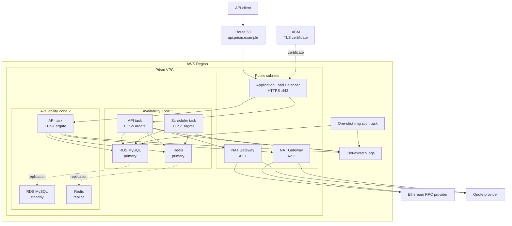
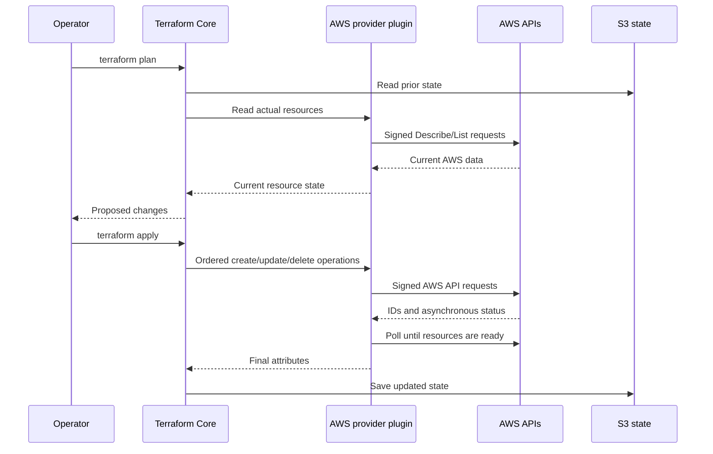
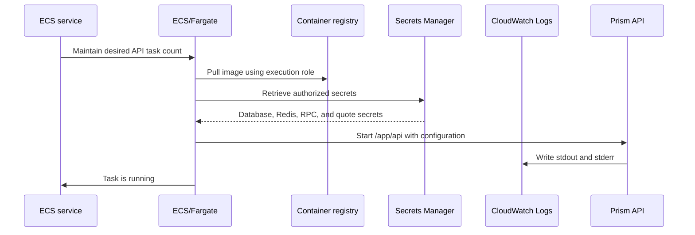

# Understanding Prism's AWS and Terraform Architecture

Moving Prism from a local Docker environment into AWS introduces two related subjects. The first is the AWS architecture that will run the application. The second is Terraform, the tool that describes and creates that architecture. This article builds a mental model of both, starting at the network boundary and ending with the AWS API calls Terraform makes.

## The production system at a glance

Prism's initial AWS design places the public API behind an Application Load Balancer while keeping the application processes, database, and cache inside a private network. It uses two Availability Zones so that the failure of one zone does not have to take down the entire service.



## Regions, Availability Zones, and the VPC

An AWS region is a geographic deployment area such as `us-west-2`. Each region contains multiple Availability Zones, usually abbreviated as AZs. An AZ is an isolated collection of data-center infrastructure with independent power, networking, and failure boundaries.

A Virtual Private Cloud, or VPC, is Prism's private network within an AWS region. The VPC spans the region, while its subnets belong to individual Availability Zones. Calling this a "two-AZ VPC" is convenient shorthand for a VPC with resources and subnets distributed across two zones.

The Prism design creates public and private subnets in both zones. The public subnets contain resources that must communicate directly with the internet, principally the load balancer and NAT gateways. ECS application tasks, RDS, and Redis live in private subnets and do not receive public IP addresses. Security groups then restrict which resources can connect to which ports. For example, only the load balancer may connect to the API on port 8080, and only the ECS security group may connect to MySQL and Redis.

## What Multi-AZ provides

Multi-AZ means running redundant service components in different Availability Zones. It is principally an availability feature.

Prism starts at least two API tasks so the load balancer can route traffic to a healthy task when another task or zone is unavailable. RDS maintains a primary MySQL instance and a synchronized standby in another zone. The application continues to use one database endpoint; during a failover, AWS changes which instance that endpoint reaches. The standby is for recovery rather than normal read scaling.

ElastiCache similarly runs a Redis primary and a replica across zones, with automatic failover enabled. This protects Prism's cache and authentication sessions from a single-node or single-zone failure.

Multi-AZ reduces important failure risks, but it is not a complete disaster recovery system. Backups, restore tests, regional recovery planning, and application-level failure handling remain necessary.

## How private tasks reach external services

Prism's ECS tasks need outbound access to services such as the Ethereum RPC provider and HTTPS quote provider. Giving every task a public IP would unnecessarily expose the application network. A NAT gateway provides outbound connectivity without making private tasks directly reachable from the internet.

When an API task makes a request, its route sends the traffic through a NAT gateway in a public subnet. The NAT gateway substitutes its public address for the task's private address and remembers the connection. Response traffic can then return to the originating task. An unrelated internet client cannot use the NAT gateway to initiate a new connection to that task.

The stack provides a NAT gateway in each zone. This avoids making both zones dependent on one zone's gateway, although managed NAT gateways carry a noticeable hourly and data-processing cost. Database and Redis traffic stays inside the VPC and does not pass through NAT.

## DNS, TLS, ACM, and the load balancer

Route 53 maps the public API hostname, such as `api.prism.example`, to the Application Load Balancer. AWS Certificate Manager, or ACM, provisions and manages the TLS certificate proving that the endpoint controls that hostname.

The certificate is attached to the load balancer by configuring its HTTPS listener to reference the certificate's AWS ARN. A client connects to port 443, receives and verifies the ACM certificate, and then communicates through an encrypted TLS connection.

In the current design, TLS terminates at the load balancer. The load balancer decrypts the request and forwards it over HTTP to an API task on port 8080 inside the private VPC. The Go application therefore does not need to store the public certificate or implement certificate renewal. ACM renews the certificate, while the load balancer handles the external TLS protocol.

## What Terraform contributes

Terraform turns the AWS architecture into version-controlled configuration. Instead of manually creating a VPC, clicking through the RDS console, and trying to remember every security-group rule, the repository describes the desired resources in HashiCorp Configuration Language, or HCL.

All `.tf` files in one directory form a single Terraform configuration. Filenames organize the configuration for people; Terraform loads and combines them rather than executing each file as an independent script.

The Prism stack uses these principal files:

- `main.tf` describes the AWS resources and their relationships.
- `variables.tf` declares the inputs required by the stack and validates important constraints.
- `terraform.tfvars` supplies the actual values for one deployment.
- `versions.tf` selects the Terraform and AWS provider versions and configures the AWS region and common tags.
- `outputs.tf` exposes useful results such as the API URL, ECS cluster name, migration task ARN, subnet IDs, and security-group ID.
- `backend.tf` declares that Terraform state belongs in S3.
- `backend.hcl` supplies the account-specific S3 state location during initialization.

## Configuration values versus Terraform state

`variables.tf` answers "which values does this stack require?" while `terraform.tfvars` answers "what are their values in this environment?"

For example, a variable declaration might require a chain ID:

```hcl
variable "chain_id" {
  description = "Expected EVM chain ID."
  type        = string
}
```

The production values file then supplies it:

```hcl
chain_id = "11155111"
```

The real `terraform.tfvars` is ignored by Git because it contains account-specific configuration, but runtime secret values are not placed in it. It contains only the Secrets Manager ARNs for the RPC URL, Redis token, and quote-provider token. RDS generates and manages its own master password. ECS resolves the authorized secret values when a task starts instead of storing them directly in task-definition environment variables. Terraform must read the Redis token to configure ElastiCache, so the encrypted, access-controlled remote state must still be treated as sensitive.

Terraform state serves a different purpose. AWS knows that a database exists, but it does not know that the database corresponds to the Terraform address `aws_db_instance.main`. State records that relationship along with resource IDs, ARNs, endpoints, and other attributes needed to update the system later. Because state can also contain sensitive values, it must be encrypted, versioned, access-controlled, and protected against simultaneous writes.

`backend.tf` selects S3 as the state backend:

```hcl
terraform {
  backend "s3" {}
}
```

`backend.hcl` then provides values such as the bucket, state key, region, and locking configuration:

```hcl
bucket         = "prism-terraform-state"
key            = "production/terraform.tfstate"
region         = "us-west-2"
encrypt        = true
dynamodb_table = "prism-terraform-locks"
```

Terraform does not fill this file automatically during deployment. An operator or CI pipeline creates it from `backend.hcl.example` before running `terraform init -backend-config=backend.hcl`. The S3 bucket and locking resource are bootstrap infrastructure: they must already exist, normally because an organization created them separately or manages them through a small independent bootstrap stack.

The `.hcl` extension identifies the file as a HashiCorp Configuration Language fragment. Normal Terraform configuration is also written in HCL but conventionally uses the `.tf` extension.

## How the AWS provider creates resources

Terraform itself is divided into Terraform Core and provider plugins. Terraform Core reads configuration, resolves variables, builds the dependency graph, compares desired configuration with state, constructs a plan, and records the result. The AWS provider understands AWS-specific resource schemas and translates Terraform operations into AWS API calls.



The provider uses AWS credentials from a configured profile, environment, short-lived CI identity, or assumed IAM role. It signs requests using AWS Signature Version 4. AWS evaluates the identity's IAM permissions before allowing each action. Terraform cannot bypass IAM; a deployment identity without `rds:CreateDBInstance`, for example, cannot create an RDS instance.

Creating an `aws_db_instance` therefore results in the provider making an RDS `CreateDBInstance` request, then polling RDS until the database becomes available. The provider returns identifiers and the database endpoint to Terraform Core, which stores them in state.

References between resources establish their creation order. If the database references an RDS subnet group, Terraform knows that the VPC subnets and subnet group must exist before the database. Independent resources can be created in parallel.

## How an API task starts

The ECS task definition is a versioned template describing one API task: its container image, command, CPU and memory allocation, environment, secret references, network port, logging, and IAM roles. The ECS service uses that template to maintain the configured number of running tasks and registers healthy tasks with the load balancer.



Each Fargate task receives its own private network interface through `awsvpc` networking. The ECS service places those interfaces in the configured private subnets, applies the ECS security group, and registers the API container's port 8080 with the load balancer target group. ECS uses the execution role to pull the image, publish logs, and resolve secret values. The application receives the separate task role after it starts.

## Planning, applying, and detecting drift

`terraform plan` compares the checked-in configuration, saved state, and resources currently visible in AWS. It previews whether Terraform will create, update, replace, or destroy anything. `terraform apply` performs an approved plan.

Some AWS changes happen in place, while others require resource replacement. A replacement can temporarily affect availability or delete data, so the plan must always be reviewed carefully before applying it.

Terraform is not normally a continuously running controller. If someone changes a resource manually in AWS, Terraform notices that configuration drift the next time it refreshes or plans and proposes how to reconcile it.

The normal workflow is:

```bash
cp backend.hcl.example backend.hcl
cp terraform.tfvars.example terraform.tfvars

# Fill in account- and environment-specific values.
terraform init -backend-config=backend.hcl
terraform fmt -check
terraform validate
terraform plan -out=tfplan

# Review the plan before creating billable or destructive resources.
terraform apply tfplan
```

The current Prism stack was assembled by decomposing the production requirements into networking, security, data, compute, ingress, observability, and deployment resources, and then expressing their dependencies through Terraform references. Its size reflects the fact that production networking and failure boundaries are explicit rather than hidden behind console defaults.

It remains an initial implementation until it has passed `terraform fmt`, `terraform validate`, and a reviewed `terraform plan` against the intended AWS account. No production infrastructure should be created merely because the configuration exists in the repository.
