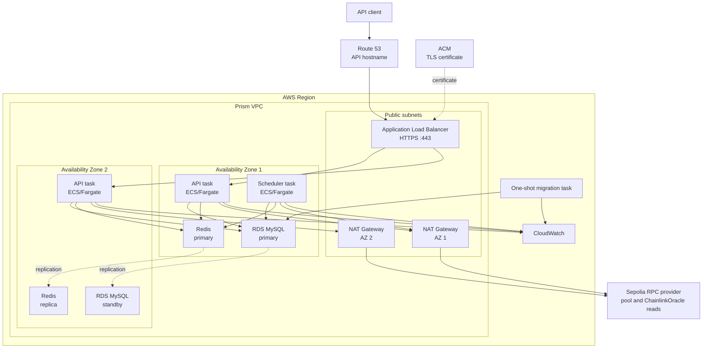
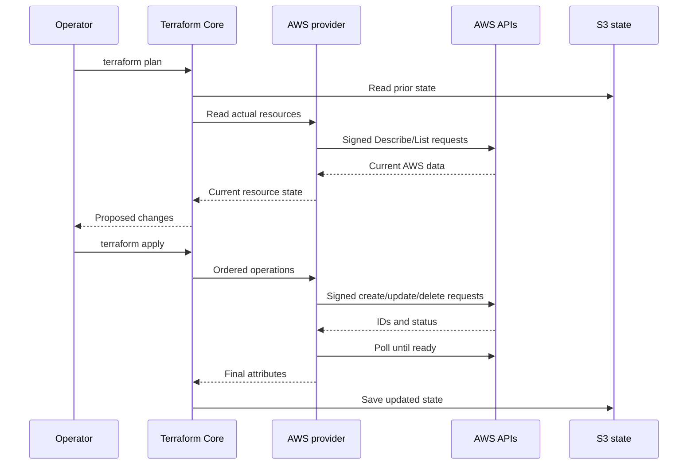
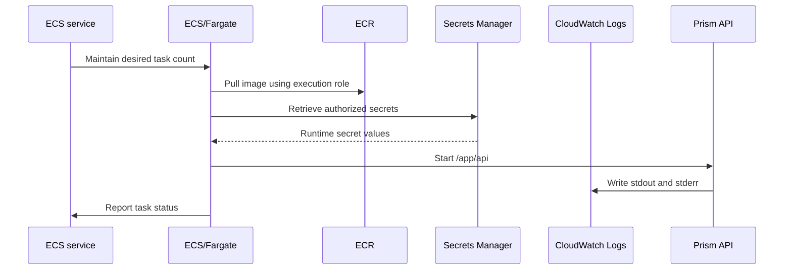

# Prism AWS architecture and deployment

This document first explains the AWS and Terraform architecture, then provides the runbook for deploying the Prism protocol to Ethereum Sepolia and the backend to AWS. Sepolia is a production-integration test environment, not evidence that the contracts are audited or ready for mainnet.

## The production system at a glance

Prism places the public API behind an Application Load Balancer while keeping application processes, MySQL, and Redis in private subnets. The design spans two Availability Zones so one zone can fail without necessarily taking down the whole API.



### Regions, Availability Zones, and the VPC

An AWS Region is a geographic deployment area such as `us-west-2`. A Region contains multiple Availability Zones, or AZs, with separate power, networking, and failure boundaries.

A Virtual Private Cloud, or VPC, is Prism's private network inside a Region. The VPC spans the Region, but each subnet belongs to one AZ. A "two-AZ VPC" means that its resources and subnets are distributed across two zones.

Public subnets contain the internet-facing load balancer and NAT gateways. ECS tasks, RDS, and Redis live in private subnets without public IP addresses. Security groups restrict traffic by source and port: the load balancer can reach the API on port 8080, while only the ECS security group can reach MySQL and Redis.

### Multi-AZ availability

Multi-AZ means placing redundant components in separate zones. Prism runs at least two API tasks so the load balancer can avoid an unhealthy task or zone. RDS maintains a primary MySQL instance and a synchronized standby; applications use one endpoint and AWS redirects it during failover. ElastiCache similarly runs a Redis primary and replica with automatic failover.

Multi-AZ is an availability feature, not a complete disaster-recovery strategy. Backups, restore tests, regional recovery planning, and application-level failure handling remain necessary.

### Private outbound traffic and NAT gateways

The private ECS tasks still need outbound access to the Sepolia RPC, which is also used for gasless `ChainlinkOracle` price reads. Their route tables send that traffic through NAT gateways in the public subnets. A NAT gateway substitutes its public address for the task's private address and permits response traffic, but it does not make the task directly reachable by unrelated internet clients.

The stack creates one NAT gateway per AZ so both zones do not depend on a gateway in one zone. NAT gateways have hourly and data-processing costs. Traffic to RDS and Redis stays inside the VPC.

### DNS, TLS, ACM, and the load balancer

Route 53 maps the API hostname to the Application Load Balancer. AWS Certificate Manager, or ACM, provisions and renews the TLS certificate proving control of that hostname. The load balancer's HTTPS listener references the certificate ARN and accepts public traffic on port 443.

TLS terminates at the load balancer. It decrypts the request and forwards HTTP to port 8080 on a private API task. The Go service therefore does not store the public certificate or implement certificate renewal.

## How Terraform represents the architecture

Terraform converts the architecture into version-controlled HashiCorp Configuration Language, or HCL. All `.tf` files in one directory form one configuration; filenames organize the code for people rather than defining an execution order.

The stack under `terraform/` uses:

- `main.tf` for the primary AWS resources and their relationships;
- `variables.tf` for input declarations and validation;
- `terraform.tfvars` for one environment's real values;
- `versions.tf` for Terraform, provider, Region, and tagging configuration;
- `outputs.tf` for useful results such as the API URL and ECS cluster;
- `monitoring.tf` and `waf.tf` for observability and request protection;
- `backend.tf` to select S3 state storage;
- `backend.hcl` to identify the account-specific state bucket, key, Region, and lock.

The `.hcl` extension means HashiCorp Configuration Language. Ordinary Terraform files also contain HCL but conventionally use `.tf`. Terraform does not generate `terraform.tfvars` or `backend.hcl`; an operator or CI system creates them from the checked-in examples.

### Variables, secrets, and state

`variables.tf` describes which values the stack accepts, while `terraform.tfvars` supplies those values for this deployment:

```hcl
variable "chain_id" {
  description = "Expected EVM chain ID."
  type        = string
}
```

```hcl
chain_id = "11155111"
```

The real `terraform.tfvars` is ignored by Git. Runtime RPC, Redis, and database credentials are not stored there directly. It contains Secrets Manager ARNs; ECS retrieves the authorized values when tasks start. RDS generates its master password. Public contract and token addresses remain ordinary Terraform variables.

Redis is different because Terraform must give the token to ElastiCache while configuring the server. Consequently, that secret can appear in Terraform state even though normal plan output redacts it.

State maps Terraform addresses such as `aws_db_instance.main` to real AWS resource IDs, ARNs, endpoints, and configuration. It must be encrypted, versioned, access-controlled, and locked against concurrent writes. Anyone who can read state must be treated as potentially able to read the Redis credential.

`backend.tf` selects S3:

```hcl
terraform {
  backend "s3" {}
}
```

`backend.hcl` supplies the deployment-specific location:

```hcl
bucket         = "prism-terraform-state"
key            = "production/terraform.tfstate"
region         = "us-west-2"
encrypt        = true
dynamodb_table = "prism-terraform-locks"
```

The bucket and lock table must exist before `terraform init`. The remaining production TODO covers creating and hardening those bootstrap resources.

### Terraform Core and the AWS provider

The `terraform` command is Terraform Core. It reads HCL, resolves variables, compares configuration with state and AWS, builds a dependency graph, produces a plan, orders changes, and writes updated state.

The HashiCorp AWS provider is a plugin downloaded by `terraform init`. It understands resources such as `aws_db_instance` and translates Terraform operations into signed AWS API requests.



The provider uses the same AWS profile, temporary login, or assumed role available to the AWS CLI. AWS evaluates that identity's IAM permissions for every request; Terraform cannot bypass IAM. Resource references establish dependencies, while independent resources may be created concurrently.

### How an ECS task starts

An ECS task definition is a versioned template containing the image, command, CPU, memory, environment, secret references, port, log configuration, and IAM roles. An ECS service maintains the desired number of long-running tasks and, for the API, registers healthy tasks with the load balancer.



With Fargate and `awsvpc` networking, each task receives a private network interface in one of the configured subnets. The ECS execution role pulls the image, resolves secrets, and configures logs. The application receives the separate task role after startup.

`terraform plan` detects the difference between configuration, saved state, and real AWS resources, including manual configuration drift. `terraform apply` executes the reviewed plan. Terraform is not normally a continuously running controller, so drift is discovered on a later refresh or plan.

## Deployment runbook

The deployment order is:

```mermaid
flowchart LR
    Inputs["Prepare external dependencies"]
    Protocol["Deploy protocol to Sepolia"]
    Manifest["Verify and archive manifest"]
    Image["Build and push backend image"]
    AWS["Apply AWS Terraform stack"]
    Migration["Run and verify migration"]
    Services["Roll out API and scheduler"]
    Verify["Verify health, logs, and alarms"]

    Inputs --> Protocol --> Manifest --> Image --> AWS --> Migration --> Services --> Verify
```



## Prerequisites

Install Node.js, Docker, AWS CLI v2, Terraform 1.7 or newer, and `jq`:

```bash
aws --version
terraform version
docker --version
jq --version
```

### Configure a non-root AWS identity

Use AWS IAM Identity Center for human access so the CLI and Terraform receive temporary credentials rather than root credentials or long-lived access keys. If Identity Center is not configured yet, sign in to the AWS console as root only long enough to:

1. Enable IAM Identity Center and secure the root user with MFA.
2. Create a personal, attributable Identity Center user.
3. Create and assign a permission set for the target AWS account. The initial bootstrap requires `AdministratorAccess` because this stack creates IAM roles and policies; replace it with a reviewed least-privilege deployment permission set when one is available.
4. Record the AWS access portal URL and the Region in which Identity Center is configured, then sign out of the root user.

Configure a named CLI profile. `prism-sso` and `prism-deploy` are local names and may be changed. Accept the default `sso:account:access` registration scope, then authenticate as the new Identity Center user and select the assigned account and permission set:

```bash
aws configure sso --profile prism-deploy
# SSO session name: prism-sso
# SSO start URL: the AWS access portal URL
# SSO region: the Region shown in IAM Identity Center
# SSO registration scopes: sso:account:access

aws configure set region us-west-2 --profile prism-deploy
aws configure set output json --profile prism-deploy
aws sso login --profile prism-deploy
```

The Identity Center Region may differ from the `us-west-2` workload Region. Clear any static credentials inherited by the shell, select the SSO profile, and verify the active identity:

```bash
unset AWS_ACCESS_KEY_ID AWS_SECRET_ACCESS_KEY AWS_SESSION_TOKEN
export AWS_PROFILE=prism-deploy
export AWS_REGION=us-west-2
export AWS_DEFAULT_REGION=us-west-2

aws sts get-caller-identity
```

The account ID must be the intended deployment account, and the ARN should be an Identity Center assumed role such as `arn:aws:sts::ACCOUNT_ID:assumed-role/AWSReservedSSO_AdministratorAccess_.../USERNAME`. Do not continue if the ARN ends in `:root`.

Do not deploy with root credentials or commit access keys, wallet private keys, secret values, `backend.hcl`, or `terraform.tfvars`.

Set the working AWS values after authentication:

```bash
export AWS_REGION=us-west-2
export AWS_ACCOUNT_ID="$(
  aws sts get-caller-identity --query Account --output text
)"
```

Before starting, obtain or create:

- a funded Sepolia deployment wallet;
- separately controlled owner addresses and a reviewed threshold for the Prism `ThresholdMultiSig`;
- Sepolia ERC-20 tokens, compatible Chainlink token/USD feeds, and liquid direct Uniswap V3 pools;
- the current Sepolia Uniswap V3 `SwapRouter02` and `QuoterV2` addresses;
- a Cognito User Pool, resource-server scopes, and app client;
- a Route 53 public hosted zone and desired API hostname;
- a private ECR repository;
- a protected S3 Terraform-state bucket and the state-locking configuration expected by `terraform/backend.hcl.example`.

The repository does not currently create the Cognito resources, ECR repository, or remote-state backend. The Sepolia protocol deployment creates the Prism multisig and Chainlink oracle used by the backend price service.

## 1. Test the protocol

```bash
cd /home/boris-alienware/projects/prism/protocol
npm ci
npm test
```

## 2. Configure the Sepolia deployment

Keep private values in the current shell or a secure secret manager:

```bash
export SEPOLIA_RPC_URL="https://..."
export SEPOLIA_PRIVATE_KEY="0x..."
export PRISM_MULTISIG_OWNERS='["0xOWNER_1","0xOWNER_2","0xOWNER_3"]'
export PRISM_MULTISIG_THRESHOLD="2"
export PRISM_FEE_ADDRESS="0x..."
export PRISM_UNISWAP_V3_ROUTER="0x..."
export PRISM_UNISWAP_V3_QUOTER="0x..."
```

Configure a Chainlink feed for every token the protocol must price:

```bash
export PRISM_CHAINLINK_FEEDS='[
  {
    "token": "0xLEND_TOKEN",
    "feed": "0xLEND_USD_FEED",
    "maxStaleness": 7200
  },
  {
    "token": "0xCOLLATERAL_TOKEN",
    "feed": "0xCOLLATERAL_USD_FEED",
    "maxStaleness": 7200
  }
]'
```

Derive `maxStaleness` from the selected feed's documented heartbeat plus a reviewed operational margin. Obtain current feed addresses from the official Chainlink feed directory.

Configure every direct swap direction used by repayment or liquidation:

```bash
export PRISM_UNISWAP_V3_POOLS='[
  {
    "tokenIn": "0xCOLLATERAL_TOKEN",
    "tokenOut": "0xLEND_TOKEN",
    "fee": 3000
  },
  {
    "tokenIn": "0xLEND_TOKEN",
    "tokenOut": "0xCOLLATERAL_TOKEN",
    "fee": 3000
  }
]'
```

Confirm that each pool exists at the configured fee tier and has sufficient Sepolia liquidity. The current adapter supports direct, single-pool routes and does not search automatically for the best route.

See [`../protocol/README.md`](../protocol/README.md) for the adapter constraints and complete protocol behavior.

## 3. Deploy and verify the Sepolia protocol

```bash
cd /home/boris-alienware/projects/prism/protocol
npm run deploy:sepolia
```

The deployment refuses a non-Sepolia RPC, deploys `ThresholdMultiSig` with the configured owners and threshold, verifies configured dependency bytecode, tests the configured Chainlink feeds, transfers oracle and adapter ownership to the multisig, deploys `PrismPool`, and writes `deployments/sepolia.json`.

Verify the generated manifest:

```bash
cd /home/boris-alienware/projects/prism

jq -e '
  .schemaVersion == 1 and
  .environment == "production" and
  .network == "sepolia" and
  .chainId == "11155111" and
  (.prismPool | test("^0x[0-9a-fA-F]{40}$")) and
  (.multisig | test("^0x[0-9a-fA-F]{40}$")) and
  (.chainlinkOracle | test("^0x[0-9a-fA-F]{40}$"))
' protocol/deployments/sepolia.json

export PRISM_POOL_ADDRESS="$(
  jq -r '.prismPool' protocol/deployments/sepolia.json
)"
export PRISM_MULTISIG_ADDRESS="$(
  jq -r '.multisig' protocol/deployments/sepolia.json
)"
export PRISM_ORACLE_ADDRESS="$(
  jq -r '.chainlinkOracle' protocol/deployments/sepolia.json
)"
export PRISM_PRICE_TOKEN_ADDRESSES="$(
  jq -c '
    .feedChecks
    | map({key: .tokenSymbol, value: .token})
    | from_entries
  ' protocol/deployments/sepolia.json
)"
```

Review and archive `protocol/deployments/sepolia.json` as a deployment artifact.

## 4. Create AWS runtime secrets

Create Secrets Manager secrets whose values are raw strings, not JSON documents:

```bash
export RPC_SECRET_ARN="$(
  aws secretsmanager create-secret \
    --region "$AWS_REGION" \
    --name prism/production/chain-rpc \
    --secret-string "$SEPOLIA_RPC_URL" \
    --query ARN \
    --output text
)"

export REDIS_TOKEN="$(openssl rand -hex 32)"
export REDIS_SECRET_ARN="$(
  aws secretsmanager create-secret \
    --region "$AWS_REGION" \
    --name prism/production/redis-auth \
    --secret-string "$REDIS_TOKEN" \
    --query ARN \
    --output text
)"

```

Store the generated Redis value in an approved credential manager before clearing the shell.

## 5. Build and push the backend image

Create the ECR repository once:

```bash
aws ecr create-repository \
  --region "$AWS_REGION" \
  --repository-name prism/backend \
  --image-tag-mutability IMMUTABLE \
  --image-scanning-configuration scanOnPush=true
```

Authenticate Docker, build the image, and push a Git-derived immutable tag:

```bash
export ECR_REGISTRY="${AWS_ACCOUNT_ID}.dkr.ecr.${AWS_REGION}.amazonaws.com"
export IMAGE_REPOSITORY="${ECR_REGISTRY}/prism/backend"

aws ecr get-login-password --region "$AWS_REGION" |
docker login --username AWS --password-stdin "$ECR_REGISTRY"

cd /home/boris-alienware/projects/prism
export IMAGE_TAG="$(git rev-parse --short=12 HEAD)"

docker build \
  --platform linux/amd64 \
  --file backend/Dockerfile \
  --tag "${IMAGE_REPOSITORY}:${IMAGE_TAG}" \
  backend

docker push "${IMAGE_REPOSITORY}:${IMAGE_TAG}"
```

Resolve the immutable digest URI required by Terraform:

```bash
export IMAGE_DIGEST="$(
  aws ecr describe-images \
    --region "$AWS_REGION" \
    --repository-name prism/backend \
    --image-ids imageTag="$IMAGE_TAG" \
    --query 'imageDetails[0].imageDigest' \
    --output text
)"
export IMAGE_URI="${IMAGE_REPOSITORY}@${IMAGE_DIGEST}"
echo "$IMAGE_URI"
```

## 6. Configure Terraform

The S3 state bucket and locking resource must exist before initialization. The final production blocker in `../backend/README.md` documents the remaining state-store hardening work; do not silently replace the configured S3 backend with local production state.

```bash
cd /home/boris-alienware/projects/prism/infra/terraform
cp backend.hcl.example backend.hcl
cp terraform.tfvars.example terraform.tfvars
```

Fill `backend.hcl` with the real state bucket, state key, Region, encryption setting, and locking resource.

Fill every value in `terraform.tfvars`, including:

```hcl
aws_region      = "us-west-2"
environment     = "production"
image_uri       = "ACCOUNT.dkr.ecr.us-west-2.amazonaws.com/prism/backend@sha256:..."
domain_name     = "api.example.com"
route53_zone_id = "Z..."

chain_id         = "11155111"
pool_address     = "0x..."
multisig_address = "0x..."
oracle_address   = "0x..."
price_symbol     = "WETH"
price_token_addresses = {
  USDC = "0x..."
  WETH = "0x..."
}

chain_rpc_url_secret_arn    = "arn:aws:secretsmanager:..."
redis_auth_token_secret_arn = "arn:aws:secretsmanager:..."

db_username = "prism"

cognito_region       = "us-west-2"
cognito_user_pool_id = "us-west-2_..."
cognito_client_id    = "..."

login_rate_limit    = 20
proposal_rate_limit = 100
alarm_email         = "operations@example.com"
```

The Cognito resource server must issue the backend's default scopes:

```text
prism/proposals.write
prism/admin.read
```

## 7. Plan and deploy AWS

```bash
terraform init -backend-config=backend.hcl
terraform fmt -check -recursive
terraform validate
terraform plan -out=tfplan
terraform show tfplan
terraform apply tfplan
```

Review the saved plan before applying it. Do not use targeted ECS-service applies or direct `aws ecs update-service` commands.

The Terraform migration gate enforces this sequence:

```text
register migration task revision
→ run that exact revision
→ wait for it to stop
→ require migration container exit code 0
→ update API and scheduler services
```

A failed migration stops the apply before either service rollout. See [`terraform/README.md`](terraform/README.md) for the Terraform architecture, Redis secret flow, monitoring, and migration-gate details.

## 8. Verify the deployment

Confirm the SNS email subscription sent by AWS, then retrieve the API URL:

```bash
export API_URL="$(terraform output -raw api_url)"

curl -i "${API_URL}/healthz"
curl -i "${API_URL}/readyz"
```

Inspect ECS and the component logs:

```bash
aws ecs describe-services \
  --region "$AWS_REGION" \
  --cluster "$(terraform output -raw ecs_cluster_name)" \
  --services prism-production-api prism-production-scheduler

aws logs tail /ecs/prism-production/migration \
  --region "$AWS_REGION" \
  --since 1h

aws logs tail /ecs/prism-production/api \
  --region "$AWS_REGION" \
  --since 15m

aws logs tail /ecs/prism-production/scheduler \
  --region "$AWS_REGION" \
  --since 15m
```

Verify all of the following:

- the migration logged `migration_success`;
- the API tasks are healthy and `/readyz` is ready;
- exactly one scheduler task is running;
- the scheduler logs `scheduler_sync_success`;
- the backend reports the expected Sepolia chain and contract addresses;
- the SNS subscription is confirmed;
- the CloudWatch alarms are not unexpectedly firing.

Do not create a production pool until its token contracts, oracle feeds, maximum staleness, Uniswap pool liquidity, position-token isolation, multisig owners, and threshold have all been reviewed.

## TODO: Harden deployment-key management

The current Hardhat configuration accepts `SEPOLIA_PRIVATE_KEY` as a configuration variable. Do not keep a plaintext private key in a committed file, shell script, command history, CI log, or shared chat.

For local Sepolia deployments, migrate the RPC URL and dedicated, low-balance deployment key from plaintext environment variables to Hardhat's encrypted keystore:

```bash
cd /home/boris-alienware/projects/prism/protocol

npx hardhat keystore set SEPOLIA_PRIVATE_KEY
npx hardhat keystore set SEPOLIA_RPC_URL

unset SEPOLIA_PRIVATE_KEY
unset SEPOLIA_RPC_URL

npx hardhat keystore list
npx hardhat keystore path
npm run deploy:sepolia
```

Store the keystore backup and its password separately. Use a deployment-only wallet with enough Sepolia ETH for deployment, no mainnet assets, and no long-term administrative role. Keep multisig owner keys on separately controlled devices, preferably hardware wallets. After deployment, verify that `PrismPool`, `ChainlinkOracle`, and `UniswapV3SwapAdapter` are controlled by the multisig.

Before supporting mainnet deployment:

- replace the exportable raw-key signer with a non-exportable hardware wallet, HSM, cloud KMS, or institutional signing service;
- if AWS is selected, use an `ECC_SECG_P256K1` signing key and restrict its IAM policy to the deployment role and required signing operations;
- use GitHub Actions OIDC for short-lived AWS access instead of long-lived AWS credentials in GitHub Secrets;
- protect the deployment environment with branch restrictions, required manual approval, least-privilege permissions, and audited deployment logs;
- keep the deployer minimally funded and transfer all lasting protocol control to the reviewed multisig;
- document backup, recovery, compromise response, owner replacement, and key rotation procedures before the first production transaction.

References:

- [Hardhat configuration variables and encrypted keystore](https://blog.nomic.foundation/how-to-manage-config-values-and-secrets-safely-in-hardhat-3/)
- [AWS KMS secp256k1 signing keys](https://docs.aws.amazon.com/kms/latest/developerguide/symm-asymm-choose-key-spec.html)
- [GitHub Actions OIDC with AWS](https://docs.github.com/en/actions/how-tos/secure-your-work/security-harden-deployments/oidc-in-aws)
