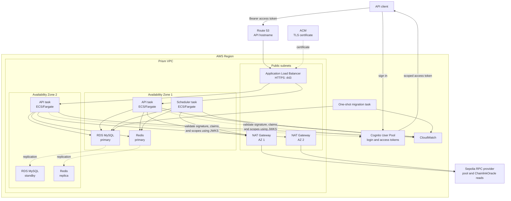
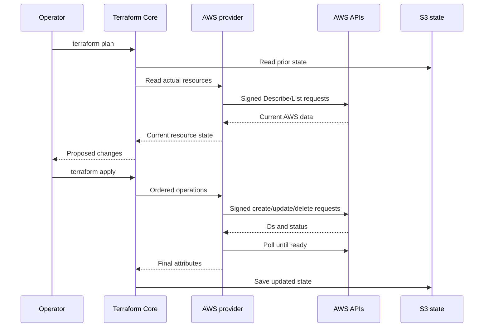
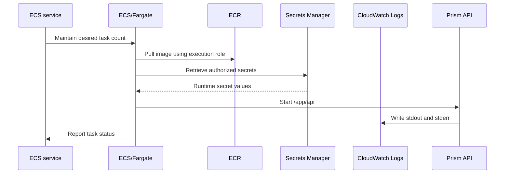
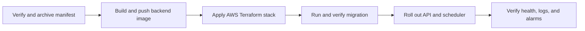
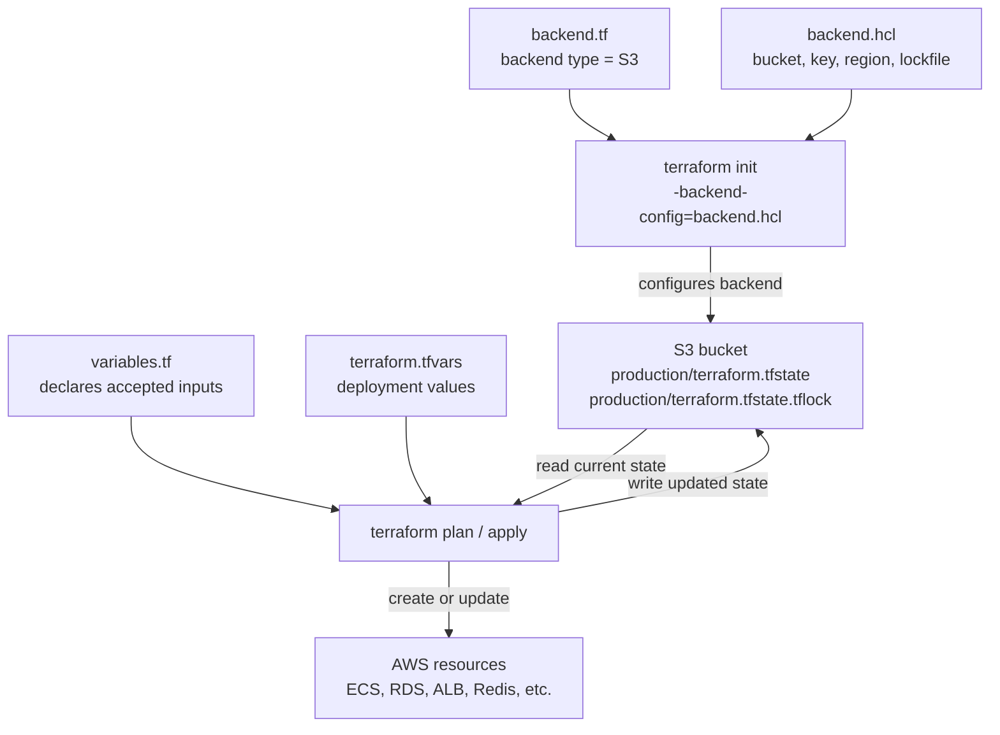

# Prism AWS architecture and deployment

This document first explains the AWS and Terraform architecture, then provides the runbook for deploying the Prism protocol to Ethereum Sepolia and the backend to AWS. Sepolia is a production-integration test environment, not evidence that the contracts are audited or ready for mainnet.

## The production system at a glance

Prism places the public API behind an Application Load Balancer while keeping application processes, MySQL, and Redis in private subnets. The design spans two Availability Zones so one zone can fail without necessarily taking down the whole API.



### Regions, Availability Zones, and the VPC

An AWS Region is a geographic deployment area such as `us-west-2`. A Region contains multiple Availability Zones, or AZs, with separate power, networking, and failure boundaries.

A Virtual Private Cloud, or VPC, is Prism's private network inside a Region. The VPC spans the Region, but each subnet belongs to one AZ. A "two-AZ VPC" means that its resources and subnets are distributed across two zones.

Public subnets contain the internet-facing load balancer and NAT gateways. ECS tasks, RDS, and Redis live in private subnets without public IP addresses. Security groups restrict traffic by source and port: the load balancer can reach the API on port 8080, while only the ECS security group can reach MySQL and Redis.

### Multi-AZ availability

Multi-AZ means placing redundant components in separate zones. Prism runs at least two API tasks so the load balancer can avoid an unhealthy task or zone. RDS maintains a primary MySQL instance and a synchronized standby; applications use one endpoint and AWS redirects it during failover. ElastiCache similarly runs a Redis primary and replica with automatic failover.

Multi-AZ is an availability feature, not a complete disaster-recovery strategy. Backups, restore tests, regional recovery planning, and application-level failure handling remain necessary.

### Private outbound traffic and NAT gateways

The private ECS tasks still need outbound access to the Sepolia RPC, which is also used for gasless `ChainlinkOracle` price reads. Their route tables send that traffic through NAT gateways in the public subnets. A NAT gateway substitutes its public address for the task's private address and permits response traffic, but it does not make the task directly reachable by unrelated internet clients.

The stack creates one NAT gateway per AZ so both zones do not depend on a gateway in one zone. NAT gateways have hourly and data-processing costs. Traffic to RDS and Redis stays inside the VPC.

### DNS, TLS, ACM, and the load balancer

Route 53 maps the API hostname to the Application Load Balancer. AWS Certificate Manager, or ACM, provisions and renews the TLS certificate proving control of that hostname. The load balancer's HTTPS listener references the certificate ARN and accepts public traffic on port 443.

TLS terminates at the load balancer. It decrypts the request and forwards HTTP to port 8080 on a private API task. The Go service therefore does not store the public certificate or implement certificate renewal.

### Cognito authentication

Cognito authenticates users and issues JWT access tokens; Prism does not handle user passwords in production. Clients send the access token as `Authorization: Bearer <token>`. The API downloads the User Pool's rotating public keys and validates the RS256 signature, issuer, app-client ID, `token_use=access`, expiry, and subject. It then requires `prism/proposals.write` for proposal creation and `prism/admin.read` for the admin session endpoint. ID and refresh tokens are not accepted as API credentials.

## How Terraform represents the architecture

Terraform converts the architecture into version-controlled HashiCorp Configuration Language, or HCL. All `.tf` files in one directory form one configuration; filenames organize the code for people rather than defining an execution order.

The stack under `terraform/` uses:

- `main.tf` for the primary AWS resources and their relationships;
- `variables.tf` for input declarations and validation;
- `terraform.tfvars` for one environment's real values;
- `versions.tf` for Terraform, provider, Region, and tagging configuration;
- `outputs.tf` for useful results such as the API URL and ECS cluster;
- `monitoring.tf` and `waf.tf` for observability and request protection;
- `backend.tf` to select S3 state storage;
- `backend.hcl` to identify the account-specific state bucket, key, Region, and lock.

The `.hcl` extension means HashiCorp Configuration Language. Ordinary Terraform files also contain HCL but conventionally use `.tf`. Terraform does not generate `terraform.tfvars` or `backend.hcl`; an operator or CI system creates them from the checked-in examples.

### Variables, secrets, and state

`variables.tf` describes which values the stack accepts, while `terraform.tfvars` supplies those values for this deployment:

```hcl
variable "chain_id" {
  description = "Expected EVM chain ID."
  type        = string
}
```

```hcl
chain_id = "11155111"
```

The real `terraform.tfvars` is ignored by Git. Runtime RPC, Redis, and database credentials are not stored there directly. It contains Secrets Manager ARNs; ECS retrieves the authorized values when tasks start. RDS generates its master password. Public contract and token addresses remain ordinary Terraform variables.

Redis is different because Terraform must give the token to ElastiCache while configuring the server. Consequently, that secret can appear in Terraform state even though normal plan output redacts it.

State maps Terraform addresses such as `aws_db_instance.main` to real AWS resource IDs, ARNs, endpoints, and configuration. It must be encrypted, versioned, access-controlled, and locked against concurrent writes. Anyone who can read state must be treated as potentially able to read the Redis credential.

`backend.tf` selects S3:

```hcl
terraform {
  backend "s3" {}
}
```

`backend.hcl` supplies the deployment-specific location:

```hcl
bucket       = "prism-terraform-state"
key          = "production/terraform.tfstate"
region       = "us-west-2"
encrypt      = true
use_lockfile = true
```

The bucket must exist before `terraform init`. Terraform stores the state at `key` and coordinates concurrent operations with an S3 lock file at `<key>.tflock`.

### Terraform Core and the AWS provider

The `terraform` command is Terraform Core. It reads HCL, resolves variables, compares configuration with state and AWS, builds a dependency graph, produces a plan, orders changes, and writes updated state.

The HashiCorp AWS provider is a plugin downloaded by `terraform init`. It understands resources such as `aws_db_instance` and translates Terraform operations into signed AWS API requests.



The provider uses the same AWS profile, temporary login, or assumed role available to the AWS CLI. AWS evaluates that identity's IAM permissions for every request; Terraform cannot bypass IAM. Resource references establish dependencies, while independent resources may be created concurrently.

### How an ECS task starts

An ECS task definition is a versioned template containing the image, command, CPU, memory, environment, secret references, port, log configuration, and IAM roles. An ECS service maintains the desired number of long-running tasks and, for the API, registers healthy tasks with the load balancer.



With Fargate and `awsvpc` networking, each task receives a private network interface in one of the configured subnets. The ECS execution role pulls the image, resolves secrets, and configures logs. The application receives the separate task role after startup.

`terraform plan` detects the difference between configuration, saved state, and real AWS resources, including manual configuration drift. `terraform apply` executes the reviewed plan. Terraform is not normally a continuously running controller, so drift is discovered on a later refresh or plan.

## Deployment runbook

The deployment order is:



## Prerequisites

Install Docker, AWS CLI v2, Terraform 1.7 or newer, and `jq`:

```bash
aws --version
terraform version
docker --version
jq --version
```

### Configure a non-root AWS identity

Use AWS IAM Identity Center for human access so the CLI and Terraform receive temporary credentials rather than root credentials or long-lived access keys. If Identity Center is not configured yet, sign in to the AWS console as root only long enough to:

1. Enable IAM Identity Center and secure the root user with MFA.
2. Create a personal, attributable Identity Center user.
3. Create and assign a permission set for the target AWS account. The initial bootstrap requires `AdministratorAccess` because this stack creates IAM roles and policies; replace it with a reviewed least-privilege deployment permission set when one is available.
4. Record the AWS access portal URL and the Region in which Identity Center is configured, then sign out of the root user.

Configure a named CLI profile. `prism-sso` and `prism-deploy` are local names and may be changed. Accept the default `sso:account:access` registration scope, then authenticate as the new Identity Center user and select the assigned account and permission set:

```bash
aws configure sso --profile prism-deploy
# SSO session name: prism-sso
# SSO start URL: the AWS access portal URL
# SSO region: the Region shown in IAM Identity Center
# SSO registration scopes: sso:account:access

aws configure set region us-west-2 --profile prism-deploy
aws configure set output json --profile prism-deploy
aws sso login --profile prism-deploy
```

The Identity Center Region may differ from the `us-west-2` workload Region. Clear any static credentials inherited by the shell, select the SSO profile, and verify the active identity:

```bash
unset AWS_ACCESS_KEY_ID AWS_SECRET_ACCESS_KEY AWS_SESSION_TOKEN
export AWS_PROFILE=prism-deploy
export AWS_REGION=us-west-2
export AWS_DEFAULT_REGION=us-west-2

aws sts get-caller-identity
```

The account ID must be the intended deployment account, and the ARN should be an Identity Center assumed role such as `arn:aws:sts::ACCOUNT_ID:assumed-role/AWSReservedSSO_AdministratorAccess_.../USERNAME`. Do not continue if the ARN ends in `:root`.

Do not deploy with root credentials or commit access keys, wallet private keys, secret values, `backend.hcl`, or `terraform.tfvars`.

Set the working AWS values after authentication:

```bash
export AWS_REGION=us-west-2
export AWS_ACCOUNT_ID="$(
  aws sts get-caller-identity --query Account --output text
)"
```

Before starting, obtain or create:

- a reviewed and archived Sepolia deployment manifest produced by the protocol deployment guide;
- a Cognito User Pool, resource-server scopes, and app client;
- a Route 53 public hosted zone and desired API hostname;
- a private ECR repository;
- a protected S3 Terraform-state bucket and the state-locking configuration expected by `terraform/backend.hcl.example`.

The repository does not currently create the Cognito resources, ECR repository, remote-state backend, or protocol contracts.

## 1. Obtain and verify the protocol deployment

Deploy and test the contracts by following [`../protocol/README.md`](../protocol/README.md). AWS deployment starts only after that guide has produced `protocol/deployments/sepolia.json`. Recheck the manifest before copying its public addresses into Terraform:

```bash
cd /home/boris-alienware/projects/prism

jq -e '
  .schemaVersion == 1 and
  .environment == "production" and
  .network == "sepolia" and
  .chainId == "11155111" and
  (.prismPool | test("^0x[0-9a-fA-F]{40}$")) and
  (.multisig | test("^0x[0-9a-fA-F]{40}$")) and
  (.chainlinkOracle | test("^0x[0-9a-fA-F]{40}$"))
' protocol/deployments/sepolia.json

export PRISM_POOL_ADDRESS="$(
  jq -r '.prismPool' protocol/deployments/sepolia.json
)"
export PRISM_MULTISIG_ADDRESS="$(
  jq -r '.multisig' protocol/deployments/sepolia.json
)"
export PRISM_ORACLE_ADDRESS="$(
  jq -r '.chainlinkOracle' protocol/deployments/sepolia.json
)"
export PRISM_PRICE_TOKEN_ADDRESSES="$(
  jq -c '
    .feedChecks
    | map({key: .tokenSymbol, value: .token})
    | from_entries
  ' protocol/deployments/sepolia.json
)"
```

Review and archive `protocol/deployments/sepolia.json` as a deployment artifact.

## 2. Create AWS runtime secrets

Create Secrets Manager secrets whose values are raw strings, not JSON documents:

```bash
export RPC_SECRET_ARN="$(
  aws secretsmanager create-secret \
    --region "$AWS_REGION" \
    --name prism/production/chain-rpc \
    --secret-string "$SEPOLIA_RPC_URL" \
    --query ARN \
    --output text
)"

export REDIS_TOKEN="$(openssl rand -hex 32)"
export REDIS_SECRET_ARN="$(
  aws secretsmanager create-secret \
    --region "$AWS_REGION" \
    --name prism/production/redis-auth \
    --secret-string "$REDIS_TOKEN" \
    --query ARN \
    --output text
)"

```

Store the generated Redis value in an approved credential manager before clearing the shell.

To enable automatic liquidation, create a separate low-balance keeper wallet, store its private key as a raw Secrets Manager value, set `liquidation_enabled=true` and `liquidation_private_key_secret_arn` in Terraform, and have the existing multisig execute `PrismPool.setLiquidator(keeperAddress)`. Apply infrastructure only after the on-chain authorization is confirmed. The keeper key is injected only into the scheduler task.

## 3. Build and push the backend image

Create the ECR repository once:

```bash
aws ecr create-repository \
  --region "$AWS_REGION" \
  --repository-name prism/backend \
  --image-tag-mutability IMMUTABLE \
  --image-scanning-configuration scanOnPush=true
```

Authenticate Docker, build the image, and push a Git-derived immutable tag:

```bash
export ECR_REGISTRY="${AWS_ACCOUNT_ID}.dkr.ecr.${AWS_REGION}.amazonaws.com"
export IMAGE_REPOSITORY="${ECR_REGISTRY}/prism/backend"

# This pipe authenticates Docker to an ECR container registry
aws ecr get-login-password --region "$AWS_REGION" |
docker login --username AWS --password-stdin "$ECR_REGISTRY"

cd /home/boris-alienware/projects/prism
export IMAGE_TAG="$(git rev-parse --short=12 HEAD)-$(date -u +%Y%m%d%H%M%S)"

docker build \
  --no-cache \
  --pull \
  --platform linux/amd64 \
  --file backend/Dockerfile \
  --tag "${IMAGE_REPOSITORY}:${IMAGE_TAG}" \
  backend

docker push "${IMAGE_REPOSITORY}:${IMAGE_TAG}"
```

Resolve the immutable digest URI required by Terraform:

```bash
export IMAGE_DIGEST="$(
  aws ecr describe-images \
    --region "$AWS_REGION" \
    --repository-name prism/backend \
    --image-ids imageTag="$IMAGE_TAG" \
    --query 'imageDetails[0].imageDigest' \
    --output text
)"
export IMAGE_URI="${IMAGE_REPOSITORY}@${IMAGE_DIGEST}"
echo "$IMAGE_URI"
```

## 4. Configure Terraform


Register a domain in **Route 53 > Registered domains > Register domains**, submit the request, and complete any emailed contact verification. After AWS approves the request, find the automatically created public hosted zone:

```bash
export ROOT_DOMAIN="prismapp.link"
aws route53 list-hosted-zones-by-name \
  --dns-name "$ROOT_DOMAIN" \
  --query "HostedZones[?Name=='${ROOT_DOMAIN}.'].Id | [0]" \
  --output text
```

Use the returned ID without the `/hostedzone/` prefix (for example, `Z0123456789ABC`) as `route53_zone_id`, and use an API subdomain such as `api.prismapp.link` as `domain_name`. Do not create a second hosted zone if registration already created one.

### Configure Cognito

In **Amazon Cognito > User pools**, create a pool and an app client. For a browser or mobile client, do not generate a client secret. Create a resource server with identifier `prism`, add scopes `proposals.write` and `admin.read`, and allow the app client to request both scopes. Configure the app client's callback, sign-out URLs and enable the scopes for the frontend. Cognito handles sign-in and token refresh; the frontend must send the resulting access token to Prism.

Retrieve the Terraform values:

```bash
aws cognito-idp list-user-pools \
  --max-results 60 \
  --region "$AWS_REGION" \
  --query 'UserPools[].{Name:Name,Id:Id}' \
  --output table

aws cognito-idp list-user-pool-clients \
  --user-pool-id "<USER_POOL_ID>" \
  --region "$AWS_REGION" \
  --query 'UserPoolClients[].{Name:ClientName,Id:ClientId}' \
  --output table
```

Set `cognito_region` to the pool's Region, `cognito_user_pool_id` to the pool ID, and `cognito_client_id` to the app-client ID—not its secret.

### Bootstrap remote state

Create the globally unique, versioned, encrypted, non-public S3 state bucket:

```bash
export TF_STATE_BUCKET="prism-terraform-state-${AWS_ACCOUNT_ID}"

aws s3api create-bucket \
  --bucket "$TF_STATE_BUCKET" \
  --region "$AWS_REGION" \
  --create-bucket-configuration LocationConstraint="$AWS_REGION"
aws s3api put-bucket-versioning \
  --bucket "$TF_STATE_BUCKET" \
  --versioning-configuration Status=Enabled
aws s3api put-bucket-encryption \
  --bucket "$TF_STATE_BUCKET" \
  --server-side-encryption-configuration \
  '{"Rules":[{"ApplyServerSideEncryptionByDefault":{"SSEAlgorithm":"AES256"}}]}'
aws s3api put-public-access-block \
  --bucket "$TF_STATE_BUCKET" \
  --public-access-block-configuration \
  BlockPublicAcls=true,IgnorePublicAcls=true,BlockPublicPolicy=true,RestrictPublicBuckets=true
```

This bootstrap bucket must exist before initialization. With `use_lockfile = true`, Terraform creates and removes `<key>.tflock` in the same bucket; no DynamoDB table is required. Do not silently replace the configured S3 backend with local production state.

```bash
cd /home/boris-alienware/projects/prism/infra/terraform
cp backend.hcl.example backend.hcl
cp terraform.tfvars.example terraform.tfvars
```

`backend.hcl` configures Terraform itself—where remote state is stored and locked—and is read by `terraform init -backend-config=backend.hcl`. `terraform.tfvars` configures the Prism deployment—such as its Region, image, domain, contracts, and Cognito IDs—and is loaded automatically by `terraform plan` and `terraform apply`. Both files are account/environment-specific and must not be committed.

Set `backend.hcl` to the created resources; Terraform creates and manages the state object at `key`:

```hcl
bucket       = "prism-terraform-state-ACCOUNT_ID"
key          = "production/terraform.tfstate"
region       = "us-west-2"
encrypt      = true
use_lockfile = true
```

The final production blocker in `../backend/README.md` documents the remaining state-store hardening work.

Fill every value in `terraform.tfvars`, including:

```hcl
aws_region      = "us-west-2"
environment     = "production"
image_uri       = "ACCOUNT.dkr.ecr.us-west-2.amazonaws.com/prism/backend@sha256:..."
domain_name     = "api.example.com"
route53_zone_id = "Z..."

chain_id         = "11155111"
pool_address     = "0x..."
multisig_address = "0x..."
oracle_address   = "0x..."
price_symbol     = "WETH"
price_token_addresses = {
  USDC = "0x..."
  WETH = "0x..."
}
liquidation_enabled                = true
liquidation_private_key_secret_arn = "arn:aws:secretsmanager:..."
liquidation_slippage_bps            = 100

chain_rpc_url_secret_arn    = "arn:aws:secretsmanager:..."
redis_auth_token_secret_arn = "arn:aws:secretsmanager:..."

db_username = "prism"

cognito_region       = "us-west-2"
cognito_user_pool_id = "us-west-2_..."
cognito_client_id    = "..."

login_rate_limit    = 20
proposal_rate_limit = 100
alarm_email         = "operations@example.com"
```

The Cognito resource server must issue the backend's default scopes:

```text
prism/proposals.write
prism/admin.read
```

## 5. Plan and deploy AWS

```bash
terraform init -backend-config=backend.hcl
terraform fmt -check -recursive
terraform validate
terraform plan -out=tfplan
terraform show tfplan
terraform show -no-color tfplan > tfplan.txt # if the plan is longer than the terminal's scrollback
terraform apply tfplan
```

Review the saved plan before applying it. Do not use targeted ECS-service applies or direct `aws ecs update-service` commands.

The Terraform migration gate enforces this sequence:

```text
register migration task revision
→ run that exact revision
→ wait for it to stop
→ require migration container exit code 0
→ update API and scheduler services
```

A failed migration stops the apply before either service rollout. See [`terraform/README.md`](terraform/README.md) for the Terraform architecture, Redis secret flow, monitoring, and migration-gate details.

## 6. Verify the deployment

Confirm the SNS email subscription sent by AWS, then retrieve the API URL:

```bash
export API_URL="$(terraform output -raw api_url)"

curl -i "${API_URL}/healthz"
curl -i "${API_URL}/readyz"
```

Inspect ECS and the component logs:

```bash
aws ecs describe-services \
  --region "$AWS_REGION" \
  --cluster "$(terraform output -raw ecs_cluster_name)" \
  --services prism-production-api prism-production-scheduler

aws logs tail /ecs/prism-production/migration \
  --region "$AWS_REGION" \
  --since 1h

aws logs tail /ecs/prism-production/api \
  --region "$AWS_REGION" \
  --since 15m

aws logs tail /ecs/prism-production/scheduler \
  --region "$AWS_REGION" \
  --since 15m
```

Verify all of the following:

- the migration logged `migration_success`;
- the API tasks are healthy and `/readyz` is ready;
- exactly one scheduler task is running;
- the scheduler logs `scheduler_sync_success`;
- the backend reports the expected Sepolia chain and contract addresses;
- the SNS subscription is confirmed;
- the CloudWatch alarms are not unexpectedly firing.

Do not create a production pool until its token contracts, oracle feeds, maximum staleness, Uniswap pool liquidity, position-token isolation, multisig owners, and threshold have all been reviewed.

## Review a saved Terraform plan

Render the plan once, inspect its summary, and list every non-no-op resource action:

```bash
terraform show -no-color tfplan > tfplan.txt
tail -n 30 tfplan.txt
terraform show -json tfplan |
jq -r '.resource_changes[] | select(.change.actions != ["no-op"]) | "\(.change.actions | join(","))\t\(.address)"'
```

Review these points before `terraform apply tfplan`:

1. Confirm the AWS identity, Region, and environment:

   ```bash
   aws sts get-caller-identity
   terraform show -json tfplan |
   jq '{aws_region: .variables.aws_region.value, environment: .variables.environment.value}'
   ```

2. Reject unexpected deletes or replacements. A first deployment should normally contain creates and no destroys:

   ```bash
   rg -n -C 3 'must be replaced|will be destroyed|Plan:' tfplan.txt
   ```

3. Review IAM roles, attachments, and inline policies for broad actions or resources:

   ```bash
   rg -n -C 8 'aws_iam_|Action.*\*|Resource.*\*' tfplan.txt
   ```

4. Review public networking and ensure only the intended ALB ports are internet-accessible:

   ```bash
   rg -n -C 8 'aws_security_group|aws_lb|aws_wafv2|0\.0\.0\.0/0|::/0' tfplan.txt
   ```

5. Review the principal recurring-cost resources and confirm their sizes and counts:

   ```bash
   rg -n -C 8 'aws_nat_gateway|aws_db_instance|aws_elasticache|aws_ecs_service|aws_lb' tfplan.txt
   ```

6. Confirm the image, domain, Cognito IDs, and contract addresses match the intended deployment:

   ```bash
   terraform show -json tfplan |
   jq '.variables | {
     image_uri: .image_uri.value,
     domain_name: .domain_name.value,
     route53_zone_id: .route53_zone_id.value,
     cognito_region: .cognito_region.value,
     cognito_user_pool_id: .cognito_user_pool_id.value,
     cognito_client_id: .cognito_client_id.value,
     chain_id: .chain_id.value,
     pool_address: .pool_address.value,
     multisig_address: .multisig_address.value,
     oracle_address: .oracle_address.value
   }'
   ```

7. Review planned outputs and all warnings:

   ```bash
   terraform show -json tfplan | jq '.planned_values.outputs'
   rg -n -C 3 '^Warning:|^Error:' tfplan.txt
   ```

Saved binary, text, and JSON plans can contain sensitive values. Do not commit them; remove review artifacts after use.

## GitHub Actions backend deployment

The backend workflows run only when backend code changes (or when their own
workflow files change):

- `backend-ci.yml` checks formatting, runs all Go tests, and builds the API,
  scheduler, and migration commands for pull requests; the deployment workflow
  reuses the same CI job after a backend change reaches `main`.
- `backend-deploy.yml` repeats CI, builds an immutable Docker image, pushes it
  to ECR, passes its digest to Terraform, runs the existing migration gate, and
  rolls out the API and scheduler ECS services. It can also be started manually.

### 1. Prepare the existing AWS deployment prerequisites

GitHub Actions deploys the same Terraform stack described above; it does not
bootstrap production from an empty account. Complete the manual prerequisites
first:

- create the private `prism/backend` ECR repository;
- create and protect the S3 Terraform-state bucket;
- complete `backend.hcl` and `terraform.tfvars` locally and successfully run at
  least `terraform init`, `terraform validate`, and `terraform plan`;
- create the referenced Secrets Manager secrets, Cognito resources, hosted
  zone, and verified protocol deployment;
- ensure the deployment identity can run the ECS migration task as well as
  update the Terraform-managed infrastructure.

The workflow never receives raw RPC, Redis, database, or keeper credentials.
It receives the Secrets Manager ARNs stored in `terraform.tfvars`, and ECS
retrieves the corresponding values at task startup.

### 2. Add GitHub as an AWS OIDC provider

Authenticate to the intended AWS account with a non-root administrative or
bootstrap identity:

```bash
export AWS_PROFILE=prism-deploy
export AWS_REGION=us-west-2
export AWS_ACCOUNT_ID="$(
  aws sts get-caller-identity \
    --profile "$AWS_PROFILE" \
    --query Account \
    --output text
)"

aws sts get-caller-identity --profile "$AWS_PROFILE"
```

Do not continue if this is the wrong account or the returned ARN ends in
`:root`. Check whether the account already trusts GitHub Actions:

```bash
export GITHUB_OIDC_PROVIDER_ARN="arn:aws:iam::${AWS_ACCOUNT_ID}:oidc-provider/token.actions.githubusercontent.com"

aws iam get-open-id-connect-provider \
  --profile "$AWS_PROFILE" \
  --open-id-connect-provider-arn "$GITHUB_OIDC_PROVIDER_ARN"
```

If that command reports `NoSuchEntity`, create the provider once per AWS
account:

```bash
aws iam create-open-id-connect-provider \
  --profile "$AWS_PROFILE" \
  --url "https://token.actions.githubusercontent.com" \
  --client-id-list "sts.amazonaws.com"
```

The console equivalent is **IAM > Identity providers > Add provider > OpenID
Connect**, with provider URL `https://token.actions.githubusercontent.com` and
audience `sts.amazonaws.com`.

### 3. Create the GitHub deployment IAM role

Set the exact, case-sensitive GitHub owner and repository names:

```bash
export GITHUB_OWNER="replace-with-github-user-or-organization"
export GITHUB_REPOSITORY="prism"
```

Create `github-actions-trust-policy.json` with the following contents:

```json
{
  "Version": "2012-10-17",
  "Statement": [
    {
      "Effect": "Allow",
      "Principal": {
        "Federated": "arn:aws:iam::AWS_ACCOUNT_ID:oidc-provider/token.actions.githubusercontent.com"
      },
      "Action": "sts:AssumeRoleWithWebIdentity",
      "Condition": {
        "StringEquals": {
          "token.actions.githubusercontent.com:aud": "sts.amazonaws.com",
          "token.actions.githubusercontent.com:sub": "repo:GITHUB_OWNER@GITHUB_OWNER_ID/GITHUB_REPOSITORY@GITHUB_REPOSITORY_ID:environment:production"
        }
      }
    }
  ]
}
```

Replace all five placeholders. Repositories created after July 15, 2026 use
GitHub's immutable subject format containing the numeric owner and repository
IDs. Retrieve the values and immutable subject prefix with GitHub CLI:

```bash
gh api repos/"${GITHUB_OWNER}/${GITHUB_REPOSITORY}" \
  --jq '{owner_id: .owner.id, repository_id: .id, created_at: .created_at}'

gh api repos/"${GITHUB_OWNER}/${GITHUB_REPOSITORY}"/actions/oidc/customization/sub
```

For an older repository that has not opted into immutable subjects, GitHub may
still issue the legacy `repo:GITHUB_OWNER/GITHUB_REPOSITORY` prefix. Use the
`sub_claim_prefix` returned by the second command rather than guessing. Append
`:environment:production` because the deployment job declares `environment:
production`; a branch-based subject such as `ref:refs/heads/main` will not match
this workflow. Validate the file and create the role:

```bash
jq empty github-actions-trust-policy.json

aws iam create-role \
  --profile "$AWS_PROFILE" \
  --role-name prism-github-deploy \
  --assume-role-policy-document file://github-actions-trust-policy.json
```

The `file://` prefix is required. Without it, the AWS CLI interprets the file
name itself as JSON and returns `MalformedPolicyDocument`. Retrieve the role ARN:

```bash
export AWS_ROLE_ARN="$(
  aws iam get-role \
    --profile "$AWS_PROFILE" \
    --role-name prism-github-deploy \
    --query 'Role.Arn' \
    --output text
)"

echo "$AWS_ROLE_ARN"
```

If the role already exists, update its trust policy instead of creating it:

```bash
aws iam update-assume-role-policy \
  --profile "$AWS_PROFILE" \
  --role-name prism-github-deploy \
  --policy-document file://github-actions-trust-policy.json
```

### 4. Grant the role deployment permissions

The trust policy only answers *who may assume the role*; it grants no AWS
resource access. Add each required permission set explicitly.

The repository includes a narrowly scoped policy for the workflow's ECR login,
image push, and digest lookup. Attach it first:

```bash
jq empty infra/iam/github-actions-ecr-policy.json

aws iam put-role-policy \
  --profile "$AWS_PROFILE" \
  --role-name prism-github-deploy \
  --policy-name PrismBackendECR \
  --policy-document file://infra/iam/github-actions-ecr-policy.json
```

`ecr:GetAuthorizationToken` requires `Resource: "*"`; all repository operations
in this policy are restricted to the production `prism/backend` repository in
account `448079093324` and Region `us-west-2`. Update that ARN if the deployment
account, Region, or ECR repository changes.

The S3 backend also needs narrowly scoped access to the production state object
and its native S3 lock file. The state bucket uses S3-managed AES-256 encryption,
so this deployment does not require KMS permissions:

```bash
jq empty infra/iam/github-actions-terraform-state-policy.json

aws iam put-role-policy \
  --profile "$AWS_PROFILE" \
  --role-name prism-github-deploy \
  --policy-name PrismTerraformState \
  --policy-document file://infra/iam/github-actions-terraform-state-policy.json
```

This policy permits listing only the configured state paths, reading and
updating `production/terraform.tfstate`, and reading, creating, and deleting
`production/terraform.tfstate.tflock`. It intentionally does not permit deleting
the state object or accessing historical object versions. Update its bucket and
key ARNs if `backend.hcl` changes.

State and ECR access still do not authorize Terraform to inspect or update the
AWS resources represented by that state. For backend-only releases, attach the
repository's release policy:

```bash
jq empty infra/iam/github-actions-backend-release-policy.json

aws iam put-role-policy \
  --profile "$AWS_PROFILE" \
  --role-name prism-github-deploy \
  --policy-name PrismBackendRelease \
  --policy-document file://infra/iam/github-actions-backend-release-policy.json
```

This policy permits Terraform to refresh metadata for the existing stack, read
the Redis token required to configure ElastiCache, register and retire Prism
task-definition revisions, run the migration task only in the Prism production
cluster, update only the API and scheduler services, and pass only their two ECS
roles. It does not authorize infrastructure creation, deletion, or mutation
outside that backend release path. Consequently, unexpected infrastructure
drift or a Terraform change requiring other mutations fails closed.

If GitHub Actions will also deploy intentional infrastructure changes, use a
separate protected workflow and attach a separately reviewed customer-managed
infrastructure deployment policy to its role:

```bash
export PRISM_DEPLOY_POLICY_ARN="arn:aws:iam::${AWS_ACCOUNT_ID}:policy/replace-with-prism-deployment-policy"

aws iam attach-role-policy \
  --profile "$AWS_PROFILE" \
  --role-name prism-github-deploy \
  --policy-arn "$PRISM_DEPLOY_POLICY_ARN"
```

The policy must allow pushing and reading images in `prism/backend`, reading and
locking the production S3 Terraform state, and the create/read/update/delete
operations required by this Terraform stack for ECS, EC2 networking, ALB,
Route 53, ACM, WAF, RDS, ElastiCache, CloudWatch, SNS, Secrets Manager metadata,
Application Auto Scaling, and the Terraform-managed IAM roles and policies. It
must also allow `ecs:RunTask`, `ecs:DescribeTasks`, and the related ECS wait and
network-description calls used by `scripts/run-migration.sh`.

There is no account-independent least-privilege policy ARN that can safely be
copied into this guide: resource ARNs include the account, Region, state bucket,
hosted zone, cluster, roles, and secrets. Start with the reviewed permissions
used by the existing non-root Terraform deployment identity, scope them to the
production resources, and validate them in a non-production account. Do not
store AWS access keys in GitHub and do not leave `AdministratorAccess` attached
to this role.

### 5. Configure the GitHub production environment

In **Repository settings > Environments**, create an environment named
`production`. Add required reviewers if production deployments should pause
for approval.

Add these environment variables:

| Name | Example |
| --- | --- |
| `AWS_REGION` | `us-west-2` |
| `ECR_REPOSITORY` | `prism/backend` |
| `AWS_ROLE_ARN` | `arn:aws:iam::123456789012:role/prism-github-deploy` |

Add these environment secrets:

| Name | Contents |
| --- | --- |
| `TF_BACKEND_HCL` | The complete contents of the production `backend.hcl` |
| `TFVARS` | The complete contents of the production `terraform.tfvars` |

Neither secret should contain AWS access keys, RPC URLs, Redis tokens, database
passwords, or the liquidation private key. The Terraform configuration expects
Secrets Manager ARNs for runtime secrets.

The `TFVARS` secret contains the complete production `terraform.tfvars`. Its
`image_uri` value is only a syntactically valid fallback. Every workflow run
builds and pushes a new image, resolves its immutable ECR digest, and exports
that value as `TF_VAR_image_uri`; Terraform gives that environment variable
precedence over `terraform.tfvars`. No manual `image_uri` update is required.

Environment secrets are unavailable to private repositories on GitHub Free.
For such a repository, upgrade to a plan that supports them or add the same
names under **Settings > Secrets and variables > Actions** as repository-level
secrets and variables. The workflow resolves those names at either level while
still using the `production` environment in its OIDC subject.

Do not add long-lived `AWS_ACCESS_KEY_ID` or `AWS_SECRET_ACCESS_KEY` repository
secrets. The workflow exchanges GitHub's short-lived OIDC token for temporary
AWS role credentials.

### 6. Verify configuration and perform the first run

Before triggering a deployment, verify the role configuration:

```bash
aws iam get-role \
  --profile "$AWS_PROFILE" \
  --role-name prism-github-deploy \
  --query '{Arn:Role.Arn,Trust:Role.AssumeRolePolicyDocument}'

aws iam list-attached-role-policies \
  --profile "$AWS_PROFILE" \
  --role-name prism-github-deploy
```

1. Protect the `main` branch and require the **Backend CI** check.
2. Configure the production environment variables and secrets above.
3. Confirm the ECR repository and Terraform remote-state bucket already exist.
4. Run **Deploy backend to AWS** manually from the Actions tab.
5. Approve the protected environment when prompted. Approval occurs before the
   deployment job; the current workflow logs the Terraform plan and then applies
   it automatically without a second approval gate.
6. Confirm that the migration succeeds, both ECS services stabilize, and
   `/readyz` returns successfully.

After that first verification, a pull request changing `backend/**` runs CI.
Merging it to `main` runs CI again and, if successful, performs the production
deployment. `workflow_dispatch` remains available for an intentional manual
rerun. If role assumption fails, compare the repository owner, repository name,
environment name, audience, and `sub` claim in the role trust policy exactly;
OIDC matching is case-sensitive.

Production deployments are serialized with the `prism-production` concurrency
group. A newer push waits for an active deployment instead of canceling it.

## Temporarily Disable Prism Services

Scale both ECS services to zero:
```
aws ecs update-service \
  --cluster prism-production \
  --service prism-production-api \
  --desired-count 0 \
  --region "$AWS_REGION"

aws ecs update-service \
  --cluster prism-production \
  --service prism-production-scheduler \
  --desired-count 0 \
  --region "$AWS_REGION"
```
