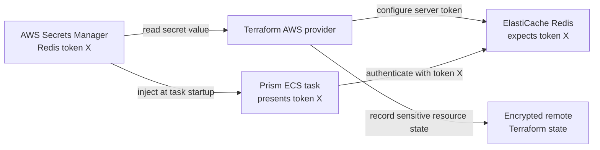
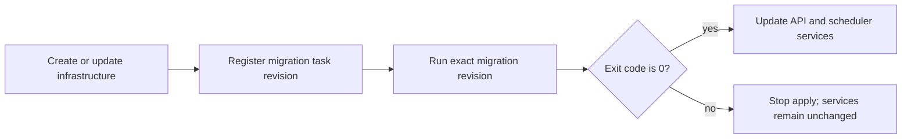

# Prism AWS infrastructure

This Terraform stack creates the production AWS baseline: a two-AZ VPC, public HTTPS Application Load Balancer, private ECS/Fargate API and scheduler, private Multi-AZ RDS MySQL, encrypted ElastiCache Redis, Route 53 DNS, ACM TLS, CloudWatch logs, IAM task roles, API autoscaling, and a one-shot migration task definition.

Before planning, create three Secrets Manager secrets containing raw string values (not JSON):

- the Ethereum RPC URL;
- the Redis AUTH token, with at least 16 characters;
- the quote-provider bearer token.

Put only their ARNs in `terraform.tfvars`. RDS generates its own master password in a separate AWS-managed secret. The ECS execution role can read only these four runtime secrets, and ECS injects them when each task starts. Terraform must read the Redis token to configure ElastiCache, so that value is also protected by the encrypted remote Terraform state.

## Redis authentication flow

Redis is different from the external RPC and quote providers because this Terraform stack configures both the Redis server and the Prism client.

ElastiCache must receive the actual token when Terraform creates or updates the replication group. That configures the server to accept clients presenting that token. ECS independently retrieves the same value from Secrets Manager when a Prism task starts and injects it as `PRISM_REDIS_PASSWORD`.



The RPC and quote-provider servers are operated and configured outside this stack. Terraform therefore places only their secret ARNs in the ECS task definition; ECS reads their values at startup, while Terraform itself does not need those values.

Terraform marks the Redis token as sensitive and hides it from normal plan output, but the value can still exist in Terraform state. Anyone able to read the state must therefore be treated as having access to the Redis credential.

Copy `terraform.tfvars.example` to an untracked `terraform.tfvars`, use an
immutable container digest, and ensure both Terraform and AWS CLI v2 use the
same authorized AWS identity. Then run:

```bash
cp backend.hcl.example backend.hcl
# Fill in the pre-created, versioned S3 state bucket and DynamoDB lock table.
terraform init -backend-config=backend.hcl
terraform plan -out=tfplan
terraform apply tfplan
```

The apply enforces this order:



`terraform_data.migration_gate` is replaced whenever the migration task-definition ARN changes. Its local provisioner invokes `scripts/run-migration.sh`, which starts that exact task revision in the private ECS network, waits for it to stop, and requires the `migration` container to exit with code `0`. Both ECS services depend on this gate. A launch error, timeout, missing exit code, or nonzero exit stops `terraform apply` before Terraform updates either service. A failed gate remains eligible to run again on the next apply after the problem is corrected.

Do not bypass this ordering with `terraform apply -target=aws_ecs_service.api`, `terraform apply -target=aws_ecs_service.scheduler`, or direct `aws ecs update-service` commands. The deployment identity needs permission to run, describe, and wait for ECS tasks in addition to its Terraform permissions.

The stack requires an encrypted, access-controlled S3 remote backend rather than silently creating local production state. The state bucket and lock table are bootstrap resources and must exist before `terraform init`. Rotating the RPC or quote-provider secret requires replacing the running ECS tasks so they resolve the new version. Rotating the Redis token also requires a reviewed Terraform plan to update ElastiCache.

The scheduler ECS service deliberately runs one replica. Its rolling-deployment bounds are 0% minimum healthy and 100% maximum, so ECS stops the old scheduler before starting its replacement instead of briefly running two schedulers. Scheduler synchronization pauses during that replacement. Do not start standalone scheduler tasks or create a second scheduler service; use a distributed lock before introducing scheduler redundancy or zero-downtime overlap.

## Request protection

The regional AWS WAF web ACL attached to the Application Load Balancer rate-limits sensitive POST operations by originating IP:

- `/api/v1/user/login`: approximately 20 requests per five-minute window;
- `/api/v1/multisig/proposals`: approximately 100 requests per five-minute window.

The limits are configurable with `login_rate_limit` and `proposal_rate_limit`. Requests over a limit receive HTTP `429`. AWS WAF estimates rates and may begin or end blocking near, rather than exactly at, the configured count; these rules protect service availability and do not replace authorization or business-level quotas.

The Go API independently limits decoded JSON bodies to 4 KiB for login and 64 KiB for proposals. Oversized bodies receive HTTP `413`, including bodies that place excess data or whitespace after an otherwise valid JSON object.

## Monitoring and alerts

Set `alarm_email` in `terraform.tfvars`. Terraform creates an SNS alerts topic and an email subscription; follow the AWS confirmation link sent to that address, because alerts are not delivered while the subscription is pending.

CloudWatch Logs metric filters convert the services' structured JSON events into metrics and alarms for API 5xx responses, scheduler failures, upstream provider failures, and migration failures. A separate scheduler-lag alarm treats the absence of a success event in two consecutive five-minute windows as a failure. The stack also alarms when average ECS API CPU remains above 80% for ten minutes. Alarm and recovery notifications use the same SNS topic, whose ARN is available as the `alerts_topic_arn` Terraform output.
