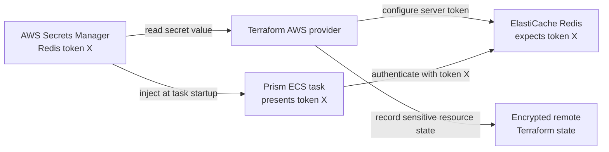

# Prism AWS infrastructure

This Terraform stack creates the production AWS baseline: a two-AZ VPC, public HTTPS Application Load Balancer, private ECS/Fargate API and scheduler, private Multi-AZ RDS MySQL, encrypted ElastiCache Redis, Route 53 DNS, ACM TLS, CloudWatch logs, IAM task roles, API autoscaling, and a one-shot migration task definition.

Before planning, create three Secrets Manager secrets containing raw string values (not JSON):

- the Ethereum RPC URL;
- the Redis AUTH token, with at least 16 characters;
- the quote-provider bearer token.

Put only their ARNs in `terraform.tfvars`. RDS generates its own master password in a separate AWS-managed secret. The ECS execution role can read only these four runtime secrets, and ECS injects them when each task starts. Terraform must read the Redis token to configure ElastiCache, so that value is also protected by the encrypted remote Terraform state.

## Redis authentication flow

Redis is different from the external RPC and quote providers because this Terraform stack configures both the Redis server and the Prism client.

ElastiCache must receive the actual token when Terraform creates or updates the replication group. That configures the server to accept clients presenting that token. ECS independently retrieves the same value from Secrets Manager when a Prism task starts and injects it as `PRISM_REDIS_PASSWORD`.



The RPC and quote-provider servers are operated and configured outside this stack. Terraform therefore places only their secret ARNs in the ECS task definition; ECS reads their values at startup, while Terraform itself does not need those values.

Terraform marks the Redis token as sensitive and hides it from normal plan output, but the value can still exist in Terraform state. Anyone able to read the state must therefore be treated as having access to the Redis credential.

Copy `terraform.tfvars.example` to an untracked `terraform.tfvars`, use an
immutable container digest, and run:

```bash
cp backend.hcl.example backend.hcl
# Fill in the pre-created, versioned S3 state bucket and DynamoDB lock table.
terraform init -backend-config=backend.hcl
terraform plan -out=tfplan
terraform apply tfplan
```

Run migrations before updating the services:

```bash
aws ecs run-task \
  --cluster "$(terraform output -raw ecs_cluster_name)" \
  --task-definition "$(terraform output -raw migration_task_definition_arn)" \
  --launch-type FARGATE \
  --network-configuration "awsvpcConfiguration={subnets=[$(terraform output -json private_subnet_ids | jq -r 'join(\",\")')],securityGroups=[$(terraform output -raw ecs_security_group_id)],assignPublicIp=DISABLED}"
```

Wait for the migration task to exit successfully before deploying a new API or scheduler revision. The stack requires an encrypted, access-controlled S3 remote backend rather than silently creating local production state. The state bucket and lock table are bootstrap resources and must exist before `terraform init`. Rotating the RPC or quote-provider secret requires replacing the running ECS tasks so they resolve the new version. Rotating the Redis token also requires a reviewed Terraform plan to update ElastiCache.

The scheduler ECS service deliberately runs one replica. Its rolling-deployment bounds are 0% minimum healthy and 100% maximum, so ECS stops the old scheduler before starting its replacement instead of briefly running two schedulers. Scheduler synchronization pauses during that replacement. Do not start standalone scheduler tasks or create a second scheduler service; use a distributed lock before introducing scheduler redundancy or zero-downtime overlap.
