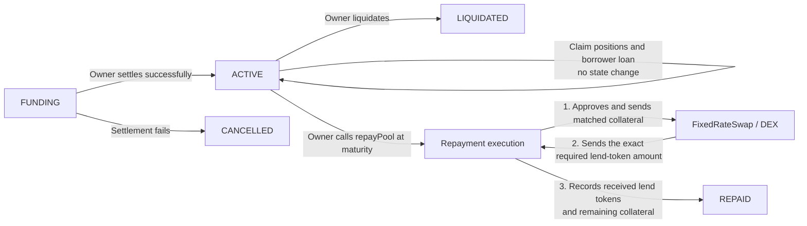

# prism smart contracts

Fixed-rate lending protocol distilled from previous DeFi experience.

## Lending pool transitions

Refunding excess lender funds or borrower collateral does not change the pool
state. Claiming lender/borrower position tokens and the borrower loan also
leaves the pool `ACTIVE`. Refunds from a `CANCELLED` pool are not currently
implemented.

At maturity, the owner calls `repayPool()`. The pool asks the configured DEX
for the collateral required to obtain the exact lend-token repayment amount,
approves that collateral, and executes the swap. The recovered lend tokens and
remaining collateral are recorded before the pool moves to `REPAID`.
