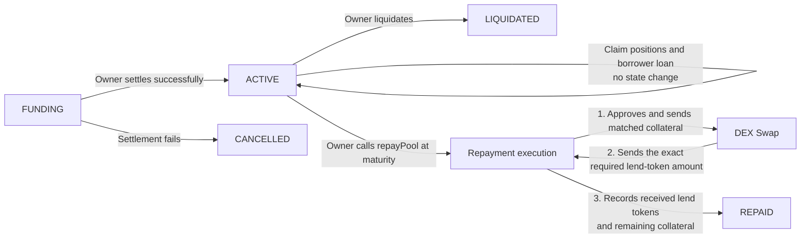

# prism smart contracts

Fixed-rate lending protocol distilled from previous DeFi experience.

## Lending pool transitions


```mermaid
flowchart LR
    F[FUNDING] -->|Owner settles successfully| A[ACTIVE]
    F -->|Settlement fails| C[CANCELLED]

    A -->|Owner liquidates| L[LIQUIDATED]
    A -->|Refund excess lend or collateral<br/>no state change| A
    A -->|Claim positions and borrower loan<br/>no state change| A

    A -->|Owner calls repayPool at maturity| P[Repayment execution]
    P -->|1. Approves and sends matched collateral| D[DEX Swap]
    D -->|2. Sends the exact required lend-token amount| P
    P -->|3. Records received lend tokens<br/>and remaining collateral| R[REPAID]
```

Refunding excess lender funds or borrower collateral does not change the pool
state. Claiming lender/borrower position tokens and the borrower loan also
leaves the pool `ACTIVE`. Refunds from a `CANCELLED` pool are not currently
implemented.

At maturity, the owner calls `repayPool()`. The pool asks the configured DEX
for the collateral required to obtain the exact lend-token repayment amount,
approves that collateral, and executes the swap. The recovered lend tokens and
remaining collateral are recorded before the pool moves to `REPAID`.

## Local deployment

Install the protocol dependencies if needed:

```bash
npm install
```

Start a persistent local Hardhat JSON-RPC node in the first terminal:

```bash
npm run node
```

Keep that process running. In a second terminal, deploy and seed the protocol:

```bash
npm run deploy:local
```

The deployment script uses the optimized production build and deploys:

- `MockOracle`
- `FixedRateSwap`
- lend and collateral tokens
- lender and borrower position tokens
- `PrismPool`

It authorizes `PrismPool` to mint the position tokens, configures local oracle prices, and creates one pool in the `FUNDING` state.

The command prints a JSON object containing the values needed by an RPC client, including:

```json
{
  "rpcUrl": "http://127.0.0.1:8545",
  "chainId": "31337",
  "prismPool": "0x..."
}
```

Contract addresses belong to the running local node. Restarting `npm run node` resets its chain state, so run `npm run deploy:local` again and use the newly printed addresses.

## Generate the Go contract bindings

The backend uses generated, typed Go bindings instead of maintaining contract ABIs by hand.

Run the following commands from the repository root.

Install the required command-line tools if they are not already available:

```bash
sudo apt install jq
go install github.com/ethereum/go-ethereum/cmd/abigen@latest
```

Make sure the Go installation's binary directory is on `PATH`:

```bash
export PATH="$(go env GOPATH)/bin:$PATH"
```

Compile the contracts so Hardhat generates an up-to-date artifact:

```bash
cd protocol
npx hardhat build --build-profile production
cd ..
```

Extract the ABI arrays from the full Hardhat artifacts:

```bash
jq '.abi' \
  protocol/artifacts/contracts/pool/PrismPool.sol/PrismPool.json \
  > protocol/contracts/pool/PrismPool.abi.json
```

Create the Go package directory and generate both bindings:

```bash
mkdir -p backend/internal/contracts

abigen \
  --abi protocol/contracts/pool/PrismPool.abi.json \
  --pkg contracts \
  --type PrismPool \
  --out backend/internal/contracts/prism_pool.go
```

Format and verify the generated code:

```bash
gofmt -w \
  backend/internal/contracts/prism_pool.go \
  backend/internal/contracts/erc20_token.go

cd backend
go test ./...
```

Repeat this process whenever either public contract ABI changes.
The `abigen` commands overwrite the existing generated Go files, which is expected; do not edit them manually.

Apply the same process to other contracts as needed.

## TODO: production asset support

Before accepting real assets such as USDT, WETH, or WBTC:

- normalize pool calculations for tokens with different decimals;
- replace the global 18-decimal minimums with per-token or per-pool minimums;
- use `SafeERC20` for non-standard ERC-20 return behavior;
- correct and test the repayment-interest units;
- replace `MockOracle` and `FixedRateSwap` with production integrations; and
- add explicit wrapped-asset UX, since native ETH and BTC are not ERC-20 tokens.
