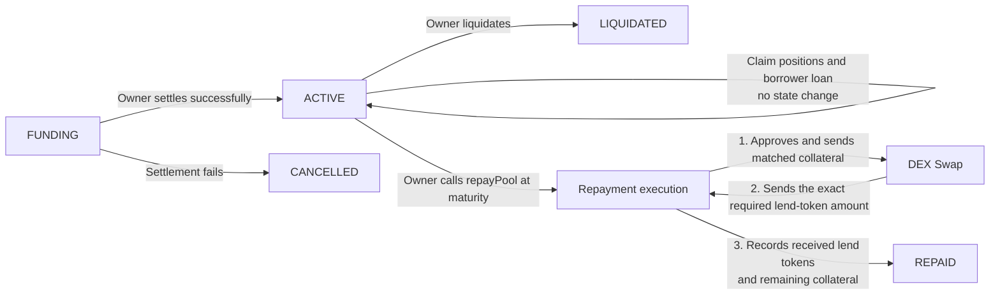

# prism smart contracts

Fixed-rate lending protocol distilled from previous DeFi experience.

Run commands in this guide from the `protocol` directory unless a command explicitly changes directories.

## Lending pool transitions


```mermaid
flowchart LR
    F[FUNDING] -->|Owner settles successfully| A[ACTIVE]
    F -->|Settlement fails| C[CANCELLED]

    A -->|Owner liquidates| L[LIQUIDATED]
    A -->|Refund excess lend or collateral<br/>no state change| A
    A -->|Claim positions and borrower loan<br/>no state change| A

    A -->|Owner calls repayPool at maturity| P[Repayment execution]
    P -->|1. Approves and sends matched collateral| D[DEX Swap]
    D -->|2. Sends the exact required lend-token amount| P
    P -->|3. Records received lend tokens<br/>and remaining collateral| R[REPAID]
```

Refunding excess lender funds or borrower collateral does not change the pool
state. Claiming lender/borrower position tokens and the borrower loan also
leaves the pool `ACTIVE`. Refunds from a `CANCELLED` pool are not currently
implemented.

At maturity, the owner calls `repayPool()`. The pool asks the configured DEX
for the collateral required to obtain the exact lend-token repayment amount,
approves that collateral, and executes the swap. The recovered lend tokens and
remaining collateral are recorded before the pool moves to `REPAID`.

## Local deployment

Install the protocol dependencies if needed:

```bash
npm install
```

Start a persistent local Hardhat JSON-RPC node in the first terminal:

```bash
npm run node
```

Keep that process running. In a second terminal, deploy and seed the protocol:

```bash
npm run deploy:local
```

The deployment script uses the optimized production build and deploys:

- `MockOracle`
- `FixedRateSwap`
- `ThresholdMultiSig` with three local owners and a threshold of two
- lend and collateral tokens
- lender and borrower position tokens
- `PrismPool`

It passes the multisig address to the `PrismPool` constructor, so the pool is multisig-controlled from its first transaction. It then authorizes `PrismPool` to mint the position tokens, configures local oracle prices, and creates one pool in the `FUNDING` state through two multisig approvals and execution.

The command prints a JSON object containing the values needed by an RPC client and saves the same object to the generated `deployments/local.json` file:

```json
{
  "rpcUrl": "http://127.0.0.1:8545",
  "chainId": "31337",
  "prismPool": "0x...",
  "multisig": "0x...",
  "prismPoolOwner": "0x..."
}
```

Contract addresses belong to the running local node. Restarting `npm run node` resets its chain state, so run `npm run deploy:local` again and use the newly generated addresses. The local deployment file is ignored by Git because its addresses are only valid for that running node.

### Fund local wallets

Mint local pUSD and pETH and send development ETH to one wallet after `deploy:local`:

```bash
PRISM_WALLET_ADDRESS=0x... npm run fund:local
```

Fund multiple wallets by providing a comma-separated list and optionally override the human-readable amounts:

```bash
PRISM_WALLET_ADDRESSES=0x...,0x... \
PRISM_LOCAL_PUSD_AMOUNT=10000 \
PRISM_LOCAL_PETH_AMOUNT=100 \
PRISM_LOCAL_ETH_AMOUNT=10 \
npm run fund:local
```

The command is restricted to local chain ID `31337`. It temporarily authorizes each development token owner as a minter, restores the previous minter state after minting, and prints the resulting balances. Set any amount to `0` to skip that asset. These tokens and balances disappear when the local Hardhat node restarts.

## Sepolia production-integration deployment

`ChainlinkOracle` reads token/USD Chainlink Data Feeds, rejects incomplete,
non-positive, future-dated, and stale rounds, and normalizes feed answers to the pool's 1e18 price scale. `UniswapV3SwapAdapter` uses configured direct-pool fee tiers for exact-input and exact-output swaps through Uniswap V3 SwapRouter02 and QuoterV2. The adapter verifies that the router and quoter use the same deployed V3 factory.

The Sepolia deployment requires explicit addresses rather than embedding addresses that may change. Obtain current feed and periphery addresses from the official Chainlink and Uniswap deployment directories, then run:

```bash
SEPOLIA_RPC_URL=https://... \
SEPOLIA_PRIVATE_KEY=... \
PRISM_MULTISIG_OWNERS='["0x...","0x...","0x..."]' \
PRISM_MULTISIG_THRESHOLD=2 \
PRISM_FEE_ADDRESS=0x... \
PRISM_UNISWAP_V3_ROUTER=0x... \
PRISM_UNISWAP_V3_QUOTER=0x... \
PRISM_CHAINLINK_FEEDS='[
  {"token":"0x...","feed":"0x...","maxStaleness":3600},
  {"token":"0x...","feed":"0x...","maxStaleness":3600}
]' \
PRISM_UNISWAP_V3_POOLS='[
  {"tokenIn":"0x...","tokenOut":"0x...","fee":3000}
]' \
npm run deploy:sepolia
```

The `deploy:sepolia` npm script automatically loads and exports variables from `protocol/.env` when that file exists. Existing shell variables and Hardhat encrypted-keystore values continue to work when `.env` is absent. The ignored `.env` file must contain Bash-compatible assignments.

The script refuses non-Sepolia RPC networks, validates the separately controlled multisig owner addresses and threshold, checks every configured dependency for bytecode, verifies each token's ERC-20 symbol and decimals, and validates each Chainlink feed's description, decimals, round completeness, positive answer, timestamp, and configured maximum staleness before sending deployment transactions. It then deploys `ThresholdMultiSig`, transfers oracle and adapter ownership to it, and deploys `PrismPool` with the production adapters. It atomically writes the versioned deployment manifest to `deployments/sepolia.json`, including the verified feed metadata, multisig owners and threshold, environment, network, chain ID, deployment time and block, configured dependencies, and deployed addresses.
Commit or upload this manifest as a deployment artifact so stdout or an operator's shell history is not the source of truth. Configure every swap direction used by repayment or liquidation.
This is a testnet integration path, not a claim that Prism's own contracts have received a security audit.

### Deploy pool-specific position tokens on Sepolia

Each Prism pool requires a unique lender and borrower position-token contract.
Deploy both tokens before preparing the pool-creation proposal:

```bash
SEPOLIA_RPC_URL=https://... \
SEPOLIA_PRIVATE_KEY=... \
PRISM_LENDER_POSITION_TOKEN_NAME="Prism USDC Lender Position Pool 1" \
PRISM_LENDER_POSITION_TOKEN_SYMBOL="pUSDC-L1" \
PRISM_BORROWER_POSITION_TOKEN_NAME="Prism WETH Borrower Position Pool 1" \
PRISM_BORROWER_POSITION_TOKEN_SYMBOL="pWETH-B1" \
npm run deploy:position-tokens:sepolia
```

The command also loads `protocol/.env` when present. It refuses non-Sepolia
networks, reads the PrismPool and multisig addresses from
`deployments/sepolia.json`, verifies that both contain deployed bytecode,
authorizes PrismPool as a minter on each new token, and transfers ownership of
both tokens to the multisig. It prints the two addresses individually and as a
final JSON object. Record those addresses in the pool proposal and deployment
records; the script does not modify the shared Sepolia manifest.

### Authorize an automatic liquidation keeper

`PrismPool.liquidate` can be called by the multisig owner or by one dedicated address configured through `setLiquidator(address)`. The keeper has no pool-administration authority. Because the Sepolia pool is owned by `ThresholdMultiSig`, authorize, replace, or revoke the keeper only through the normal multisig approval and execution flow. The target is the deployed `PrismPool`, the value is zero, and the inner calldata is `PrismPool.interface.encodeFunctionData("setLiquidator", [keeperAddress])`; use `ethers.ZeroAddress` to revoke it. Do not enable the backend scheduler until the multisig transaction has executed and `pool.liquidator()` equals the scheduler signer address.

An older `PrismPool` deployed before `setLiquidator` was added cannot use the automatic keeper and must be redeployed from the current contract source. Do not transfer pool ownership from the multisig to the scheduler as a workaround.

Verify the deployment manifest before archiving or consuming it:

```bash
jq -e '
  .schemaVersion == 1 and
  .environment == "production" and
  .network == "sepolia" and
  .chainId == "11155111"
' deployments/sepolia.json
```

Use [`../backend/README.md`](../backend/README.md) to run the backend locally from `deployments/local.json`. Use [`../infra/README.md`](../infra/README.md) to deploy AWS from the verified `deployments/sepolia.json`.

## Pool ownership

`PrismPool` accepts an explicit `initialOwner_` constructor argument. The local deployment supplies the `ThresholdMultiSig` address rather than temporarily assigning ownership to the deployer. Consequently, direct `createPool` calls from individual owner wallets revert; pool creation must be approved and executed through the multisig.

With the local node, deployment, backend API, and scheduler running, create another pool through the backend-prepared multisig flow:

```bash
npm run create-pool:api
```

The helper requests a `create_pool` proposal from `POST /api/v1/multisig/proposals`, broadcasts the required number of approvals from the local deployment owners, executes the approved transaction, verifies that `poolCount()` increased, and waits for the scheduler to index the new pool. It is a local-development automation helper; production owner wallets should review, sign, and broadcast the prepared transactions independently.

Settle a funding pool through the same backend-prepared multisig flow:

```bash
# Defaults to the seed pool, pool 0.
npm run settle-pool:api

# Or select another zero-based on-chain pool ID.
PRISM_POOL_ID=1 npm run settle-pool:api
```

The settlement helper checks that the pool exists and is in `FUNDING`, advances
the local Hardhat timestamp to its settlement time when necessary, requests a
`settle_pool` proposal, validates its calldata, broadcasts the required
approvals, and executes it. It then verifies that the pool became `ACTIVE` or
`CANCELLED` and waits for the backend to index that state. The seed pool has no
deposits, so settling pool `0` normally moves it to `CANCELLED`.

Prepare the latest funding pool for the local repayment integration:

```bash
npm run setup-repay:local
```

The setup helper mints assets to local lender and borrower accounts, deposits
both sides, configures the collateral-to-lend `FixedRateSwap` rate, funds the
swap with lend-token liquidity, advances to settlement, and settles through an
API-prepared multisig proposal. It finishes with the selected pool `ACTIVE`.
It targets the latest pool by default; select another funding pool with
`PRISM_POOL_ID`.

The default local sequence is:

```bash
npm run create-pool:api
npm run setup-repay:local
PRISM_POOL_ID=1 npm run repay-pool:api
```

All setup token quantities are decimal strings expressed in each token’s smallest unit. `PRISM_SETUP_SWAP_RATE` is a decimal fixed-point exchange rate scaled by 1e18. And they can be overridden:

```bash
PRISM_POOL_ID=1 \
PRISM_SETUP_LEND_AMOUNT=1000000000000000000000 \
PRISM_SETUP_COLLATERAL_AMOUNT=1000000000000000000 \
PRISM_SETUP_SWAP_RATE=3000000000000000000000 \
PRISM_SETUP_SWAP_LIQUIDITY=100000000000000000000000 \
npm run setup-repay:local
```

The repayment helper defaults `maxCollateralAmount` to the pool's settled
collateral; override that limit in the collateral token's smallest unit when
needed:

```bash
PRISM_POOL_ID=1 \
PRISM_MAX_COLLATERAL_AMOUNT=5000000000000000000 \
npm run repay-pool:api
```

The helper preflights the swap quote and liquidity, advances the local Hardhat
timestamp to maturity, requests and validates a `repay_pool` proposal,
broadcasts its approvals and execution, verifies the `REPAID` state, and waits
for the backend to index that state.

Prepare and liquidate a fresh local pool with:

```bash
npm run create-pool:api
npm run setup-liquidate:local
PRISM_POOL_ID=1 npm run liquidate-pool:api
```

`setup-liquidate:local` performs the same minting, deposits, swap configuration,
liquidity funding, and API-driven settlement as `setup-repay:local`. It then
lowers the mock collateral price, verifies that the active pool is
undercollateralized, and leaves it ready for liquidation. It targets the latest
funding pool by default. Select a pool or override the crash price with:

```bash
PRISM_POOL_ID=1 \
PRISM_SETUP_COLLATERAL_CRASH_PRICE=1000000000000000000000 \
npm run setup-liquidate:local
```

The liquidation helper defaults `maxCollateralAmount` to all settled
collateral. Override it with `PRISM_MAX_COLLATERAL_AMOUNT`. It validates the
API-prepared `liquidate_pool` calldata, broadcasts the multisig flow, verifies
state `LIQUIDATED`, and waits for the backend to index it.

## Multisig administration

`ThresholdMultiSig` supports `addOwner`,`removeOwner`, `replaceOwner`, and `changeThreshold`. These functions use `onlySelf`, so no owner can call them directly. Owners must approve identical transaction parameters targeting the multisig itself, after which an owner executes the approved transaction.

Every owner or threshold update increments `configurationVersion`. The version is part of the transaction hash, which invalidates pending approvals created under an earlier owner configuration.

## Generate the Go contract bindings

The backend uses generated, typed Go bindings instead of maintaining contract ABIs by hand.

Run the following commands from the repository root.

Install the required command-line tools if they are not already available:

```bash
sudo apt install jq
go install github.com/ethereum/go-ethereum/cmd/abigen@latest
```

Make sure the Go installation's binary directory is on `PATH`:

```bash
export PATH="$(go env GOPATH)/bin:$PATH"
```

Compile the contracts so Hardhat generates an up-to-date artifact:

```bash
cd protocol
npx hardhat build --build-profile production
cd ..
```

Extract the ABI arrays from the full Hardhat artifacts:

```bash
jq '.abi' \
  protocol/artifacts/contracts/pool/PrismPool.sol/PrismPool.json \
  > protocol/contracts/pool/PrismPool.abi.json

jq '.abi' \
  protocol/artifacts/contracts/admin/ThresholdMultiSig.sol/ThresholdMultiSig.json \
  > protocol/contracts/admin/ThresholdMultiSig.abi.json

jq '.abi' \
  protocol/artifacts/contracts/oracle/ChainlinkOracle.sol/ChainlinkOracle.json \
  > protocol/contracts/oracle/ChainlinkOracle.abi.json

jq '.abi' \
  protocol/artifacts/contracts/oracle/ChainlinkOracle.sol/IChainlinkAggregatorV3.json \
  > protocol/contracts/oracle/IChainlinkAggregatorV3.abi.json
```

Create the Go package directory and generate the bindings:

```bash
mkdir -p backend/internal/contracts

abigen \
  --abi protocol/contracts/pool/PrismPool.abi.json \
  --pkg contracts \
  --type PrismPool \
  --out backend/internal/contracts/prism_pool.go

abigen \
  --abi protocol/contracts/admin/ThresholdMultiSig.abi.json \
  --pkg contracts \
  --type ThresholdMultiSig \
  --out backend/internal/contracts/threshold_multi_sig.go

abigen \
  --abi protocol/contracts/oracle/ChainlinkOracle.abi.json \
  --pkg contracts \
  --type ChainlinkOracle \
  --out backend/internal/contracts/chainlink_oracle.go

abigen \
  --abi protocol/contracts/oracle/IChainlinkAggregatorV3.abi.json \
  --pkg contracts \
  --type ChainlinkAggregatorV3 \
  --out backend/internal/contracts/chainlink_aggregator_v3.go
```

Format and verify the generated code:

```bash
gofmt -w \
  backend/internal/contracts/prism_pool.go \
  backend/internal/contracts/threshold_multi_sig.go

cd backend
go test ./...
```

Repeat this process whenever either public contract ABI changes.
The `abigen` commands overwrite the existing generated Go files, which is expected; do not edit them manually.

Apply the same process to other contracts as needed.

## TODO: production asset support before accepting real assets such as USDT, WETH, or WBTC

- [x] normalize pool calculations and global token-quantity minimums for tokens with different decimals;
-  [ ] replace the global normalized minimums with independently configurable per-token or per-pool minimums;
-  [ ] replace every raw `transfer`, `transferFrom`, and `approve` call in `PrismPool` with `SafeERC20`, including zero-reset-compatible approvals, before supporting arbitrary mainnet tokens;
-  [ ] correct and test the repayment-interest units;
-  [ ] add explicit wrapped-asset UX, since native ETH and BTC are not ERC-20 tokens.

## TODO: Chainlink and Uniswap adapters

- [x] provide Chainlink Data Feed and Uniswap V3 production integrations while retaining mocks for local development;
-  [ ] replace the direct, single-pool Uniswap V3 configuration with automatic route discovery that compares available pools and fee tiers, supports multi-hop routes when appropriate, and applies explicit liquidity and price-impact limits;
-  [ ] remove on-chain QuoterV2 calls from repayment and liquidation because Uniswap quoting is gas-intensive and intended for off-chain simulation; obtain reviewable quotes during proposal preparation and execute swaps with independently enforced on-chain input/output limits;

## TODO: Position-token redemption warning

`withdrawLend()` and `withdrawBorrow()` are intentionally permissionless. They burn position tokens from `msg.sender` and send the redeemed assets back to that same address, so a caller cannot directly redeem tokens held by another address. Position tokens therefore act as transferable bearer claims.

The current fungible `PositionToken` does not identify the pool that minted it, however, and the withdrawal functions do not independently track a holder's redemption entitlement for each pool. Reusing one lender or borrower position-token contract across multiple pools can therefore allow tokens minted for one pool to be redeemed against another pool. This is unsafe when the pools have different redemption ratios.

Until this is redesigned, every pool must use unique lender and borrower position-token contracts. The local deployment and `create-pool:api` helper currently reuse their generated position-token addresses, so creating multiple pools with those helpers is for development only and must not be treated as production-safe.

TODO: enforce pool-specific positions in the protocol, either by deploying unique tokens per pool, using an ERC-1155 token ID derived from `poolId`, or adding explicit per-pool redemption accounting.

## TODO: Harden deployment-key management

The current Hardhat configuration accepts `SEPOLIA_PRIVATE_KEY` as a configuration variable. Do not keep a plaintext private key in a committed file, shell script, command history, CI log, or shared chat.

For Sepolia deployments, migrate the RPC URL and dedicated, low-balance deployment key from plaintext environment variables to Hardhat's encrypted keystore:

```bash
npx hardhat keystore set SEPOLIA_PRIVATE_KEY
npx hardhat keystore set SEPOLIA_RPC_URL

unset SEPOLIA_PRIVATE_KEY
unset SEPOLIA_RPC_URL

npx hardhat keystore list
npx hardhat keystore path
```

Then run the Sepolia deployment command documented above. Store the keystore backup and its password separately. Use a deployment-only wallet with enough Sepolia ETH for deployment, no mainnet assets, and no long-term administrative role. Keep multisig owner keys on separately controlled devices, preferably hardware wallets. After deployment, verify that `PrismPool`, `ChainlinkOracle`, and `UniswapV3SwapAdapter` are controlled by the multisig.

Before supporting mainnet deployment:

- replace the exportable raw-key signer with a non-exportable hardware wallet, HSM, cloud KMS, or institutional signing service;
- if AWS is selected, use an `ECC_SECG_P256K1` signing key and restrict its IAM policy to the deployment role and required signing operations;
- use GitHub Actions OIDC for short-lived AWS access instead of long-lived AWS credentials in GitHub Secrets;
- protect the deployment environment with branch restrictions, required manual approval, least-privilege permissions, and audited deployment logs;
- keep the deployer minimally funded and transfer all lasting protocol control to the reviewed multisig;
- document backup, recovery, compromise response, owner replacement, and key rotation procedures before the first production transaction.

References:

- [Hardhat configuration variables and encrypted keystore](https://blog.nomic.foundation/how-to-manage-config-values-and-secrets-safely-in-hardhat-3/)
- [AWS KMS secp256k1 signing keys](https://docs.aws.amazon.com/kms/latest/developerguide/symm-asymm-choose-key-spec.html)
- [GitHub Actions OIDC with AWS](https://docs.github.com/en/actions/how-tos/secure-your-work/security-harden-deployments/oidc-in-aws)
