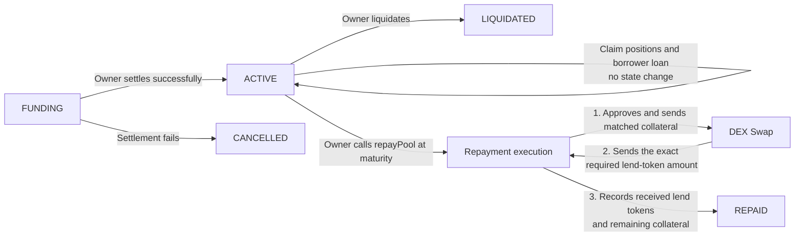

# prism smart contracts

Fixed-rate lending protocol distilled from previous DeFi experience.

## Lending pool transitions


```mermaid
flowchart LR
    F[FUNDING] -->|Owner settles successfully| A[ACTIVE]
    F -->|Settlement fails| C[CANCELLED]

    A -->|Owner liquidates| L[LIQUIDATED]
    A -->|Refund excess lend or collateral<br/>no state change| A
    A -->|Claim positions and borrower loan<br/>no state change| A

    A -->|Owner calls repayPool at maturity| P[Repayment execution]
    P -->|1. Approves and sends matched collateral| D[DEX Swap]
    D -->|2. Sends the exact required lend-token amount| P
    P -->|3. Records received lend tokens<br/>and remaining collateral| R[REPAID]
```

Refunding excess lender funds or borrower collateral does not change the pool
state. Claiming lender/borrower position tokens and the borrower loan also
leaves the pool `ACTIVE`. Refunds from a `CANCELLED` pool are not currently
implemented.

At maturity, the owner calls `repayPool()`. The pool asks the configured DEX
for the collateral required to obtain the exact lend-token repayment amount,
approves that collateral, and executes the swap. The recovered lend tokens and
remaining collateral are recorded before the pool moves to `REPAID`.

## Local deployment

Install the protocol dependencies if needed:

```bash
npm install
```

Start a persistent local Hardhat JSON-RPC node in the first terminal. For a backend running directly on the host:

```bash
npm run node
```

For a backend running in Docker, Hardhat must also accept connections arriving through the host's Docker bridge interface:

```bash
npx hardhat node --hostname 0.0.0.0
```

Docker's `host.docker.internal` hostname resolves to the host gateway, commonly `172.17.0.1` on Linux. A Hardhat node bound only to its default `127.0.0.1` address cannot accept connections through that gateway. Binding to `0.0.0.0` is intended for local development and may expose the development
node to the local network, depending on the host firewall.

Keep that process running. In a second terminal, deploy and seed the protocol:

```bash
npm run deploy:local
```

The deployment script uses the optimized production build and deploys:

- `MockOracle`
- `FixedRateSwap`
- `ThresholdMultiSig` with three local owners and a threshold of two
- lend and collateral tokens
- lender and borrower position tokens
- `PrismPool`

It passes the multisig address to the `PrismPool` constructor, so the pool is multisig-controlled from its first transaction. It then authorizes `PrismPool` to mint the position tokens, configures local oracle prices, and creates one pool in the `FUNDING` state through two multisig approvals and execution.

The command prints a JSON object containing the values needed by an RPC client and saves the same object to the generated `deployments/local.json` file:

```json
{
  "rpcUrl": "http://127.0.0.1:8545",
  "chainId": "31337",
  "prismPool": "0x...",
  "multisig": "0x...",
  "prismPoolOwner": "0x..."
}
```

Contract addresses belong to the running local node. Restarting `npm run node` resets its chain state, so run `npm run deploy:local` again and use the newly generated addresses. The local deployment file is ignored by Git because its addresses are only valid for that running node.

To pass the generated contract addresses to the Docker backend:

```bash
export PRISM_POOL_ADDRESS="$(
  jq -r '.prismPool' protocol/deployments/local.json
)"
export PRISM_MULTISIG_ADDRESS="$(
  jq -r '.multisig' protocol/deployments/local.json
)"
docker compose up --build
```

## Pool ownership

`PrismPool` accepts an explicit `initialOwner_` constructor argument. The local deployment supplies the `ThresholdMultiSig` address rather than temporarily assigning ownership to the deployer. Consequently, direct `createPool` calls from individual owner wallets revert; pool creation must be approved and executed through the multisig.

With the local node, deployment, backend API, and scheduler running, create another pool through the backend-prepared multisig flow:

```bash
npm run create-pool:api
```

The helper requests a `create_pool` proposal from `POST /api/v1/multisig/proposals`, broadcasts the required number of approvals from the local deployment owners, executes the approved transaction, verifies that `poolCount()` increased, and waits for the scheduler to index the new pool. It is a local-development automation helper; production owner wallets should review, sign, and broadcast the prepared transactions independently.

Settle a funding pool through the same backend-prepared multisig flow:

```bash
# Defaults to the seed pool, pool 0.
npm run settle-pool:api

# Or select another zero-based on-chain pool ID.
PRISM_POOL_ID=1 npm run settle-pool:api
```

The settlement helper checks that the pool exists and is in `FUNDING`, advances
the local Hardhat timestamp to its settlement time when necessary, requests a
`settle_pool` proposal, validates its calldata, broadcasts the required
approvals, and executes it. It then verifies that the pool became `ACTIVE` or
`CANCELLED` and waits for the backend to index that state. The seed pool has no
deposits, so settling pool `0` normally moves it to `CANCELLED`.

Prepare the latest funding pool for the local repayment integration:

```bash
npm run setup-repay:local
```

The setup helper mints assets to local lender and borrower accounts, deposits
both sides, configures the collateral-to-lend `FixedRateSwap` rate, funds the
swap with lend-token liquidity, advances to settlement, and settles through an
API-prepared multisig proposal. It finishes with the selected pool `ACTIVE`.
It targets the latest pool by default; select another funding pool with
`PRISM_POOL_ID`.

The default local sequence is:

```bash
npm run create-pool:api
npm run setup-repay:local
PRISM_POOL_ID=1 npm run repay-pool:api
```

All setup token quantities are decimal strings expressed in each token’s smallest unit. `PRISM_SETUP_SWAP_RATE` is a decimal fixed-point exchange rate scaled by 1e18. And they can be overridden:

```bash
PRISM_POOL_ID=1 \
PRISM_SETUP_LEND_AMOUNT=1000000000000000000000 \
PRISM_SETUP_COLLATERAL_AMOUNT=1000000000000000000 \
PRISM_SETUP_SWAP_RATE=3000000000000000000000 \
PRISM_SETUP_SWAP_LIQUIDITY=100000000000000000000000 \
npm run setup-repay:local
```

The repayment helper defaults `maxCollateralAmount` to the pool's settled
collateral; override that limit in the collateral token's smallest unit when
needed:

```bash
PRISM_POOL_ID=1 \
PRISM_MAX_COLLATERAL_AMOUNT=5000000000000000000 \
npm run repay-pool:api
```

The helper preflights the swap quote and liquidity, advances the local Hardhat
timestamp to maturity, requests and validates a `repay_pool` proposal,
broadcasts its approvals and execution, verifies the `REPAID` state, and waits
for the backend to index that state.

## Multisig administration

`ThresholdMultiSig` supports `addOwner`,`removeOwner`, `replaceOwner`, and `changeThreshold`. These functions use `onlySelf`, so no owner can call them directly. Owners must approve identical transaction parameters targeting the multisig itself, after which an owner executes the approved transaction.

Every owner or threshold update increments `configurationVersion`. The version is part of the transaction hash, which invalidates pending approvals created under an earlier owner configuration.

## Generate the Go contract bindings

The backend uses generated, typed Go bindings instead of maintaining contract ABIs by hand.

Run the following commands from the repository root.

Install the required command-line tools if they are not already available:

```bash
sudo apt install jq
go install github.com/ethereum/go-ethereum/cmd/abigen@latest
```

Make sure the Go installation's binary directory is on `PATH`:

```bash
export PATH="$(go env GOPATH)/bin:$PATH"
```

Compile the contracts so Hardhat generates an up-to-date artifact:

```bash
cd protocol
npx hardhat build --build-profile production
cd ..
```

Extract the ABI arrays from the full Hardhat artifacts:

```bash
jq '.abi' \
  protocol/artifacts/contracts/pool/PrismPool.sol/PrismPool.json \
  > protocol/contracts/pool/PrismPool.abi.json

jq '.abi' \
  protocol/artifacts/contracts/admin/ThresholdMultiSig.sol/ThresholdMultiSig.json \
  > protocol/contracts/admin/ThresholdMultiSig.abi.json
```

Create the Go package directory and generate both bindings:

```bash
mkdir -p backend/internal/contracts

abigen \
  --abi protocol/contracts/pool/PrismPool.abi.json \
  --pkg contracts \
  --type PrismPool \
  --out backend/internal/contracts/prism_pool.go

abigen \
  --abi protocol/contracts/admin/ThresholdMultiSig.abi.json \
  --pkg contracts \
  --type ThresholdMultiSig \
  --out backend/internal/contracts/threshold_multi_sig.go
```

Format and verify the generated code:

```bash
gofmt -w \
  backend/internal/contracts/prism_pool.go \
  backend/internal/contracts/threshold_multi_sig.go

cd backend
go test ./...
```

Repeat this process whenever either public contract ABI changes.
The `abigen` commands overwrite the existing generated Go files, which is expected; do not edit them manually.

Apply the same process to other contracts as needed.

## TODO: production asset support

Before accepting real assets such as USDT, WETH, or WBTC:

- normalize pool calculations for tokens with different decimals;
- replace the global 18-decimal minimums with per-token or per-pool minimums;
- use `SafeERC20` for non-standard ERC-20 return behavior;
- correct and test the repayment-interest units;
- replace `MockOracle` and `FixedRateSwap` with production integrations; and
- add explicit wrapped-asset UX, since native ETH and BTC are not ERC-20 tokens.

## TODO: Position-token redemption warning

`withdrawLend()` and `withdrawBorrow()` are intentionally permissionless. They burn position tokens from `msg.sender` and send the redeemed assets back to that same address, so a caller cannot directly redeem tokens held by another address. Position tokens therefore act as transferable bearer claims.

The current fungible `PositionToken` does not identify the pool that minted it, however, and the withdrawal functions do not independently track a holder's redemption entitlement for each pool. Reusing one lender or borrower position-token contract across multiple pools can therefore allow tokens minted for one pool to be redeemed against another pool. This is unsafe when the pools have different redemption ratios.

Until this is redesigned, every pool must use unique lender and borrower position-token contracts. The local deployment and `create-pool:api` helper currently reuse their generated position-token addresses, so creating multiple pools with those helpers is for development only and must not be treated as production-safe.

TODO: enforce pool-specific positions in the protocol, either by deploying unique tokens per pool, using an ERC-1155 token ID derived from `poolId`, or adding explicit per-pool redemption accounting.
